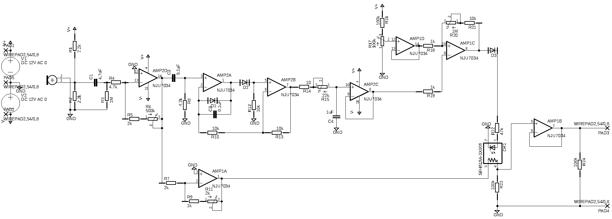
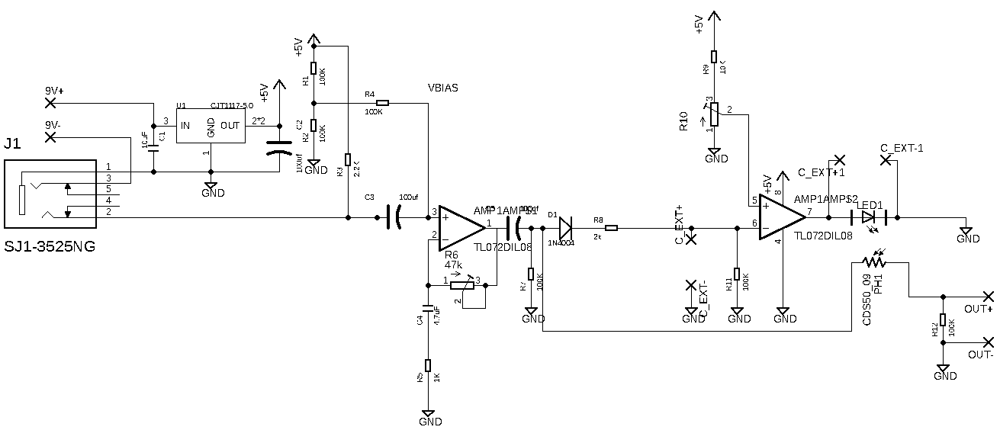

以下にExidiophoneの回路図を添付する。

1つ目はバージョン1.xのつまみが5つついていたモデルである。

{width=100%}

もう一つはバージョン3.0で、2.0とは電源部を除きほぼ回路は同じなのでこちらのみ添付する。

{width=100%}

どちらのバージョンもオペアンプは単電源もしくはレールツーレールの、入力電圧が0Vに近づいても出力が反転しないもので無ければLEDの点滅が起きない。バージョン3.0の回路図ではTL072となっているがこれは回路図制作の都合上であり実際には新日本無線NJU13404などを使用している。