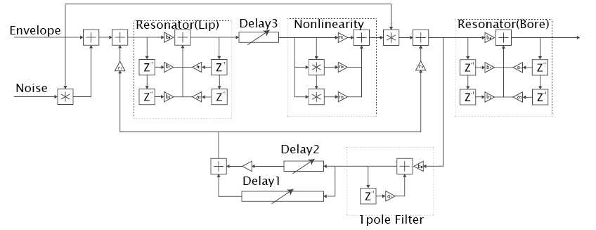

# Introduction

Since the 1980s, physical modeling techniques have been employed for the purpose of reproducing the tone of unreal instruments. The user manual of YAMAHA VL1, the first commercial physical modeling synthesizer, states, "One of the remarkable features of the VL1’s Virtual Acoustic Synthesis system is that just about any driver can be used with any type of pipe or string" [@yamahamanual].

The principle of the sound synthesis method of physical modeling is to computationally simulate the physical structure of a musical instrument [@smith2010pasp]. However, in this *Aphysical Unmodeling Instrument* work, we focused on the “re-physicalization” of physical modeling as a sound installation, with a focus on the Whirlwind meta-wind instrument model.

# Whirlwind

Whirlwind is a meta-wind instrument model developed by Cook et al. [@cook1992meta]. The model combines three models of waveguide instruments: the trumpet, flute, and clarinet. All models have a similar structure: a feedback system that contains filters, delays, and nonlinearities in a loop.

Figure 1 depicts a block diagram of the Whirlwind. On the left, it has an envelope controlled by a controller and the sound of virtual breath mixed into the envelope. The rest of the model forms a feedback loop with wave propagation in the bore and reflection at the end of the body. Delay1 and Delay2 represent the propagation delay corresponding to the length of the bore and the position of the tone hole. Delay3 represents the sound propagation delay in the embouchure of a flute. Each $+$  in the loop functions as addition. The polynomial $ax^3+bx^2+cx$ represents multiplication combining the outputs from Delay3 as the nonlinearity of the lip or the reed. The biquad filter at the upper left represents the player's lip, modeled as a resonator with a single mode frequency. The one-pole filter works as a low-pass filter of the reflection. With these components, Whirlwind morphs its sound from a brass instrument to a woodwind using the HIRN dedicated MIDI controller.

# Aphysical Unmodeling Instrum-ent

*Aphysical Unmodeling Instrument* is a sound installation that re-physicalizes the Whirlwind by using physical objects in the real world. Instead of using any MIDI or digital input to control the Whirlwind model, we replace each part of the model with physical objects and commit the control to the real world. Next, we describe an implementation at the 2017 HANARART art festival, which was held in 2017 from October 27 to November 5 [@hanarart2017].

## Spaces for interpretation

The re-physicalization process presents two different realms of interpretation. The first one is the abstraction of the components. We can broadly consider each component from a “bird’s-eye view” (e.g., the lip of a reed), or in detail from a “worm's-eye view” (e.g., $ax^3+bx^2+cx$ ). Both a complex function and a combination of separated functions could form the same component of a model.

The second interpretive realm is the choice of physical object. With physical objects in the real world, we can realize the same function (e.g., addition) with diverse methods (e.g., record multiple sounds by using a microphone or mix different sound sources in a mixer). For the re-physicalization, we must consider the degree of abstraction as well as the practicability of physical objects.

## 2017 HANARART Implementation

In the 2017 HANARART art festival  implementation, we re-physicalized Whirlwind in a room of Yagi Fudanotsuji Kouryuukan, an old cultural property in Nara, Japan.

At first, we replaced the **envelope** with a paper windmill triggered by the wind. When the wind blew, the motor attached to the windmill converted the rotational energy of the paper windmill into voltage.

**Noise** was re-physicalized using a combination of a needle, a piezo microphone, and a paper belt running similar to a cassette tape. The microphone was attached to the end of the needle and perceived the scratching noise from the other end of the needle as an electric signal.

The **delays** were replaced with sound wave propagations. We employed three sets of speakers and microphones. The time delay changed according to the rotation of a bar with the speakers attached to the end of the bar. The pitch of the feedback sound changed because of the changes in the delay time.

We re-physicalized most of the **additions** as electrical additions with an audio mixer. As an exception, we employed acoustic additions with the two speakers and two microphones of Delay1 and Delay2, as well as three speakers and a microphone of Delay3.

For the **multiplications**, we used a set of an LED and photoresistor (CdS cell) in the envelope. The CdS behaved as a volume controller by changing its resistance, whereasile the brightness of the LED corresponded to the voltage of the envelope. We also replaced the multiplication in the polynomial $ax^3+bx^2+cx$ with two double-balanced mixer ICs because of the requirement of a fast response in the model (the LED and CdS were too slow for this purpose).

We replaced the **resonator** of a lip or a reed with paper cylinders. Each of the cylinders had a different length and diameter. They moved randomly between the speaker and the microphone as a result of the wind movement.

For the **one-pole (low-pass) filter**, we hung two pieces of paper in front of the two speakers on the bar to reflect and excise the high-frequency tone.

Through our examination of the model, we identified no purpose of the biquad filter at the final section. Therefore, we did not use that filter in our re-physicalization.

## Results

According to the implementation, we noticed that the sound from the installation was more similar to a normal Larsen tone than to the sound from the original Whirlwind that we previously implemented on a computer. This may have been due to three errors that we noticed after the implementation. The first was the reverse order of the resonance and the nonlinearity. The second was the multiplication with the LED and the CdS for the envelope control instead of an addition in the proto-model of the trumpet. The third was the inappropriate use of the paper cylinder as a resonator in terms of its behavior. Because of its extremely low weight, the sound from the reflectance of the cylinder was too low to notice the effect of the resonance.

# Discussion

The Whirlwind model virtually combines three real wind instruments. Therefore, in the re-physicalization, we had to interpret the undescribed part of the model. With such interpretation, the work could take various forms in different environments, even if the model was identical.

In future work, we would like to correct the limitations identified in our results. We aim to extend our approach with other formats, such as sound sculptures or a performance with different interpretations.

# Acknowledgement

This work was supported by JSPS KAKENHI Grant Number JP17H04772. The authors also thank to KAKEHASHI foundation and staffs of 2017 HANARART Art Festival for supporting the work.
