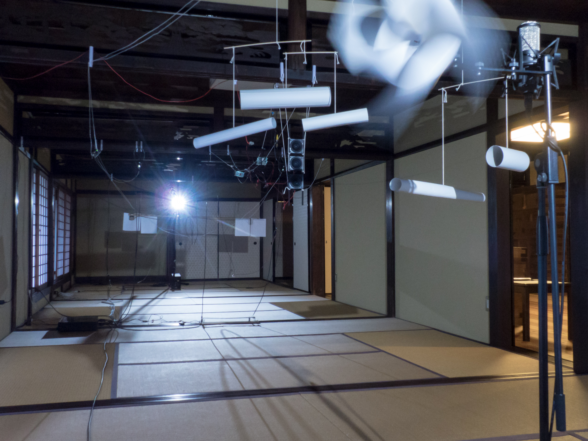
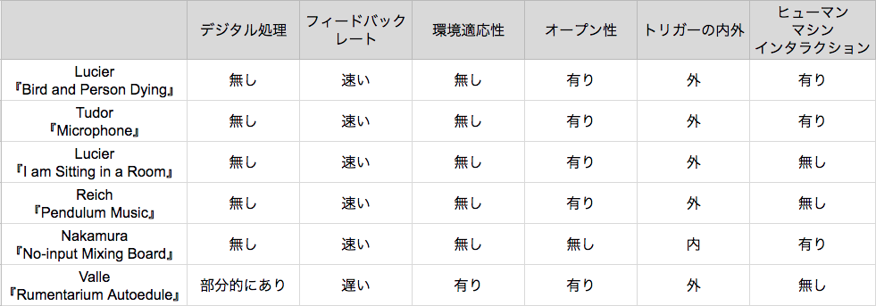
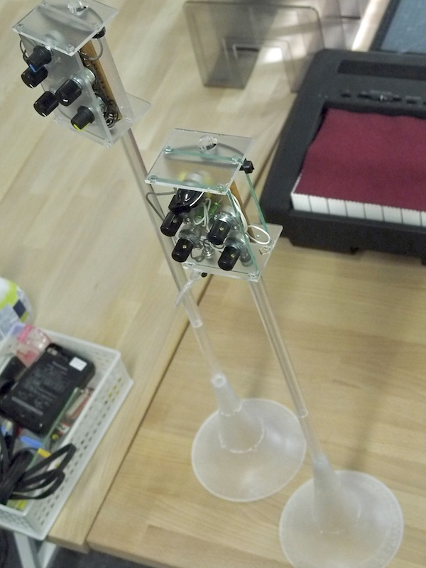

# 概要 {.unnumbered}

本研究では音を生成する手法をメディア考古学的視点に基づいて再考する3つの作品制作を行った。

研究の背景にはメディア考古学という過去のメディアにまつわる言説を調査することで直線的な歴史観を否定し異なる歴史の可能性を提示する研究アプローチの存在があり、音にまつわるメディア考古学研究が聴取に重きを置くのに対して本研究では音源、音を生成する仕組みについてメディア考古学的視点での調査とそれを元にした異なる音生成のあり方を探る作品制作を行った。

具体的なアプローチとして、まず物理モデリング合成という、実際の楽器をコンピューターで再現する手法を電子回路や共鳴器のような音響的要素で物理的に再実装、具現化するサウンドインスタレーション『Aphysical Unmodeling Instrument』の制作、展示を計4回行った。

また、オーディオフィードバックを発音原理とする、演奏に空間的要素が入り、既存の楽譜で記述不可能、またコンピューター上での再現が不可能な電子音響楽器『Exidiophone』の開発とそれを用いたパフォーマンスを行った。

最後に、音楽、更には時間の記述を再考するためのフィードバック構造を持つ、時間を分割する機能のみを持った電子計算機としての回路彫刻作品『Electronic Delay Time Automatic Calculator』の制作、展示を行った。

以上3作品それぞれの制作を経た考察を俯瞰して検討した上で、メディア考古学的アプローチとして3作品を改めて考察し、音の生成の方法の異なる可能性について議論する。

# 謝辞 {.unnumbered}

本研究は作品制作を中心としたもので、しかも展示や演奏を何度も繰り返すことでの考察を得るものだったため、実行にあたっては様々な人の協力なしには実現できませんでした。

まずはじめに、指導教官である城一裕准教授は作品制作に対する的確なコメントや、何度やっても支離滅裂なロジックを直せない筆者の研究発表や論文執筆に粘り強く付き合っていただいたことに何より感謝しています。またいくら片付けても片付かない研究室の机に目をつぶっていてくれた城研究室の皆にも大変感謝しています。

またデジタル・ファブリケーション機器の使用やその他制作にあたっての技術的なアドバイスを津田三朗さんをはじめとした大橋キャンパス工作工房スタッフのみなさま、テクニカルスタッフの伊藤慎一郎さんからいただきました。それから演奏の機会を提供してくれた薬院IAF SHOP*の佐藤恵一さん、水道橋ftarriの鈴木美幸さん、演奏企画を持ちかけていただいたすずえりさん、真木類さん、duennさん、中村弘二さん、共に演奏してくれた蓮沼執太フルフィルのみなさんがいなければ本研究は成り立ちませんでした。また何度も演奏に足を運んでいただき様々なコメントを寄せてくれたShuta Hirakiさん、高橋聡太さんにもお礼を申し上げます。それから、演奏イベント・団体の「緑青」を共に企画運営してくれた増田義基、岡千穂との音楽の議論を通じて本論文に直接現れないものも含めて様々な洞察を得ることが出来ました。またSchool for Poetic ComputationのFall 2018 Classの中で関わってくれた、特に講師のTaeyoon Choi, Zachaly Lieberman, Lauren Gardner, Sam Levinge, American Artist, CW&T, それからゲスト講師だったMelanie Hoffをはじめ、TAや同じ10週間を過ごした同期の生徒、卒業生のみなさまのおかげで作品制作に新たな視点を得ることが出来ました。

また、かけはし芸術文化振興財団には研究の後半、2018年度の奨学生として経済的支援をいただきました。

そして何より、演奏や展示を実際に見てくれたみなさまのおかげで本研究が成立したものと思っています。大変ありがとうございました。

最後に、経済的な支援はもちろんいつまでたっても決まる気配のない進路に口を出すこともなく、時に的確なアドバイスをしてくれた両親の松浦知之と松浦美穂になによりの感謝をここに記します。

# 序論

## はじめに

本研究はメディア考古学のアプローチからの音に関わる3つの作品制作を通じて、音の生成と記述を考察するも。より具体的にはレコードやラジオといった音響再生産技術とコンピューターを用いた音の生成の歴史をたどることで、 音を人間の聴取と知覚に基づくのではない、音の生成と記述について再考し、音を作り出すという行為の今日における意義を問い直すものである。

> *テクノロジーは常にミュージシャンを刺激する新しい種類の音を生み出してきました―歪んだ音からシンセサイザーの電子音まで。今日、機械学習の進歩とニューラル・ネットワークは音生成の新たな可能性を切り開きました。*(Google NSynth Super Webページより、筆者訳[@Google2018])

この文章はGoogle社が2017年に発表したNSynthという、機械学習技術を音の生成に用いた新しいシンセサイザーの謳い文句だ。

新しい技術を用いれば新しい表現が開拓できる。こうした言い回しは新しい楽器の宣伝文句に常に用いられてきたもので、筆者自身そういった思考を持って音楽プログラミングを始めた。しかし最新のツールやプログラミング言語、ライブラリなどを追いかけ追いつこうとすることはツールを使おうとしているはずなのに使わされている様な感覚を時に生む。新しい技術というときにその新しさとは誰が決めたものなのかと考えるようになり、コンピュータ内で完結する作曲や演奏に限界を感じ始めた。

確かに歴史上、信号処理や音声合成などのデジタル音響技術は例えば録音した歌声の音高を自然に後から編集させる技術や一度足し合わせてしまった音源同士を後から分離できる技術など、アナログ技術だけでは不可能だったことを可能にしてきた。

その一方で常に新しい技術が新しい表現を生み出してきたのかといえばそうではない。例えばシンセサイザーを世に広めたのはクラシック音楽の演奏を収めたアルバムだったように、新しい表現を生むと言いながらも既存の表現を新しい技術で再生産することが繰り返し行われてきた。

> *クララ・ロックモアはまるで彼女自身が肉声で歌っているかのようにテルミンを演奏するほどの名手だったが、ロマン派の名曲などから一歩も離れようとしなかった。トラウトニウムのすべてを知り尽した作曲家/演奏家であったオスカー・ザラは、件の楽器のためにいくつもの曲を書いたが、どれも保守的な音楽という印象を免れない。モーグ・シンセサイザーの名を世界に知らしめたウォルター（ウェンディ）・カーロスの出世作は”Swithced on Bach”だった。その数年後には日本の冨田勲が『月の光』を発表している[^tomita]。どれも多くの人に感銘を与え、演奏や作曲、編曲の技が優れているにもかかわらず、ここには新しいものは何もない。*[@Murai2005,"技術と音楽についての自動筆記風覚書"]

[^tomita]: 「Switched on Bach』も『月の光』もクラシック音楽をシンセサイザーで演奏したもの。

もちろんシンセサイザーでバッハはこれまで演奏されてこなかったという意味での新規性はあるとは言える。逆に言えば新規性だけがあって、必然性は無い。既存の楽器では絶対に作れないがシンセサイザーでは作れる音楽ではない。この新規性は既存のものを再生産した結果の副作用としての新規性、ということもできるだろう。

他方、そうでない新規性として、アーティストがそうした楽器や新しいテクノロジーを適当に弄り回しているうちに生まれる表現、技術の誤用とも呼べるものがある。これはCasconeがデジタルフォーマットの誤用を意図的に用いるグリッチを始めとした表現に対してもちいた「失敗の美学」という考え方[@Cascone2005]や、サーキットベンディングという、音の出るおもちゃの電子回路を知識のないままに実験しながら繋ぎ変えることで新しい楽器として使用するような試みにも通じる[@Hertz2012]。ただ、こうした手法は基本的にノイズミュージックと対になって語られる事にも触れるべきだろう。楽器を壊しておかしな音を出させるのだからその定義からしてノイズと化すのは仕方なく思える。

ではこうした誤用による新規性の全てがノイズとして葬り去られてきたのかと言うとそうではない。例えばオーディオフィードバック―ハウリングと呼ばれる、スピーカーから出た音がマイクと増幅器を通じてフィードバックし持続音を出す現象は望まれざるものとして回避するための研究がいくつも成されている一方で、エレキギターにおいてはJimi Hendrixを始めとした数々のミュージシャンが演奏法の一つとして用いてきた歴史がある[@Eck2017] (3章で詳説する)。

このエレキギターのハウリングは電気増幅という技術の進展を背景に生まれたのは確かだが、技術が進歩したからこの表現が生まれたという直接的な因果関係では無いのは確かだろう。技術が一方的に新しい表現を生むのでも、表現者の要請が新しい道具を開発させるのでも無い。

そうした考えをもとにして、本研究は基本的に過去に起きたある技術の発展に伴う表現の変化とその受容の歴史を調べ直した上で、あり得る表現の形を作品として提示するというプロセスを取る。こうした立場の参考となる研究アプローチに、メディア考古学と呼ばれる研究手法がある。

## メディア考古学

メディア考古学とは学問の名前ではなく、研究のアプローチである。日本でメディア考古学を紹介してきた研究者の太田純貴によれば、その最大限一般化された定義は「日々増殖するメディアテクノロジーによって、埋没してしまったメディア文化やそれがもたらす経験についての言説の掘り起こし」であり、「大半のメディア考古学者たちに共通するのは、メディア文化についての規範的で正統的な物語を突き抜けて「掘り下げて」、省かれたものや的外れに終わった解釈を指摘すること」だという[@Ohta2016]。

こうしたアプローチは研究者に、また当人が自認して行う場合に限らず、例えばHuhtamoがアーティストの行っている作品制作をメディア考古学的アプローチである、と指摘するといった例もある[@Huhtamo2015]。

同じように代表的なメディア考古学の研究者であるHertzとParikkaはサーキットベンディングは一つのメディア考古学的実践として捉えることができるという。計画的廃用化という、内部をブラックボックス化しユーザーが自分でメンテナンスを不可能にしたり、サービスをある期間で打ち切ることで新しい製品を買わせることで技術を合法的に殺す、古びさせるという方法のカウンターとして、素人が古びた装置を知識なく改造し異なる道具、例えば楽器に変えてしまうという方法を取ることで、その装置は無理やり生き返らされた”ゾンビ・メディア”として復活し、技術発展の直線的な歴史を否定する働きを持つとする[@Hertz2012]。{+@fig:parikka-blackbox}はそうしたプロセスを概念化したものである。

![[@Hertz2012]より、サーキットベンディングの概念的な説明図。左上：メディアが新しい時の正常に動作する状態、右上、メディアが故障し正常に動作しなくなった状態、左下：壊れたメディアを開けてもそれは専門家の領域であり修理することができない、右下：しかしその領域を間違えた接続を行うことで別の機能をもつものとして再生させる](../img/parikka-blackbox.png){width=100% #fig:parikka-blackbox}

サーキットベンディング自体はメディア考古学という言葉が生まれるよりも前の70年代のDIYアマチュア電子工作文化を背景にしており、David TudorやGordon Mummaといった(技術の専門でない)現代音楽の作曲家が電子回路を自分で作ることで音楽作品とする様な文脈にも結び付けられる[@Collins2013, p48]。

Huhtamoがメディア考古学的なアプローチを取るアーティストの代表例のPaul Demarinisは、Tudorが始め彼の死後現在まで続いている、自身で回路を構成して音楽を作るグループ”Composer Inside Electronics”にも所属していた人物で、DIYエレクトロニクスと音楽の文脈を受け継ぎながらも、より綿密なリサーチに基づく高度な技術を用いて古びたメディアを違う文脈上に再生させる作品制作を行っている。Demarinisはレコードプレイヤーの再発明や、炎を音声再生のメディウムとして用いる装置などを過去の研究論文や特許などからの綿密なリサーチに基づき制作するが、こうした研究は装置の調査だけにとどまらず、例えば近年の作品『Jiffy Pop(2014)』『Tympanic Alley(2015)』では人間の聴覚系とそれに関連する脳活動に関するリサーチをもとに作ってもいる[@Demarinis2015]。Huhtamoは彼のこのような制作スタイルをThinkとTinker―いじくり回すという意味のアマチュア電子工作ではよく使われる言葉とをあわせた”Thinkerer”と呼び、ゾンビ・メディアと同様直線的な歴史を否定するという観点から見ている。こうしたアプローチと関連するものとして、アーティストであり研究者でもある城らはDIYカルチャーの延長線上にもあるパーソナルファブリケーションの普及とメディア考古学を背景にして、あり得たかもしれないメディアの発展の形―例えばレーザーカッターでベクター画像から直接レコードの波形を刻む、オーディオプレイヤーに接続されたコイルを、耳に取り付けた磁石に近づけることで、軟骨伝導によって音を聴く装置など―を探るプロジェクト『車輪の再発明』という、作品とツールの中間点をつくるプロジェクトを行っている[@Jo2013]。

## 音を生み出す仕組み

本研究ではメディア考古学の視点で音を生成する技術を顧みる。

メディア考古学の手法で音響研究（サウンド・スタディーズ）を行うJonathan Sterneは『聞こえ来る過去(2003)』でフォノグラフ（レコードの原型）を「人の代わりに聞く機械[@Sterne2015,p47]」として耳を対象にした解剖学や生理学が音響複製技術を立ち上げたとする。

その議論を押さえた上で、聴覚文化論研究者の秋吉康晴はフォノグラフを発明者のエジソンが「話す機械」として捉えていたことや、例えばレコードの一大会社の名前が「ビクター・トーキングマシン・カンパニー」であったことを挙げ耳ではなく声という視点で音響研究を今一度捉え直している[@Akiyoshi2015;@Akiyoshi2016]。

他にも、Sterneは「MP3」(2012)の中では聴覚をモデル化することで聞こえない音をデータから取り除くものとして知覚符号化が文化に与えた影響に着目している[@Sterne2006;@Sterne2012]が同じく音声圧縮のテクノロジーである線形予測符号(Linear Predictive Coding, 通称LPC)が人間の発声の仕組みをモデル化することで電話通信回線などの声の伝送のための効率的な符号化実現をしてきた[@Moriya2017]ことには触れていない。

聴覚の研究と同時に進んでいた発音、音の生成の研究は人間の体にとどまらず、楽器の発音原理をコンピューター上で模倣しようとする物理モデリング合成というシンセサイザーのいち手法にも発展している。しかしここで、楽器は音楽のために用いられるものであり究極の正しさというものは存在しないという点から技術の誤用的逸脱が多々発生し、しかもそれはあくまでも正当な発展の延長のように語られる[@Borin1992 など。詳しくは2章で見る]という点で特異である。

また、スピーカーという聴覚に基づいて聞こえの音をそのまま再現する透明なメディアを先述したサーキットベンディング、グリッチのように誤用することで、人間とのインタラクションが発生しその存在が前景化され、オルタナティブな音を生成する仕組みに変化させる。Eckは『Between Air and Electricity』(2017)で実験音楽史に加えてSterneの音響研究の視点も踏まえた上でスピーカーやマイクロフォンが楽器として扱われてきた作例を多数挙げながら歴史化を試みている[@Eck2017]。

本研究ではこうした歴史的背景を踏まえ、**知覚を元にして発展してきたテクノロジーをメディア考古学的視点で掘り下げ、異なる音生成のあり方を探る**、3つの作品制作を行った。

1つ目は物理モデリング合成という、実際の楽器を模倣するためのテクノロジーがリアルでない音を生成するのに多数使われていることを背景にして、Whirlwindという実際の楽器ではありえない複数の管楽器を合成したモデルを、コンピューター上ではなくアナログ電気回路やスピーカー、マイクロフォン、音響共鳴器といった物理的オブジェクトで再現実化させるインスタレーション『Aphysical Unmodeling Instrument』である。

2つ目は、オーディオフィードバックを基本発音原理としてスピーカーというやマイクロフォンの楽器性を増大させる、またその仕組みからコンピューター上での完全な再現が不可能な電子音響楽器『Exidiophone』である。

3つ目は、コンピューターでの音楽生成黎明期のソフトウェアとハードウェアの境界の曖昧さに注目し、音をコンピューター上で表現、生成することの最小限の状態を考えるための時間を区切るという機能だけを持つ原始的なコンピューターとしての回路彫刻作品『EDTAC』である。

## 本論文の構成

本論文の以降の構成を{+@fig:structure}に示した。

{width=70% #fig:structure}

本章ではメディア考古学という研究アプローチと、音を生成する仕組みへの着目という3つの作品の背景となる背景を説明した。

2、3、4章では具体的に実践した3つのプロジェクトについて一つずつ解説する。それぞれのプロジェクトは時期的にオーバーラップする部分があるので以下に実際の制作のタイムラインを示した({+@fig:timeline})。

2章ではインスタレーション作品『Aphysical Unmodeling Instrument』を、その背景となる物理モデリング合成の歴史や非リアルな目的での利用という歴史を追った上で、実際の作品の内容の解説と、全4回行った展示の様子とその内容と変遷を見ていく。その上で制作を通して得られた経験と背景とを合わせた考察を行う。

3章では電子音響楽器『Exidiophone』を、オーディオフィードバックという現象、Eckがまとめたスピーカーとマイクロフォンの楽器としての利用、またオーディオフィードバックに限らないフィードバックシステムを音作品に用いた例などを背景として押さえた上で、試作も含めた計11回の演奏を通した楽器の開発とアップデートの過程を見ていく。そして演奏を通して当初の思想と変化した部分や、先行作品との比較を通じた考察を行う。

4章では『EDTAC(Electronic Delay Time Automatic Calculator)』を、コンピューターを用いて音を生成してきた最初期の例を追うと共に、この作品の表現形態であった音を出す回路彫刻の先行例についても触れる。その後制作過程と発表の過程をまとめた上で考察を行う。

5章では、3つの作品制作それぞれを通じて得られた経験を俯瞰しての考察、またメディア考古学的研究という視点、聴覚でない音の記述方法の視点という序論で挙げた点についてどういった現状の結論が得られたかについて議論する。

6章ではそれまでの議論の内容を要約した上で、さらなる議論の可能性として言える事を挙げ、また今後の作品制作の展望について述べ、本研究のまとめとする。

{#fig:timeline width=100%}

# Aphysical Unmodeling Instrument

本章ではインスタレーション作品「Aphysical Unmodeling Instrument」の作品の解説と、その制作と展示のプロセスを詳しく記す。

「Aphysical Unmodeling Instrument」は楽器の音色を計算で模倣する物理モデリング合成という手法を、コンピュータを用いて実装するのではなく、スピーカーやマイクロフォン、共鳴器や照明、光センサーなど物理的なオブジェクトの組み合わせで実装するサウンドインスタレーションである。

この作品は90年代に作られたWhirlwindという、クラリネット・フルート・トランペットの3つの管楽器を合体させた形の計算モデルを再実装する。

展示は2017年から2018年にかけて合計4回行われ、それぞれ和室、大学の教室、無響室、音楽ホールのロビーという音響的にも設置環境的にも異なる場所で展示された。すべての展示で元になっているモデルは同じだが、部屋の条件に合わせて具体的な実装も異なっている。

本章ではまず、本作品の背景となる技術、物理モデリング合成の歴史と手法を概観する。その上で、物理モデリング合成が、実際の楽器をコンピューター上で模倣するという目的を持つにも関わらず実際には非現実的な音作りに多数応用されており、その例を見ていく。また例のモデル、モデリングという行為の定義の議論が科学哲学の領域においてなされていることにも触れる。

その次に、非現実的な物理モデルの一つでもあり、作中で直接参照したCookによるメタ管楽器モデルWhirlwindを説明した上で本作「Aphysical Unmodeling Instrument」が具体的に何を行う作品なのか解説する。

そして実際に「Aphysical Unmodeling Instrument」の4回の展示の実装と、各展示における部分ごとの変遷を詳説する。最終的に、4回の展示を通して得られたことについて議論し、まとめる。

## 背景

### 物理モデリング合成

{#fig:physicalmodel-history width=100%}

物理モデリング合成とは実際の楽器の発音機構を計算で模倣する手法である。{+@fig:physicalmodel-history}はBilbaoによる物理モデリング合成の手法の歴史を概観したものである[@Bilbao2009]。

1965年頃からRissetとMathewsは音響心理研究と主観評価法の発展を背景にしてコンピューターを用いた楽器音の分析と再合成の研究を行っている[@Risset1965; @Mathews1969]。こうした研究を元に加算合成、ウェーブテーブル合成、周波数変調合成といった手法で実際の楽器音や人間の声をコンピューター上で再現する試みが数多く行われてきた[@Roads1996]。

Smithはこうした手法と物理モデリング合成と違いは、前者が**人間の聴覚に基づいて音をモデル化**しているのに対して、物理モデリング合成は**音源の発音の仕組みをモデル化**していることだと述べている[@OSmithIII2004;  @smith2010pasp]。

もっとも基礎的な手法は、力学モデルを微分方程式として作り、その解を求め、離散化して計算機に実装するものである。例えばバネの片方の端におもりが付いていて、片方が壁に固定されているときバネを引っ張ると質点は一定の間隔で揺れる。これは一般に
$$
m \frac{d^2x(t)}{dt^2} = -kx(t)
$$
$$
(ただしmはバネの先の質点の重さ、kはばね定数、x(t)は時間tにおけるバネの自然長からの伸び縮み)
$$

とモデル化され、この微分方程式は
$$
x(t) = Asin(\sqrt{\frac{k}{m}}t+\alpha)
$$
$$
(A,\alpha はx(0)および\frac{dx(0)}{dt}、すなわち初期位置と初期速度によって決定される。)
$$

と解くことができる。コンピューターの中で扱う場合はこれを
$$
x[n] = Asin(\sqrt{\frac{k}{m}}\frac{n}{f_s}+\alpha)
$$
$$
(f_sはサンプリング周波数:時間を1秒間に何回分割するかを表す)
$$

という数列ですれば表現できる。

この数式の中ではバネそのものの重さが0ということになっているし、質点は重さはあるが全く回転しない、理想的には体積が全く無い前提になっている。現実のバネは引っ張りすぎれば伸び切ってしまうので無限に伸ばせるわけではないし、ミクロ的に見ていけば現実のバネはkが完全に一定にはならない。なにより現実には空気抵抗やバネの中で伸び縮みのエネルギーが熱として消えていくので、振動はだんだんと減衰していき、いつかは止まる。しかし上述の計算モデルは無限に振動を続けることになる。つまり、正確ではないと言える。しかし、振動をはじめてから3秒後までの様子を計算で再現したくて、現実のバネも3秒後に振幅が最初の0.999倍程度までしか減衰していないとすれば、この数式はある程度バネのふるまいを表していて、有益に使うことができる。そのうえで、例えば弦をごく小さなバネが連結されたものと見立てる≒モデル化する事で弦の振動を新たに計算モデル化出来るので、これも有益だと言える。

ただこうした方法は微分方程式が立てられても解を直接求められないものが多く存在する。例えばバネの例では無限に伸ばせるわけではないということを考慮し、$-kx(t)$を$-(kx(t)+\beta x(t)^3 )$として復元力が段々と大きくなっていく様なモデル化をしたダフィング方程式がある。これは通常のバネの振動とほとんど似たような挙動をするであろうことはわかるが、直接は解くことは出来ない[@Yasuda2001]。

そうした時には微分方程式を直接解かないままに離散化し、時間ステップごとに一つ前の結果を計算に利用する、漸化式の形で直接計算するという方法が取られる。こうした方法がBilbaoの年表の中のDirect Simulationにあたるもので、物理学の分野で古くから研究が成されている。この手法は方程式さえ立ててしまえば（数値誤差からの限界はあるものの）どんなモデルでも理論上計算はできるというメリットが有る一方で、弦や膜の振動といった空間的な広がりを持つ波動のシミュレーションは、1単位時間に細かく分割された全ての点を計算する必要があるため計算コストが非常に高い。コンピューターの性能が上がった今日でもリアルタイムでの実行は[@Allen2015]のような例が出てきてはいるが少ない。

そうした理由から、80年代半ばより管や弦を進行波の反射や拡散といったよりマクロな視点でモデル化するデジタルウェーブガイド合成（又は単にウェーブガイド合成）、周波数成分を解析し、共鳴器を並列する形でモデル化するモード合成、式を一度時間的にも空間的にも周波数領域に変換し、離散化してから時間領域に戻す関数変換法などの方式が開発されてきている。

### リアルでない物理モデリング合成

物理モデリング合成は"実際の"楽器を模倣する手法と書いたが、実際にはそうでない目的に多く用いられている。それは最初期のMathewsらの研究と比較的近年のRabensteinらの研究の締めくくりが以下のようになっていることにも伺えるだろう。

> *コンピューターの音楽的価値は本物の楽器にできる事を全て複製できるという能力はもちろんのこと、実際の楽器音を包括し、超えて拡張された音の種類を生み出せることにあります。[@Mathews1969,筆者訳]*

> 音響の分野において、関数変換法を応用することで音響合成の分野を実存する楽器だけにとどまらず、現実には実現不可能な構造の物理的な振動の特性を直接シミュレーションするまでに広げています。　[@Trautman2003,筆者訳]

この様なリアルを目指しつつ非リアルも求める指向を、Borinらは物理的リアルさはあくまで発想の源でしか無いとして、**疑似物理モデリング**という言葉を用いて説明している[@Borin1992]。ただ、例えば商用のシンセサイザーなどの説明においては、物理モデリングのまず第一のメリットや新規性としてPCMなどでは不可能な楽器のリアルな再現というのを挙げた上で非リアルな応用がさらなる魅力として語られる傾向がある。

商用のシンセサイザーとしてはじめて物理モデリング音源を採用したYAMAHA VL1のユーザーマニュアルにはこの様な文言が見られる[@vl1perfectguide1993]。

> *VA音源は、物理モデルによる音の合成という今までになかった音源方式をとっています。これはいわば、音源内に仮想的に作りあげたアコースティック楽器を使って音づくりをしているわけです。ですからその音は、息使いや音の存在感、そして音と音のつながりの自然さなどの面で、AWM2音源よりもリアルです。(10p)*

> *VA音源では、まずインストゥルメントという部分で物理モデルの管の長さやリードの形などを自由に変形することによって、現実には作ることも演奏することも不可能な新しいアコースティック楽器を創造することが可能です。(7p)*

リアルさを強調する一方で現実には作れない音が出せることも新規性として挙げていることがわかる。また1996年のコンピューター・ミュージック・マガジンの物理モデリング音源を特集した号では

> *DTM用の音源に限らず、現在あるほとんどのシンセサイザがPCM方式となっています。*
>
> *音源は音質的にも非常にクリアで,かつリアルなサウンドを作り出してくれますが,このPCMにも限界があります。*
>
> *一言でいえば表情の乏しさとでもいうのでしょうか。*
>
> *これを,シミュレーションというまったく違うアプローチで解決してくれるのが物理音源なのです。(p2)*

> *しかし,ここでもうお気付きの方もいらっしゃるかもしれませんが,このような組み合わせによるシミュレーションですので,世の中には存在しない,マウスピースと弦といった組み合わせも可能になってきます。ちょっと妙ではありますが,電子音ではない,アコースティックな音が作れるというのが,この物理音源の魅力でもあるのです。(p3~p4)*

と、リアルさとありえない楽器という一見対立する2つをどちらも魅力として語っていることから、開発側だけでなくユーザー側もこうした宣伝文句をある程度受け入れていた事が伺える[@cmmagazine1996]。

より意図的に物理モデリングを実際の楽器の再現以外に用いたものの代表例としてフランスの音響研究所ACROE-ICAでCadozらによって開発されてきたCORDIS-ANIMAシステムがある。これを用いて作られた作品『pico..TERA』は作曲という行為自体をバネ、おもり、ダンパのような物理的な相互作用のモデルを組み立てるものとしたものだ[@Cadoz2002]。また近年の類似したシステムとして、同様にバネ、おもり、ダンパをグラフィカルに組み合わせて仮想的な楽器を作るソフトウェアRurataeがある[@allen2014ruratae]。

現在販売されている物理モデリング合成を用いたシンセサイザーの中でこうした非リアルな応用をしている製品として、Applied Acoustic Systems(A|A|S)社のソフトウェア音源でウェーブガイド合成がベースと思われる弦楽器のモデルで、本物の弦楽器にはありえないパラメーター設定が可能なString Studio VS-2、モード合成をベースにした2種類の共鳴器を合成できる抽象的な打楽器Chromaphone、また同社とIntellijel Design社が共同で開発したユーロラック規格のハードウェア音源モジュールPlonkなどがある[@aas2017web; @IntellijelDesignsInc2017]。

こうした物理モデリング合成の非リアルへの展開をまとめた文献は少ないが、Kojsらは作曲などの作品に応用した例をアカデミックな領域中心であるものの整理した[@Kojs2007]。その中で応用の方向性をパラメーターを広げて使う**拡張(Extended)**、2つ以上の楽器や共鳴器、発音体を組み合わせる**融合(Hybrid)**、バネやおもりといった物理要素を組み合わせる**抽象(Abstract)**という3種類に分類し整理した({+@fig:kojs-table})。

VL1のような例は融合の典型だと言えよう。A|A|S社のシンセサイザーは、例えばChromaphoneは融合型でもあるが、材質の金属らしさを表すパラメータをリアルタイムに可変でき、拡張型の要素も同時に持つと考えられ、完全に分類できるわけではないがある志向性のタグ付けには使えるだろう。

{#fig:kojs-table width=85%}

最後に、これまで挙げた例はコンピューター上での物理モデリングの応用だったが、全く別種の応用として現実の楽器開発に技術を逆輸入したYAMAHAの管楽器Venovaを挙げておく。元々サクソフォンなどの円錐管の周波数特性を再現するために、仮想的に2つに枝分かれした円筒として扱うことで効率的な計算を可能にする分岐管構造という技術があり[@masuda2011pipe]、これを応用してVenovaはサクソフォンのような音色を保ちつつ楽器を小型化する目的で、実際に分岐した円筒管の構造を持つ[@Yamaha2017]。

### モデリングに関する科学哲学に置ける議論

こうした物理モデリングの非リアルな応用の一つの補助線となりうる議論として、そもそもモデル、モデリング、モデル化という言葉が何を指しているのかが統一されていないという問題が科学哲学の文脈で議論されている。

Giereは1988年の著作の中でこういった議論を行っている。本章はじめに例としてあげたバネとおもりが摩擦や空気抵抗を無視して考えることができるのは科学者というコミュニティの中で共有された社会的に組みあげられた存在だという。そしてこの様な理想化されたシステムそのものを(理論)モデルと呼ぶと定義した。またモデル構築の中で行われる、例えば我々が$ma = -kx$という数式を見たときに$x$という値をおもりの位置であると認識することを**解釈**と、逆に現実のおもりとバネについて解析をするなかでおもりの位置を$x$と名付けることを**特定**と呼んでいる[@Giere1988]。ここでGiereはモデルそのものと、それを定義づけるテキストや数式をモデルそのものと分けている。{+@fig:giere-model}はそうしたモデル、そのテキスト、実際のシステムの関係性を表したものだ。

![[@Giere1988]より引用した、モデルとその記述、現実のシステムの関係性を表した図](../img/giere-model.png){#fig:giere-model width=70%}

Godfley-Smithはこうした議論を踏まえた上で科学者がモデルという言葉を用いる時、モデルを表すテキスト(Giereの図のSet of Statements)を表しているのか、モデルそのもの(図におけるModel)を表しているのか、またそれがある固有のモデルに関するものなのか複数の物を指しているのかはっきりしない、様々なケースがあることを指摘する[@Godfrey-Smith2009]。Godfley-Smithは同時にモデルと実世界の関係性は小説の中の世界など、フィクションのようなものではないかという説を提案している。

Wisebergは特定の対象のないモデリングというものも存在すると議論する。これは3種類あり、1つ目はいくつかのモデルを一般化した汎化モデル（例えば、$ma=-kx$という数式は電気回路においてコンデンサとコイルの共振を表す式にも使われるが、これらは一般化して調和振動子と呼ばれる）、2つ目は現実ではありえない条件のモデルを作ることで逆説的に現実世界へのヒントを得るもの、3つ目は純粋な数学的分析に近いが時に現実世界への洞察を与えてくれるもの(セルオートマトンという、ピクセルをシンプルな遷移規則で変化させるモデルが例として挙げられている)である[@Wiseberg2017]。

こうした議論が活発なのは生物学や化学の分野だが、非リアルな物理モデリング合成の例も対象のモデリングという見方ができるだろう。

### Cookによるメタ管楽器モデルWhirlwind

Whirlwindはウェーブガイド合成でモデリングされたトランペット、フルート、クラリネットの計算モデルを和集合的に合体させたものである[@cook1992meta]。元々の3つのモデルはすべてウェーブガイド合成という手法をベースにしていて、フィルタ、遅延を含むフィードバックという点で共通している。HIRNという専用のコントローラとともに使うことで、金管楽器と木管楽器の音色をモーフィングしたような演奏が出来るとされている。

{#fig:whirlwind width=100%}

{+@fig:whirlwind}はWhirlwindの処理を図解したものである。図の左側、コントローラに入力された息は、その強さ(Envelope)と、息の強さに応じて変化する雑音(Noise)として扱われる。それ以外の部分は、仮想的な管楽器の中で音波が伝達、反射される様子をフィードバックループとしてモデル化している。Delay1とDelay2は管の長さと木管楽器のトーンホールの位置に応じて変化する遅延を表す。Delay3はフルートにおける唄口から左側の頭部管端での反射を表す。$+$ は音波の加算を表す。Nonlinearityは唇やリードの振動で生じる歪を多項式 $ax^3+bx^2+cx$ と単純化して表現している。Resonator(Lip)は演奏者の唇を単一の固有振動数を持つ共鳴器として、双二次フィルタでモデル化している。Delay1,2の手前の1pole Filterは管の端で音波が反射するときに高周波数成分が減衰するのをモデル化したものだ。

Resonator(Bore)は、元の3つのモデルには存在しないにも関わらずWhirlwindでは追加されている双二次フィルタである。筆者はこれは管楽器のベル部分の持つ周波数特性を表現するものとして配置していると推測し(Bore)と名前を付けたが、実際の詳しい用途は不明である。

## 作品概要

Aphysical Unmodeling InstrumentはWhirlwindをコンピューターではなく物理的なオブジェクトの組み合わせで実装するサウンドインスタレーションである。

例えば{+@fig:whirlwind}でDelayと書かれた遅延処理はスピーカーとマイクの組み合わせで、音速と距離に応じた音波の遅れで置き換え、加算は複数のスピーカーの音をマイクで拾う、電気的にミックスする、フィルターは音響的な共鳴器を用いるなどデジタルのアルゴリズムとして記述されているものをアナログな領域で実行する。

インプットやユーザーインターフェース（音程）の操作は例えば風で操作されたり、モビールのようにオブジェクトが自律的に動くことで変化したりするようになっていて、人を介さずに音を発音すると同時に、人の介入によってもパラメーターが変化する部分的なインタラクションを含む。

## 展示内容とその変遷

本章では2017年10月から2018年6月の間に計4回展示を行った「Aphysical Unmodeling Instrument」の各展示での様子を時系列で説明する。

1. 奈良・町家の芸術祭はならぁと 2017(2017年10月)
2. インターカレッジ・ソニックアーツフェスティバル2017(2017年12月)
3. FREQ2018  -21世紀初頭の音と音楽- (2018年3月)
4. New Interfaces for Musical Expression 2018(2018年6月)

### 事前実験

作品の制作に際し、コンピュータ上でWhirlwindを再実装した。この実装には音響処理言語Faust[^faust]およびCycling' 74 Maxを使用し[@matsuura2017whirlwind]、エンベロープなどの演奏パラメータを変更した際の音色の変化を確認した。

[^faust]:フランスの音響研究所GRAMEの開発する関数型音声処理プログラミング言語。C++を中心にMaxやWebブラウザなど様々なプラットフォーム上で実行可能なのが特徴。<http://faust.grame.fr>

次にディレイ部分のみをスピーカーによる空気伝播に置き換える実験を九州大学大橋キャンパスの残響可変室にて行った。オーディオインターフェースの入出力における遅延を考慮しその音速に応じた遅延時間を差し引いてマイクとスピーカーの距離を設定したところ、ソフトウェア上での再実装と近似した音色が出ることを確認した({+@fig:aui-test}、2018年10月6日)。

{#fig:aui-test width=70%}

その後、遅延以外の部分も電気回路など物理的なオブジェクトとして実装するテストを行い、はならぁとでの展示内容を具体的に決定した。

### 奈良・町家の芸術祭 はならぁと ぷらす2017

{#fig:aui_hanarart width=100%}

{width=100% #fig:aui-hanarart-diagram}

奈良・町家の芸術祭はならぁと 2017のうち、10月27日から 11月5日にかけて開催された「はならぁと ぷらす」企画内[^hanarart]、橿原エリア（八木札の辻ゾーン)公募作家として、八木札の辻交流館2階にて展示した。展示環境の制約として、会場が文化財に指定されているため釘やテープなどを壁に使用できないこと、運搬の都合上持ち込めたスタンド類に限りがあった事などから会場に常備されていた鴨居フック(手回しネジでクランプのように上下から挟み込むフック)を積極的に使用し、ケーブルなどをフックに直接吊ったりテグスやタコ糸をフックに引っ掛け、そこからLEDなどを固定するなどの設置方法を取った。

[^hanarart]: https://hanarart.jp/2017/archives/2185

以下、各計算要素の置き換えを詳しく見ていく。

#### 実装

仮想の管楽器における息の強さとして定義されている**エンベロープ**は計算モデルの外側のパラメータであるが、本作品ではこれも計算と同様置き換え方は自由なものと捉え、モーターの軸に風車を繋ぎ、その回転速度に応じた電圧の変化をエンベロープとして取り扱っている({+@fig:aui_hanarart}最手前)。通常は窓を開けた状態で風を入力としていたが、風があまりない日は会場の扇風機を風車に当たるように首振りで使用していた。また会期後半は近隣への音漏れを対策して欲しいと要望があったので窓を閉める必要があり、これ以降はほぼ常時扇風機を利用した。

Whirlwindではホワイトノイズとして表現されている息を吹き込む際の**ノイズ**を、この時はモーターによって回転する紙テープのベルトにコンタクトマイクの付いた針をあてがうことで出力される雑音により置き換えている。厳密には擬似乱数しか作ることが出来ないデジタル処理ではなく、紙テープを擦る音を用いることで、有限な周期でループする機構から、その聞こえは殆ど雑音となるという状態を作り出している(+@fig:aui-nara-noise)。

{#fig:aui-nara-noise width=50%}

**加算**の殆どは各要素から流れる電気信号をミキサーによって合流させることで作られている。一部遅延と関わる部分では複数のスピーカーから単一のマイクに対して音を発することで加算を置き換えている({+@fig:aui-nara-main2})。

**遅延**は管体を進む音波の伝播遅延をスピーカーから出した音のマイクロフォンに到達するまでの伝播遅延により再現している。スピーカーの取り付けられた棒は風で水平にランダムに回転するので遅延時間が変化するが、同じスピーカーから2つのマイクにはそれぞれ同じ遅延時間で届く必要があるので、スピーカーの高さは2つのマイクの中間点になっている({+@fig:aui-nara-main2})。

{#fig:aui-nara-main2 width=50%}

**乗算**としてエンベロープに比例した音量を出力するためにLEDとCdSセルを用いている。エンベロープとしての電圧の変化に対応してLEDの明るさが変化し、その明るさの変化によってCdSセルの抵抗値が変化する。そのCdSセルにオーディオ信号を流すことで、LEDが光っている時は音量が大きくなり消えている時は小さくなるようにしている({+@fig:aui-nara-mult-light})。

{#fig:aui-nara-mult-light width=50%}

$ax+bx^2+cx^3$で表される**歪部分の乗算**の置き換えには前項のようなLEDとCdSセルの乗算機構では応答速度が遅いため適さない。そのため十分応答速度が早い素子であるダブルバランスドミキサICのNJM2594を用いて$ax+bx^2+cx^3$を記号的に置き換えた({+@fig:aui-nara-mult2})。

{#fig:aui-nara-mult2 width=50%}

唇の振動をモデル化した**共鳴器**の部分はマイクとスピーカーの間をモビールの要領でランダムに動く異なる長さの紙筒に置き換えた({+@fig:aui_hanarart}手前側)。管体端での音波の反射の際の拡散を表す**高域減衰フィルタ**はスピーカーの手前に紙を垂らすことで、高域はある程度紙で反射され減衰するような置き換えを行った({+@fig:aui-nara-main2})。

#### 実際の音、置き換え間違え

以上のような置き換えで風が吹いた時に風車が回り、LEDを点灯させマイクからの信号の音量を変化させ、持続音が鳴る。実質的な音のなる仕組みはオーディオフィードバック（ハウリング、詳しくは次章を参考）と捉えることができる。実際に会場での音の聞こえがあたかも管楽器のようだったかというと、主観的にあまりそうは聞こえなかった。観客の一部からフルートや尺八のように聞こえたという声もあったが、これもコンセプトを話すなかで出てきた意見なので、そこに引っ張られている可能性もある。

またこの中での置き換えでは共鳴と非線形歪の順番が逆になっていることに後から気がついた。ソフトウェア上の実装で順番を入れ替えた所音色そのものには大きな変化は感じられなかったが、発振するときのパラメーターの変化などは見られたので以後で修正することにした。

### インターカレッジ・ソニックアーツフェスティバル2017

{#fig:aui_icsaf width=100%}

{#fig:aui-icsaf-diagram width=100%}

2017年12月15日、16日に昭和音楽大学にて開催されたインターカレッジ・ソニックアーツフェスティバル(以下ICSAF)2017で、一般教室の中で展示した[^icsaf2017]。

[^icsaf2017]: http://ic.jssa.info/

この会場でも壁に対してなにかを固定することが出来ず、さらに天井などから物を吊り下げることも出来なかったため、マイクスタンドを複数利用し、そこからスピーカーなどを吊り下げるようにした。

#### 実装

この展示では、**エンベロープ**はCD、2つの光センサー(CdS)をマイクロフォンスタンドから吊り下げ、机から2つのLED照明を吊り下げることで置き換えた({+@fig:icsaf1})。片方の光センサはエンベロープとして、片方は共鳴器の周波数を変える仮想の唇の締め具合のパラメーターとして利用している。CDのは風などで不確定に回転し、照明からの光を反射し光センサの値を変化させる。

{#fig:icsaf1 width=50%}

**ノイズ**はポータブルラジオをチューニングしない状態で使用し({+@fig:icsaf2}左)、接続されたイヤホンをマイクロフォンの先端に括り付ける形で設置している。

{#fig:icsaf2 width=50%}

**遅延**、**加算**、**乗算**ははならぁとでの展示を同じ置き換えを用いた。

**共鳴器**はプラスチック製のタンクにアクリルパイプを取り付けた共鳴器に小型マイクを設置するで置き換えている({+@fig:icsaf2}右)。光センサーがポンプを制御しタンク内の水の容量を変えることで、タンク内の共振周波数を変える。ここで、はならぁとの展示で逆になっていた非線形歪と共鳴の順番は修正されている。

**高域減衰フィルタ**として紙を実装していた部分は記号的な役割以上の効果が実感できずそもそもスピーカーの周波数特性として高域があまり出ていなかったためこの展示以降では省略している。

#### 実際の音

この展示に置いて共鳴と歪の順番が逆になっていた問題を始め、前回正しく実装出来ていなかった部分が修正されたものの実際の音の聞こえはオーディオフィードバックの音以上に特殊なものにはならなかった。

### FREQ2018 21世紀初頭の音と音楽

{#fig:aui_freq width=100%}

{#fig:freq-diagram width=100%}

2018年3月29日、30日に九州大学大橋キャンパス音響特殊棟で、筆者が所属する城研究室が主催したイベント「FREQ2018 21世紀初頭の音と音楽」（以下FREQ2018）の中で音響特殊棟無響室の中で展示した。

#### 実装

前2回の展示ではスタンドでマイクロフォンを2つ縦に並ぶように設置し、その中間の高さに2つのスピーカーが吊り下げられ回転するようになっていたが、この展示ではスピーカーとマイクロフォンの位置関係が逆転している。これは、前回まで使用していた小型スピーカーの特性が悪いことから別の機種を使用することにしたものの、天井から吊り下げるには重すぎたことからマイクロフォンの方を吊り下げることにしたという理由がある。

**エンベロープ**ICSAF2017での展示同様、2つの光センサ、2つのLED照明を用いているが、反射板としてCDではなくA4大のアルミ板を用いている。ここで、このアルミ板は反射板であると同時にそれぞれのマイクロフォンと天秤のように重さの釣り合いを取る機能もある。またはじめはICSAFのときのように自律的な移動だけで音を鳴らしたかったが、完全な密室である無響室においては吊り下げたものの自律的な回転がほとんど起きなかったため扇風機を使用している。扇風機は片方の光センサが一定の明るさを超えるとオン・オフが切り替わる様になっている。

**ノイズ・遅延・乗算**はICSAF2017と同様の置き換えを行った。

**加算**は電気的加算という点では同じだが、ケーブルをつなぐことでの加算から一部はミキサーを使用しての加算となっている。

**共鳴器**もICSAF2017同様プラスチックタンクとアクリルパイプを用いたが、共鳴周波数の変更は名刺大の画用紙を糸で左右から吊り下げ、風で自由に動くことでパイプの開口面積を変える事で操作するかたちになっている({+@fig:freq2018-res})。

{width=50% #fig:freq2018-res}

#### 実際の音

無響室という部屋の反響によるスピーカー-マイク間の特性の変化を最小限に抑えられる環境もあってか、この時は筆者の主観では木管楽器に近い音が聞こえた。しかしイベント共演者の鈴木英倫子さん曰く「『この辺が管楽器に聞こえるはずなんです』、と熱心に説明してくれたものの、あまり管楽器に聞こえない」[^suzueri]とう感想だったため、客観的にはまだ聞こえの面で管楽器のようでは無かったと思われる。

[^suzueri]: https://twitter.com/suzueri/status/1013284455094472705

### New Interfaces for Musical Expression 2018

{#fig:aui-nime-prep width=70%}

{#fig:aui-nime2018 width=70%}

{width=100% #fig:aui-nime2018-diagram}

2018年6月3日から9日にかけてアメリカのVirginia Polytechnique Insutitute and State Universityで開催された国際学会New Interfaces for Musical Expression 2018で、音楽ホールMoss Arts Centerの2階ロビーにて展示した。

この時の展示環境は天井が高いため吊り下げ不可能という点でICSAF2017の状況に近かった。スピーカーではなくマイクを吊り下げる方法はFREQのときから引き続いてでき、かつ設営時間などを考えた簡便なセッティングということでスピーカーを床に設置し、マイクロフォンを振り子のようにスタンドから吊り下げるという方式を取った。この時も吊り下げ方は2点で固定し直線（正確には弧）の軌道を描くのでスピーカーからの距離がそれぞれ同じになるようにという制限は守られている。5月17日に一度九州大学大橋キャンパス音響特殊棟スタジオで実験した({+@fig:aui-nime-prep})後、ほとんど同じセッティングを会場で組み立てた。

#### 実装

この展示では**エンベロープ**はICSAF2017やFREQ2018の展示と同様2つのLED照明、2つの光センサーを用いたが光センサーを用いて小型LEDを光らせまた光センサーで音量をコントロールする、という流れの冗長性を考え、LED照明で光センサを直接駆動している({+@fig:aui-nime2018-3})。また反射板を使うのではなくLED照明自体が糸で吊られており風などで回転する。

**ノイズ・加算・遅延・乗算**はFREQ2018から変化はない。**共鳴器**はプラスチックのタンクではなくガラス瓶を使用し、蓋を上からテグスで吊り下げ、やはり自律的に回転し瓶の開口面積が変化するようになっている({+@fig:aui-nime2018-2})。

{#fig:aui-nime2018-3 width=100%}

{#fig:aui-nime2018-2 width=100%}

#### 実際の聞こえ

この時の音はこれまでと比べて歪やノイズ、また突発的な音量の上下が比較的少ない持続音が鳴った。これは実際の所この展示で初めて使用したミキサーについていたコンプレッサー(入力された音量が小さければ音量を上げ、大きければ自動で小さくする)機能を使用することで安定させていたこともある。またLED照明と光センサを一度別のLEDを経由させるのを辞めたことにより全体のシステムがシンプルになり、観客からも音が出る条件、出ない条件がよく伝わっているように思えた。

## 考察

4回の展示を繰り返す中で、例えば非線形部分の乗算は記号的に電気乗算器で置き換える一方、例えば共鳴器は音響的共鳴器という異なる抽象化度合いで再物理化していた。共鳴器は元のモデルではbiquadフィルタという、乗算5つ、加算1つ、遅延4つというより低レベルな計算の組み合わせの実装と記述されているので、それを非線形部分同様記号的に置き換えることも可能ではあった。これを行わなかったのは、そちらのほうが電気と音響という演算のドメインを複数もたせたほうが面白そうだから、というアーティストとしての判断に過ぎない。ただここで問題にしたいのは、なぜその解釈の幅が存在するのかということだ。

この疑問をWhirlwindはKojsの分類のどこに属するのか、という問いから考える。概念レベルではWhirlwindはトランペット・フルート・クラリネットを合成し、その間をモーフィングできるようなモデルであったので融合型と考えるのが自然だとは考えられる。ただ、VL1を始めとした融合型の応用は、異なる楽器同士の発音部と共鳴部といった、概念レベルだけでなく計算モデルそのものをモジュール的に分割し再び組み合わせる事で行っている。そちらと比較するとWhirlwindはそのように計算モデル自体を分割できるわけではない。むしろ、3つの楽器をすべて表しきれるよう抽象化しているのでそのまま抽象型の分類として捉えたほうがよくも見えてくる。Kojsの分類の中の抽象型はバネ・おもり・ダンパという物理法則レベルでの高度な抽象化の例しか取り扱っていなかったが、実際には抽象化度合いにもいくつかの段階があるといえる。

そしてこの特異な抽象化度合いが計算モデルを再物理化させるときの解釈の曖昧さを生み出しているのではないか。例えばVL1で挙げられていたような弦という発音体と管楽器の共鳴器の組み合わせというのは、ありえないとは言っても、例えばVenovaで分岐管が物理化されているように実際の弦と管楽器を元にした共鳴器である程度実際に再現できるようにも思える。逆に、バネ・おもり・ダンパといった高度な抽象度を持つモデルでも本物のバネ・おもり・ダンパをそれぞれ繋げば、実際の音の忠実度がどうなるかはともかく、同じように物理化する際の解釈が分かれることは無いだろう。

一方でWhirlwindはその抽象化の方法の特異さが、この計算は実際の楽器におけるどこの部分を表すのかという対応関係を曖昧にする。

こうした問題を考えると、楽器の物理モデルとは一見導き出された計算式それだけのように思えるが、実際にはモデル化した者が現実の楽器のどの様な部位を、どの様な意図をもって、どういった数値演算に置き換えたのかという情報が付随しないことには成立しないといえる。そうした付随情報はGiereが言うように数式を導出した論文に書いてあるかもしれないし、科学者たちのあいだで暗黙的に共有されているケースもあるだろう。

また、はならぁとの展示では比較的厳密に元のモデルとの対応関係が守られていたものの、NIMEの展示では例えば照明が変化するだけでなく外が曇りで暗くなったりするようなことでも音の出方が変わってしまうので、一対一にパラメーターが対応しているとも言えない部分が増えていった。それに加えて出音が実際の管楽器らしさであるかどうかもそこまで重要でなくなっていった。展示を繰り返すうちに、いくつかの選択肢がある時の判断基準として"Whirlwindらしくする"よりも"Aphysical Unmodeling Instrumentというより抽象的なシステムらしくする"意識への変化があったように思う。その抽象化の一方でマイクとスピーカーの位置関係という制約は4作品できちんと守り通されている。こうした関係はBorinの物理モデルはあくまで発想の元でしかない、という言い方と一致するように思う。

Bilbaoはなぜわざわざ存在している楽器をコンピューター上に再現するのか？という理由に対してひとつは”できそうだから(*Because it can be done*)”、もう一つは"存在する楽器の要素を組み合わせて遊ぶためのフレームワークになる"ということを挙げている[@Bilbao2009,p25]。この発言について考えると、物理モデリングのリアルな応用も非リアルな応用もどちらもティンカリング的好奇心の元に行われる一つの矛盾のない行動と見ることもできるのかもしれない。そうであればVL1のありえない楽器の要素の組み合わせといった応用例はサーキットベンディングのソフトウェア、概念的なものということもできる。そのプロセスをより俯瞰して眺めた本作品はDemarinisをのようなThinkering的な行為のもとでの音楽作品と位置づけることもできるだろう。

またこうしたモデルという部分的に制約され部分的に解釈のしなければならない制作プロセスは、物理モデルを楽譜と見立てて演奏する、という感覚にも近いものがあった。展示環境に左右されインストール時その場での判断で内容が変化していく事なども相まってその組立ての行為は次章で行うような即興演奏の感覚とも近かった。こうした感覚は即興演奏家であり展示作品も時に制作する大友良英が**展示＝演奏というメタファー**を用いたり、展示作品に身体性の痕跡を残すといった言い方することに近い[@Otomo2017,p45,p52,p136]。

## まとめ

本章ではインスタレーション作品『Aphysical Unmodeling Instrument』について説明してきた。

本作品は物理モデリング合成という実際の楽器をコンピューター上に再現する技術がその定義に反するようにも見えるリアルでない応用が成されてきた歴史と、”モデル”という概念の定義の定まらなさ、用法の曖昧さを背景にして、Whirlwindという3つの管楽器を抽象化したモデルを実世界に現実のオブジェクトで再物理化するものだった。

実際の4回の展示を繰り返す中で、段々とWhirlwindとの1対1的対応関係は曖昧になっていき、結果的に出音そのものが似ているかどうかも重要な要素でなくなっていった。

こうした流れは物理モデリングの非リアルな応用の理由とティンカリング的側面で重なるところもあるし、それをより俯瞰したプロセスでもあったと位置づけられる。またモデルを楽譜と見立てて部分的な制約のもと即興演奏を行うような捉え方もできた。

こうした、音楽の興味のもとに行われた本作品ではあったが、一方で物理的なオブジェクトを空間に配置するという行為を行う以上この作品をどこかに出品するためにインスタレーション展示という美術の枠組みの中に留まらざるを得ず、音楽的なモチベーションを見る側に伝えることが難しいという不満も残った。これは次章のExidiophoneという楽器を制作する一つのモチベーションにもなった。

# Exidiophone

Exidiophoneは、オーディオフィードバック(ハウリング)を音の発音原理に用いた電子音響楽器である。

楽器には対向して配置されたLEDと光センサー、コンデンサを挿すソケット(初期型にはこれら3つの代わりに5つのつまみ)及び小型のマイクロフォン、出力のコネクタがついており、スピーカーとつなげて使う。スピーカーのボリュームが小さい間はマイクロフォンから拾った音がスピーカーから出てくるだけだが、音量を上げると純音のような音がLEDの明滅に合わせて鳴ったり止まったりを自律的に繰り返す。

ExidiophoneははじめはAphysical Unmodeling Instrumentを制作していた時の興味から、オーディオフィードバックとウェーブガイド合成という管楽器の物理モデリング合成の手法の類似性（遅延付きフィードバック）に着目して作り始めた。しかし制作と演奏、楽器の改良を繰り返す中でそうした興味は少しづつ変化していった。

本章では、まずこの楽器の発音原理であるオーディオフィードバックという現象について説明する。そして、楽器や実験音楽の歴史の中で、オーディオフィードバックという現象がどのように、またどの様な興味で用いられてきたのかを、ハウリングに限らないフィードバックシステムを用いた作品群の分類を行ったSanfilippoらの研究、またスピーカーやマイクロフォンを楽器として用いてきた歴史についての研究を行ったEckの研究を足がかりに見ていく。加えて、筆者がExidiophoneの制作に取り掛かる前に演奏の経験を持ち、本楽器制作にあたって大きく影響を受けたWaisviszの電子楽器Crackleboxについても触れる。

その上で、Exidiophoneの詳細な構造について解説する。次に、2018年1月から2019年1月にかけての1年間、計8回の演奏機会を通しての楽器自体のアップデートと、演奏の変遷を記す。そして、演奏から得られた経験と先行研究を参照することで本楽器が楽器の歴史上、また音楽演奏の歴史上にどう位置づけられるのかについて考察する。

## 背景

### オーディオフィードバック（ハウリング）

オーディオフィードバックとは、スピーカーから出た音がマイクロフォンに拾われ、マイクロフォンからの信号が増幅器を通り、再びスピーカーに出力されることを繰り返すことで持続音が発生する現象である。日本ではハウリング、英語では現象を始めに報告したデンマーク人の物理学者Søren Absalon Larsen (1871–1957)に因んでLarsen Effectとも呼ばれる[^larsen]。

一つのスピーカーからマイクロフォンへのループの場合、スピーカーから出た音がマイクロフォンに届くまでの時間遅延がスピーカー・マイクロフォン間の距離及び音速に比例して発生する。

この時間遅延は、一般にコム(櫛形)フィルタと言われる一定の間隔で交互に強め合う周波数と打ち消し合う周波数があらわれる周波数特性を生み出す。(参考文献)

この特性に加えて、マイクロフォンとスピーカー、増幅器の周波数特性を合成したときに、それぞれの周波数ごとの増幅率が1を超えた部分でオーディオフィードバックが発生する。

ただしマイクロフォン、スピーカー、増幅器のいずれかで入力に対して非線形の出力が発生する、すなわち歪が発生したときには理論的な解析はより困難になる。

[^larsen]: [@Guo2013]に参考文献として"A. Larsen, “Ein akustischer Wechselstromerzeuger mit regulierbarer Periodenzahl für schwache Ströme,” Elektrotech. Z., ETZ 32, pp. 284–285, Mar. 1911."と引用されているが原典をあたることが出来なかったのでここに紹介するに留める。

### フィードバックシステムの音楽、芸術作品への利用

オーディオフィードバックは拡声の際に意図せず発生してしまい、回避されるべきものとしてなど古くより様々な研究が行われている[@Boner1964]。

一方でオーディオフィードバックを積極的に芸術作品や音楽の中に取り入れる試みも数多くなされている。大衆音楽の分野ではバンドBeatlesが『I Feel Fine』で初めて用いられたほかJimi Hendrixがエレキギターにディストーション効果を附した上でフィードバック音をを用いながらアメリカ国家を演奏したものが代表的な例として挙げられており、現代音楽、実験音楽の分野でもほぼ同時期からRobert Ashleyの『The Wolfman』で用いられたほか、Steve Reichの『Pendulum Music』などが代表例としてあげられる[@Eck2017]。

また、オーディオフィードバックに限らず出力を入力に帰還するフィードバックシステムを芸術に用いる例は、1950年ごろからNobert WienerやRobert Ashbyによって立ち上がった学問であるサイバネティクスの影響が顕著に見られる。サイバネティクスは第二次世界大戦における弾道制御の自動化やレーダーシステムのためにフィードバックシステムを用いたことなどを始まりにして、同時期に登場した電子計算機（今日のいわゆるコンピューター）とShannonに始まる情報工学と共に勃興し、今日の人工生命や人工知能研究、ヒューマン・マシン/コンピュータ・インタラクションといった研究の基礎となった[@Rid2016]。

SanfilippoとValleはこうした音を用いる作品でのフィードバックシステムの利用はサイバネティクスの流れをくむものと、その後オーディオアンプの登場によって発生したオーディオフィードバックをアーティストが意図せずに用いたもの、ハードウェア・ハッキングなどの過程で偶発的に生じたものなど複数の文脈があると分析したうえで、アーティストがフィードバックシステムを用いた意図や興味を分析するための視点として以下の4つがその特徴だと挙げた[@sanfilippo2013feedback]。

- 非線形と繰り返し効果
- 相互作用・相互依存性・相乗効果(複数パスのフィードバック)
- 自己組織化/非組織化とホメオスタシス（恒常性）・ホメオレシス（変化）
- カオス・複雑性

その上で、作品に用いられるフィードバックシステムを{+@fig:sanfilippo-framework}のように図式化し、以下の6つの、各々3つの段階を持つ指標を用いて代表的な作品群を分類することを試みている。

- アナログ・デジタル変換がある、ない、部分的に用いている
- フィードバックスピード(オーディオレート、コントロールレート、両方)
- システムが環境に対してオープンである、無い、ある
- トリガーが外部、内部、どちらも
- システムに環境適応性がある、ない、一部ある
- ヒューマン・マシンインタラクションのある、ない、一部ある

{width=80% #fig:sanfilippo-framework}

{#fig:bunrui width=100%}

{+@fig:bunrui}は実際に分類された中から本研究中で関連があると思われる6作品を抜き出したものである。以下、まずヒューマンインタラクションがある、無いという視点ではじめの4つを見ていく。

Reichの『Pendulum Music』(1968)は複数のスピーカーにつながれたマイクが各々のスピーカーの上に振り子状に吊られ、奏者が始めにマイクを持って離すとスピーカーの上を通過した時だけハウリングによって音が鳴るというものである。Lucierの『I am Sitting in a Room』(1981)は部屋の中で喋り声を繰り返し録音、再生し続けることで声がやがて部屋の音響特性に応じた持続音に飽和していく録音作品である。この2つはフィードバックループの中に人間が介入はしていないのでインタラクション無しとなっている。

同じくLucierの『Bird and Person Dying』(1975)はスピーカーから鳥の鳴き声を再生すると同時に耳につけたマイクロフォンの音をフィードバックさせ、演者が位置や向きを変えることでフィードバックの音を変化させていくパフォーマンス作品で、Tudorの『Microphone』(1973)は2つのマイクで拾った音をアナログ電子回路で複雑に変調させ38個のスピーカーから出力してフィードバックを得るインスタレーションである。これは観客と演奏者という違いはあるがどちらもループへの人間の介入がある。

その他、『No Input Mixing Board』は、中村としまるによるミキサーの出力を入力にフィードバックすることでミキサー自体を楽器のようにしてしまう演奏法だ。唯一環境に対してシステムがオープンでなく、かつ内側にトリガーを持つとされている。ここでは即興演奏自体が一つの聴覚を通じたフィードバックシステムと述べられ、演奏のコントロール自体も含めたシステム全体が閉じたループとみなされている。Valleの『Rumentarim Autoedule』(2010)はコンピューターで動くアクチュエータなどで打楽器を鳴らし、その音をマイクロフォンで拾いまた別の楽器のトリガーとすることで、自律的に演奏が持続する、コンピューター音楽でありながら電子音を使わないアプローチの作品である。唯一フィードバックレートが遅く、デジタル処理を使っており、また環境適応性という、周りの環境の変化に追従してシステムも変化するという特徴を持つ。

### スピーカーとマイクロフォンの楽器としての利用

フィードバックシステム全体からオーディオフィードバックに焦点を再び絞ると、フィードバックシステムそれ自体が持つ特徴に加えてオーディオフィードバックの意図的な利用はマイクロフォンやスピーカーを現実の音の増幅や録音の再生(Reproduction)でなく用いているという特徴がある。Eckはマイクロフォンとスピーカーの利用法には4つのアプローチがあると分析する[@Eck2017,p25]。

1. Reproducing レコードを代表とした何かの音を取り出すこと
2. Supporting　現実の楽器を増幅して補強すること
3. Generating　電子楽器などを用いて、現実の楽器でない音を新しく音を作り出す
4. Interacting スピーカー、マイクロフォン自体とのインタラクションがある

この内4の人間とのインタラクションを、楽器が楽器として認識されるための条件として挙げる。楽器と奏者との関係性は人間が楽器を鳴らし、また楽器から聞こえてくる音を元に楽器の演奏を制御するResonance（共鳴）と、制御しようと思っても出来ない不確実さ[^resistance]であるResistance（抵抗）の2種類によって決定づけられるとした上で、スピーカーやマイクロフォンは基本的に1から3までの用法でResistanceを限りなく少なくするように作られているところをオーディオフィードバックなどの、間違った使い方で制御不可能性などのResistanceを増やし、マイクロフォンやスピーカーの楽器としての要素を強調させるとする[@Eck2017,p49]。

[^resistance]: システム上の不確定さに限らず、例えばピアノでグリッサンド（ある音からある音をなめらかにつなぐような指示）を弾くときには実際には12音に区切られているのでトロンボーンのようにスムーズな演奏にはならいないといった演奏不可能性なども含むとする。

その中で実際の作例でオーディオフィードバックを用いていた作品として、先述した『Pendulum Music』『Bird and Person Dying』を始め、スピーカーとマイクロフォンを距離を近づけたり遠ざけたりすることでピッチが変化することを演奏の要素に用いたHugh Daviesの『Quintet』(1968)や、残響時間の長い空間でマイクロフォンを付けたヴィオラをスピーカーから拡声して出力するシステムで持続音を演奏しながら歩き回り、フィードバックによって持続音に複雑な倍音が付加されるAnne Wellmerの『Green Piece』(2006)といった作品が紹介されている。また単に楽器的アプローチとして使うだけでなく、Paul Craenen『tubes』(2007)ではマイクロフォンの音がシンプルなデジタル処理を経てスピーカーに出力されるシステムが2つあり、2人の演者がスピーカーとマイクのあいだで体やPVCのパイプを動かすことでオーディオフィードバック音を変化させ演奏する。この演奏は予め振り付け的に決められた動きがあり、よりダンスや演劇のようなパフォーミングアーツの要素が意識されている。

### Cracklebox

また楽器の形態でフィードバックシステムを用いたものの代表例として、Cracklebox(Kraakdoos)がある。

Crackleboxは1975年にMichel Waisviszを中心としてオランダの電子楽器の研究所STEIMが開発した電子楽器で、両手に収まる大きさの木製の箱の上に6つの金属面が出ている電子回路基板が取り付けられており、小型スピーカーが基板の裏に取り付けられている。電子回路には1つの演算増幅器(オペアンプ)と少数のコンデンサ、トランジスタが取り付けられている。6つの金属面はオペアンプの各端子に接続されており、2つ以上の接点を手で触ることで、人体をコンデンサとして介した電気的フィードバックが発生する。金属板に触れている面積や、6つのうちどれを触るかの組み合わせにより発生する音が変わる。

指で触る以外にも、電極をスプーンやフォークに繋いで口に運ぶことで音を発生させたり、複数人で異なる電極に触れて、人同士の間に床や布、自転車、植物などを挟んで音を鳴らす例が挙げられている[@Waisvisz2004]。

Waisviszはこの楽器をラジオを分解して中の基板を手で触ることで音を変えることからはじめており、こんにち、ハードウェア・ハッキングやサーキットベンディングといった既存の電気回路を改造して音を鳴らす文化の初期の代表例であると同時に[@Collins2013,75p]、制作の動機として同時代の主要な電子音楽が既存の現代音楽の記譜に基づいて作られていることへの不満を挙げ、その**音の記述不可能性**にこそ魅力を見出している。

筆者もExidiophoneを制作するよりも前にCrackleboxでの演奏を複数回行っているが、6つの接点一つ一つが音の高さや音量といった聴覚上のパラメーターに対応しているわけではないので、西洋音楽的な指示で任意の音を出すことはおよそ不可能である。触り方で指示を行えばある程度の再現性を持って音を出すことは可能だが、接点と指とが触れている面積が僅かでも変化すれば大きく音色が変わることや、電池の残量などによっても音が変化するので、現実的に演奏の再現は難しい。

## 作品概要

### 動作の仕組み

{#fig:exidiophone-sys width=100%}

Exidiophoneの基本的な動作原理を{+@fig:exidiophone-sys}に示した。

通常のオーディオフィードバックは、増幅器の限界まで際限なく増幅し続ける。一方、Exidiophoneは音量を光の強さで制御する光センサと、対向して設置されている、通常点灯しているがマイクロフォンからの信号の音量が一定を超えると消灯するLEDが設置されており、

1. フィードバックの音量が大きくなる
2. LEDが消える
3. 光センサーが音量を小さくする
4. フィードバックが止まる
5. LEDが再点灯する
6. 1に戻る

といった流れで、光の明滅と共にフィードバック音が自律的に鳴る鳴らないを繰り返す。

この流れを見ると、オーディオフィードバックというループ、音量を自律制御するループ、更に奏者の聴覚を経て演奏へとフィードバックされる3重のフィードバックループを見ることができる。

### インターフェース

Exidiophoneを演奏する方法として、主にはスピーカーとの距離を変える、スピーカー、マイクロフォンの向きを変える、間を手で遮ったり、パイプなどを挟んで音響的特性を変化させることが主になる。

それ以外の楽器自体に備わるインターフェースは、開発段階で2つに大きく分かれる。

バージョン1では5つのつまみを回すコントロールが中心になっている。5つのつまみはそれぞれ、

1.　マイクロフォンからの信号の増幅率
2.　LEDを消灯するしきい値の電圧
3.　LEDが消灯するまでの反応速度
4.　電圧しきい値のヒステリシス特性[^hysterisis]
5.　スピーカーへ出力する信号の増幅率

という機能になっている。1.と5.はどちらも全体の音量を変化させるという共通点があるが、1.の値はLED消灯の電圧比較に影響を与えるのに対し5.は影響を与えないという相違点がある。

[^hysterisis]: 電圧比較のしきい値を、入力信号が増加して通過ときには高く、入力信号が減衰して通過するときには低くなるような特性のこと。電圧比較をするときに微小なノイズ成分が出力に影響を与えないようにするために用いられる。

バージョン2以降では、1.2.の可変抵抗はそのまま残っているが、小型の半固定抵抗という形で実装されており、ケースを開けてドライバーで操作するようになっていて、演奏時には操作しない。3.はつまみは省略された代わりに、ケース外側にあるソケットにコンデンサを装着でき、その容量が大きいほど反応速度が遅くなる。演奏中に差し替えることも可能である。4.5.は完全に省略されている。また、バージョン1ではLEDと光センサ(CdSセル)が熱収縮チューブで固定されたアナログオプトカプラがケース内に設置されていたが、バージョン2以降ではケースの外側にLEDと光センサが隙間を開けて設置されている。この間を指で遮ったり、外側から照明をあてることでも増幅率を制御することができる。

## 演奏と楽器の変遷

筆者は以下で説明する以前に前項で紹介したCrackleboxを用いた即興演奏を何度か行っている。その中では、マイクロフォンで拾った音を増幅し、その信号の流れるケーブルを直接Crackleboxの接点に触れさせることで、人体をコンデンサとしたフィードバックに加えてマイクロフォンからのオーディオフィードバックを発生させて演奏することなどを行ってきた。

### 6月　ノーインプットミキサー＋マイク

2017年6月、九州大学大橋キャンパス内で行われたイベント「つくると！vol.3」の中で、中村のNo-input Mixing Boardのようにミキサーの出力端子から入力端子へケーブルをつなぐことでフィードバックを起こすシステムでの演奏を行った。No-input Mixing Boardとの違いは、電気的フィードバックに加えてマイクロフォンからのオーディオフィードバックを加えている点である。

この時の機材はミキサーとしてBehringer MX-1604A、マイクロフォンにSHURE Beta57A×2、スピーカーにMeyer Sound UPM-1p×2を用いた。

操作はミキサー上でフィードバックゲインをフェーダーでコントロールしたり、それぞれのチャンネルのイコライザーのつまみを回したりすることを基本的に行った。その上で演奏中に何度かスタンドにマイクロフォンの向きを変化させたり、マイクロフォンを手で覆うことでオーディオフィードバックの周波数特性を変化させる事を行った。この時のテスト中に金管楽器に近い音色が発生したことは『Aphysical Unmodeling Instrument』の制作にもつながっているのだが、マイクロフォンとのインタラクションで積極的な演奏を行うアイデアはこの時にスタートしている。

### 12月　緑青、ソフトウェアによる試作と演奏（Faust&Max）、インターフェースの限界

2017年12月14日、東京のイベントスペース落合Soupにて自主開催した音楽イベント「緑青 #0」で、ラップトップと自作ソフトウェアを用いた演奏を行った。

Exidiophoneに繋がる、フィードバックの音量が大きくなったら自動的に増幅器のゲインを0にするというアイデア(以下、自動ゲインリセット)はここで初めて用いられた。

この段階では筆者は全てソフトウェア内で試作を繰り返しており、グラフィカルプログラミング環境Cycling'74 Maxを主な環境としてインターフェース構築などを行い、信号処理の大半に関数型音声処理プログラミング言語Faustを用いた[^faustgen]。

[^faustgen]: faustgen~というMaxの中でFaust言語をリアルタイムでコンパイル、実行できる外部ライブラリを用いている。

増幅、歪、自動ゲインリセット、遅延の4エフェクトを直列に繋いだモジュールを8つ並列し、それぞれの出力を一度足し合わせ再分配して入力にフィードバックする、といった構造を持っている。演奏時にはそれぞれの増幅や歪、ゲインをリセットするしきい値、遅延時間などをパッチ上のノブやボタンなどのグラフィカルインターフェースを直接マウスでコントロールするか、キーボード入力やMIDIコントローラーにそれぞれのパラメーターを割り当てることで操作した。

結果としては音色そのものは興味深いものが作れたものの演奏時はマウス、キーボード、コントローラーのつまみやパッドをいじる以外の事が行えずその不自由さも残す事になった。そこから、この仕組みそのものを『Aphysical Unmodeling Instrument』で行っていたように実際の楽器として構成することで面白いものができるかもしれないということでExidiophoneの制作に取り掛かることになった。

### バージョン1.0

{#fig:exidiophone_freq width=70%}

#### FREQ2018 21世紀初頭の音と音楽 1stプロトタイプ

2018年1月頃からExidiophoneの回路設計、プロトタイプを始め、2018年3月に九州大学大橋キャンパス音響特殊棟で行われたイベント「FREQ2018 -21世紀初頭の音と音楽-」 で最初のパフォーマンスを行った。基板をAutodesk Eagleで設計し、オープンソースのCAMソフトウェアFlatCAMとCNCミリングマシンRoland SRM-20を用いて基板を製作し、パーツを実装した。3Dプリンター(Formlab form2)で出力した筐体に基板を収めた。

基板は±12Vの電源で動作しているため、5Vから±12Vに変換するDC-DCコンバータを用いた電源モジュールを制作し、そのモジュールから3.5mmステレオミニジャックを通して基板へ接続する。

筐体にはアクリルのパイプを通せるような穴が空いており、演奏時にはアクリルのパイプをアームを取り外したマイクスタンドに固定し、3Dプリントしたベル状の共鳴器を片側に、もう片側に基板の入った楽器を取り付け演奏した。アクリルパイプは径の異なる2本をトロンボーンのように組み合わせて長さを可変できるようにしている。

当初はアクリルパイプの長さを変えることで実際にトロンボーンのようにピッチを可変させて、慣れたらある程度狙った音程を出せるようになるものにすることも考えていた。しかし実際に演奏してみると数センチメートルレベルでの微妙なピッチの変化は発生するがおそらくスピーカーとマイクロフォンの周波数特性のほうが支配的になってしまい、例えばパイプの長さを短くしていくと音程が徐々に高くなるがある程度で低い音に戻ってしまい、また少しずつ上昇していくというような効果になってしまった。

### バージョン1.1

{#fig:exidiophone_ver11 width=50%}

{#fig:exidiophone_tpf width=100%}

次の演奏に向けて、当初から複数台を組み合わせて演奏することを考えていたので、もう1台の制作に取り掛かった。その際、バージョン1.0では3Dプリントした筐体が重すぎる、今後複数台製造するにあたって時間と手間がかかりすぎるといった問題点を克服するために筐体をアクリル板をレーザーカッターで加工し組み合わせる形で製造することにした。基板は1台はバージョン1.0から流用し、もう1台を新しく実装した({+@fig:exidiophone_ver11})。

#### 北千住BUoY 「Alternative Act 1.0 -Tech Performance Fes.」

4月14日,15日、北千住BUoYにて共同自主開催したイベント「Alternative Act 1.0 -Tech Performance Fes.-」にてバージョン1.5を用いて演奏を行った{+@fig:exidiophone_tpf}。

しかし14日には、CNCで切削できる基板が紙フェノール基板という衝撃で銅箔が欠けやすいタイプのものだった事や、電源モジュールからの±12vが逆極性で繋がれる事でオペアンプに異常な発熱が発生したりという原因で、運搬中に1台は故障し音が出なくなってしまっていた。そのためパフォーマンスは1台のExidiophoneと2台のスピーカーを用いて演奏を行った。この際、1台のスピーカーの入力をそのまま出力するLink Out端子からもう一台のスピーカーに繋いだ。2台のスピーカーのうち、片方はスタンドで目線の高さあたりに設置し、もう片方は床に設置した。それぞれスピーカーのイコライザーを片方は高音を強調するように、もう片方は低音を強調する用に設定した。

更に15日にはリハーサルの段階では音が出ていたものの本番では故障し音が出なくなっていたので(同様の理由と推測される)、急遽別のパフォーマンスを実施した。

また、アクリル板の筐体は生産の時間は短く出来たものの、運搬の途中で容易に割れてしまい組み立てられなくなるという問題が発生した。なお、3Dプリントしたレジン製のベル共鳴器も同様に運搬途中で破損が発生し、接着剤などの応急処置を施す必要があった。

### バージョン1.2

2018年5月27日に東京、銀座にある資生堂花椿ホールで行われた「蓮沼執太フルフィル　公開リハーサル」でExidiophoneを使うつもりだったが、1台は基板が完全に故障してしまっており、楽器の筐体も割れてしまっていたため残っていた1台の基板を新たに汎用ケースの中に収めた。

しかしこれも運搬中の衝撃のためか、現地でテストしたときには音は出るもののLEDを消灯する機能が働かなくなっていたため使用することができなくなっていた。

### バージョン1.xでの課題点

ここまでのバージョン1.xでの問題点を改めて整理する。

まずは先述した筐体および基板の耐久性の問題があった。加えて一つの回路の中で4回路入りオペアンプを2台用いるという回路の複雑さがパーツを増やし、パーツの密度の増加が銅箔パターンを細くし基板が欠けやすくなると共に故障箇所の特定を難しくしているということも故障時のメンテナンスの手間を増やしていた。

また演奏面ではつまみの操作が中心になることで、観客から見たときに何が起きているのかわからない、5つの異なるパラメータを操作するものが全て同じつまみであるために演奏時に混乱するという問題があった。結果的に2台以上を同時に演奏するときはこの段階では出来なかったが、これだけのパラメータを2台以上同時に操作するのはおよそ不可能であった。

その中でも音量の操作に関してはスピーカーとマイクの距離や向き、Exidiophone上の2種類の音量つまみ、さらにはスピーカーの主音量つまみでも操作可能なので、それぞれの状態がいまどうなっているかを演奏時に全て把握することが難しいうえに、冗長である。

またソフトウェア上では音色の操作として有効だったヒステリシス特性のパラメーターは実際の楽器上ではLEDの点滅間隔を操作するつまみと得られる効果はさほど変わらなかったので、そちらと統一してもよいだろうと判断した。

### バージョン2.0 回路、インターフェースの一新

{#fig:exidiophone_ver3 width=50%}

バージョン1.2までの反省を経て、6月初旬頃から新たなバージョンの制作作業に取り掛かった。

まずは回路を、オペアンプを8回路使用していたところから2回路まで削減し、回路の機能をシンプルにすると共に制作を簡易化した。具体的には音量を検出するのに使っていた全波整流回路(絶対値回路)をダイオード1本の半波整流回路に単純化、インピーダンスを下げるために出力段など合計3箇所に用いていたボルテージフォロワ(バッファ)回路を排し、冗長だった増幅器を1回路にまとめる事で、最終的に信号増幅に1回路、しきい値との電圧比較に1回路の計2回路に収めることが出来た。

また、オペアンプの数が多いと回路がシンプルにできる±12Vの両電源も2回路だけなら単電源で直接駆動したほうが電源モジュールを排することも出来て演奏時のセッティングも簡単になると判断し、電源は5VのACアダプタから直接供給する形にした。

回路の実装はパーツ数が減った事により、回路図とパターン作成まではEagleで行ったものの基板をCNCで削って実装するよりも早くなるだろうという判断でユニバーサル基板を用いて実装した。

{+@fig:exidiophone_ver3}がバージョン2.0の写真である。

ケースはバージョン1.3同様に汎用のケースを用いたが、基板が小型になったためケースも同様に小型のものを利用した。ケースをネジで壁などに固定できるタイプのものを使用し、そのネジ穴に結束バンドを通すことでアクリルパイプを取り付けたり楽器をどこかに固定できるように運用した。

LEDは10mm径の超高輝度白色LEDを利用し、ケースの穴に90°折り曲げた足を差し込み接着剤で固定した。光センサはCdSを同様に固定している。写真ではそのまま設置されているが、テスト演奏を繰り返す中で明るい場所では消灯中でもフィードバックが容易に発生してしまう事があったため、CdSに短く切った熱収縮チューブを被せることでLED以外の方向からの光をある程度遮蔽している。

またLEDの点滅間隔の制御は楽器ケースに取り付けたソケットにコンデンサを差し込み、その静電容量が大きいほど点滅がゆっくりになるようにしている。

#### 水道橋ftarri 「フタリのさとがえり」

2018年7月1日、水道橋ftarriで行われたライブイベント「フタリのさとがえり」でバージョン2.0を初めて使用した。この時も当初は2台同時に使用する予定だったが、片方がオペアンプの故障のため使用できなかった。

そこでセッティングはスピーカーはYAMAHA MS101-2を2台使用し、Alternative Act 1.0のときと同様片方のスピーカーのLine Outをもう一台のインプットに接続した。

またこの演奏の時からほぼ毎回、防犯用のホイッスルを演奏の中で何度か吹くことを行うようになった。これはフィードバック音の中に笛の音が介入することでExidiophoneのピッチが強制的に変化したり、大音量で吹くことで全ての楽器のLEDを強制的に消灯する事ができるなどの効果がある。

この笛の使用によってExidiophoneの演奏方法の中に**音で音をコントロールする**といった方法が加わったということができる。無論、笛以外の楽器でもこうしたことを行うことはできるが、演奏の自由度の低いホイッスルを選んだ理由としては演奏時には笛を吹く以外の操作が発生しないのでExidiophone自体の演奏の邪魔にならないこと、単純な音の方がExidiophoneによる音の変異が際立つ事、それによって本来の防犯用笛の目的である信号音が楽音に変化するという面白みがある。無論こうした理由付けははじめから全てそうだったという訳ではなく、演奏を繰り返す中で徐々に顕在化してきたものではある。

#### 薬院IAF SHOP* 「KINK GONG JAPAN TOUR 2018 電磁的音族」

{width=100% #fig:kinkgong}

2018年7月8日、福岡市薬院にあるIAF SHOP*で行われたイベント「KINK GONG JAPAN TOUR 2018 電磁的音族」で演奏した。この演奏でExidiophone2台をはじめて同時使用した({+@fig:kinkgong})。スピーカーはYAMAHA MS101-2をそれぞれに対して繋いでいる。笛も使用した。1台はマイクスタンドにアクリルパイプとベルを付けスピーカーは床においた。1台はスタンドを用いず、会場にあった台にスピーカーを置き、楽器とパイプは直接手で持って使用したり床に置いたりした。

結果的には2台を同時に操作することはやはり難しく、片方を鳴りっぱなしにしている状態でもう片方の楽器を演奏するしかない状態にはなった。ただ片方の演奏がもう片方の音にも影響を与えるといった状況が作れたので、楽器の表現能力そのものは広がったように思えた。

#### 九州大学大橋キャンパス 「つくると！ vol.5」

2018年7月15日、九州大学大橋キャンパス、多次元デザイン実験棟で開催されたものづくりイベント 「つくると！ vol.5」の中のライブパフォーマンスコーナーに出演した。この演奏ではExidiophoneを2台、ミキサーに接続しそこからモニタースピーカーFOSTEX NF-4Aをステージ後方に左右1台ずつ、YAMAHA MS101-2をステージ前方の床の左右に1台ずつ設置した。前回同様片方だけをマイクスタンドに設置している。

このセッティングは会場が比較的広いのでそれを有効活用したいという考えと前回までの演奏でYAMAHA MS101-2が低音があまり出ないことに不満を感じた結果である。

結果として、狙っていた低音の強調などは効果的に行えたものの、ミキサーを介しての演奏となったためスピーカーの音量制御をミキサーのフェーダーで行う時間が多くなり、一部ミキサーのイコライザーの操作での音色の変化もつけることになった。これは演奏のバリエーションそのものは広がった一方でバージョン1.xでのツマミを用いた操作ばかりになるという反省を繰り返すことにもなった。

{#fig:tsukuruto2018 width=70%}

#### 水道橋ftarri 「ftarri 6周年記念コンサート vol.3」

2018年7月21日、水道橋ftarriにて演奏を行った。

この日は後述する蓮沼執太フルフィルのリハーサルを行っており、それに向けた機材の更新が反映されている。機材はExidiophoneバージョン2.0を2台、片方にはベル型共鳴器を付け、もう片方はパイプのみを使用した。この演奏から、アルミニウム製の照明スタンドにワイヤレスマイク用クリップをアダプタを介して取り付け、楽器に通したアクリルパイプを挟む形で固定している。また、アクリルパイプよりもより共鳴が発生させやすいのではないかという考えから、アルミニウムパイプを太さの違うものを2つ用意し、それも演奏中でアクリルパイプやスピーカーユニットに近づけるなどの方法で利用した。

この時は片方を私物のスタジオモニタースピーカーEVE Audio SC204に接続し、もう一台は会場のPAシステムに入力した。SC204を利用した理由はYAMAHA MS101と違いマイクスタンド用のネジ穴が本体についているので持ち運びに適しているからだったが、結果としてSC204は高域用のリボンツイーターユニットがついていたため、MS101に比べて高域でのフィードバックが発生しやすく、演奏のバリエーションが広がったように感じられた。

一方、会場のPAの方はスピーカーシステムにBOSE L1という、小型ユニットを縦に細長く並べた中〜高域用ユニットと、サブウーファーで出来ているシステムを使用しており、先述のFOSTEXよりも低い音域でのフィードバックが発生した。スピーカーまでの距離も長かったため、楽器とスピーカーの間をただ歩き回るだけでも発音パターンに変化が生まれる事があった。

{#fig:exidiophone_ftarri2 width=50%}

#### DOMMUNE 蓮沼執太フルフィル特集

2018年8月6日、インターネット配信イベントDOMMUNEに出演した。この時は自宅から東京のスタジオへ音声を送った上でインターネットに配信されるという特殊な状況だった。

この時のセッティングは、Exidiophoneを直接YAMAHA MS101に接続したものを2台、先述したライブ、緑青で使用したソフトウェア上でのフィードバックシステム、Cracklebox、紙コップとバネを用いた簡易音具[^analapos]を用いている({+@fig:dommune})。

[^analapos]: 本題に深くかかわらないので詳説は省くがこの簡易音具は鈴木昭夫の楽器アナラポスに影響を受けて制作したものである。オリジナルでは紙コップではなく缶を用い、より長くゆるいバネを用いているが、演奏としてはアナラポス同様にバネを引っ掻いたり紙コップを叩いたりして音を出す。

この演奏が他のどの演奏とも異なっていた点は、最終的に演奏を2チャンネルの音源として送らなければならなかったことだ。たとえ使用しているスピーカーが2つであっても、これ以外の演奏で観客は基本的にExidiophoneがフィードバックを起こしているスピーカーそのものからの音を聞くが、この演奏のようなフォーマットではそうはならない。

その状況下ではExidiophoneから出る信号を分岐ケーブルやアクティブスプリッターを用いてミキサーなどに送り、最終的に配信の信号に混ぜるか、通常のアコースティック楽器のようにスピーカーから出た音を更にマイクロフォンで収録して配信の信号に混ぜる2つの選択肢が考えられるが、この時はExidiophoneに加えCrackleboxなどのアコースティック楽器が他にもあったので後者を選んだ。ラップトップ後方に置いてある2台のコンデンサーマイクロフォンはその集音とともに、ソフトウェアへのさらなるフィードバックにも使われた。

一番の困難は配信音のモニタリングだった。ソフトウェアから出る音も含めた最終的な配信音をスピーカーで出すと、その音が更にExidiophoneやその集音マイクにも拾われてしまい、それはあまりに複雑過ぎて混乱するだろうと判断しヘッドフォンでのモニタリングを行ったのだが、Exidiophoneの演奏にはフィードバックに使われるスピーカーに注意深く耳を傾けないと演奏しづらい。一方で最終的な出音を確認しないわけにもいかないがヘッドフォンを付けていてもその他のスピーカーからの音もある程度聞こえてしまうので、結局配信音がバランスよくミックスできていたかは確認できなかった。

{width=70% #fig:dommune}

#### すみだトリフォニーホール / 蓮沼執太フルフィル「フルフォニー」

この演奏は音楽家の蓮沼執太が主催するポップ・アンサンブル”蓮沼執太フルフィル”という26人の演奏集団のうちの1人として参加したものだった。

本番での演奏は開場時間中での客入れ時間に少人数での即興演奏を行ったほか、『centers \#3』『フルフォニー』『Hello Everything』の曲の演奏でExidiophoneを用いた({+@fig:exidiophone_fullphil})。

スピーカーはEve AudioSC204を使用し、PA用のマイクロフォンが1本しか使えないという制約があったため、2台を近づけて横並びに配置した。リハーサルを繰り返す中でベル型共鳴器を使うと歪んだ音が出るがアルミニウムパイプの場合は出ない、ということがわかってきたため、蓮沼執太フルフィルの音楽性との兼ね合いも考えベル型共鳴器は利用していない（この後も持ち運びのしづらさなどからあまり利用していない）。

演奏にあたっての楽譜などの指示ははじめはなく、リハーサルで入れそうなところで音を出しながら曲のどの部分で使うかを判断していく、というプロセスを取った。最も困難な点は26人の演奏かつ、PAシステムを利用していることもあってバンド全体で演奏しているときにはマイクロフォンがその音を拾い、ドラムセットが隣だったこともあり常に消灯する状態になってしまいフィードバックを発生させられない、ということだった。この問題より自ずからExidiophoneを演奏するのは曲の比較的静かな部分、という事になった。

結局、曲のこの小節からこの小節まで演奏する、という指示だけが決まっており基本的にその中では即興で演奏、という形になった。ただ『centers \#3』ののリハーサルのなかで曲のキーであるG(ピアノのソ)の音は出せるか、という質問を受け、はじめは無理だろうと考えていたが試しにパイプの長さや、マイク、スピーカーの位置関係を予め覚えておけば、特定の音を狙って出せないがGの倍音のどれかを上下する、といった演奏は可能であることがわかってきたので、他の曲でもなるべく曲のキーから外れない音を狙って出すようにした。

これは当初考えていて放棄したトロンボーンのようなピッチ変化の奏法に近いものが結果的に実現されたことになったので、開発する中で最も予想外だった展開だった。

{#fig:exidiophone_fullphil width=50%}

### バージョン3.0

9月に入ってから基板を両面PCBとして設計し直し、9V電池で駆動するようにしたバージョンをSeeed StudioのFusionPCBというサービスを利用して発注した。回路そのものはバージョン2.0とほとんど変わっていないが、9V電池を内部で5V駆動するためのリニアレギュレータ―、マイクを外付けするための3.5mmステレオミニジャックを新たに加えた。電池で駆動する際に常に電源が入ったままになってしまうことを避ける目的も兼ねて、3.5mmジャックにマイクを挿しているときのみ電源が入る仕様になっている。

加えて、バージョン2.0での演奏体験を元にして改めて3Dプリントでボディを製造することにした。2.0制作当初は光センサを手で覆ったりすることでの演奏は積極的には想定していなかったが、実際には演奏手段として有効だったという経験から、ボディの一部分をくぼませてその部分にLEDと光センサを対向させるという形状を取った。

3DプリンタはUltimaker 3を使用しPLAフィラメントで印刷した。精度ではバージョン1.0に用いたform2に劣るが、水溶性サポート剤が使用できるので表面の状態を綺麗に保つことができることや、レジン素材よりも割れにくいこと、微妙な寸法のズレを熱を掛けることである程度後から修正できることなどのメリットがある。

{#fig:exidiophone_model width=50%}

{#fig:exidiophone_pcb width=50%}

#### 九州大学大橋キャンパス FREQ x HARDCORE AMBIENCE

2018年12月20日、九州大学大橋キャンパスで行われたイベント「FREQ x HARDCORE AMBIENCE」でバージョン3.0を初めて使用した。

この演奏では2台のバージョン2.0と新しく製造した3台のバージョン3.0、計5台を全て使用し、大橋キャンパス音響特殊棟スタジオ内を全体的に使用したパフォーマンスを行った。

それぞれの楽器はひとつずつスピーカーに繋がれていた。2つはEVE Audio SC204、2つはYAMAHA StagePas、1つはYAMAHA MS101に接続した。

この内StagePasに繋いだものはスピーカーと共にスタジオ内に設置されていたグランドピアノのそばに設置し、パフォーマンス中はピアノのサスティンペダルを踏み、ピアノの弦による残響効果を利用することを試みた。もう片方のStagePassには、Exidiophoneと同時にマイクロフォンSHURE Beta57Aが繋がれており、次章で解説するEDTACが鳴らす打鍵音を拡声している。

またMS101にはパフォーマンス中にアルミ箔をテープでスピーカー前面に貼り付け、ビリビリと共振する音を鳴らすことを行った。これは当日になって思いつき一度も事前に試していなかったが予想以上に効果的な音色の変化が見られた。

その他の試みも概ね面白い効果を生み出し、ピアノの低音の打鍵は残響と共にExidiophoneのLEDの点滅に伴ってうねるような音を発し、単純に2台から5台まで一挙に増えた事による挙動の複雑さ、広い会場に分散して配置した空間的効果、自由に動き回る鑑賞者とのインタラクションとこれまでのパフォーマンスと比べて大きな違いがあった。

FREQ2018でのバージョン1.0のはじめの演奏、IAF SHOP*でのバージョン2.0を2台使った演奏、そしてこの演奏とを3回鑑賞している音楽家のShuta Hirakiからは"以前の楽器の仕組みと響きに向き合う感じからぐっと鑑賞の視野が広がりなおかつ完成度の高いパフォーマンスだった" [^yorosuzu]"本人の手を離れる要素の割合がこれまで観た中では明らかに高かったにも関わらず、音の連なりに演奏っぽさをすごく感じる瞬間とかもあったのが不思議なところ"[^yorosuzu2] といった感想も受けた。

[^yorosuzu]: https://twitter.com/yorosz/status/1076084406438158336
[^yorosuzu2]:https://twitter.com/yorosz/status/1076085394142158848

{#fig:exidiophone_ver4 width=50%}

## 考察
ここまで見た、演奏とアップデートを繰り返す中での変化をまとめる。

まずはじめは楽器の開発にあたっての注目点はAphysical Unmodeling Instrument製作時からも考えていた、オーディオフィードバックと物理モデリング合成のうちのウェーブガイド合成という手法との類似性だった。そのためトロンボーンのようにスライドするパイプの機構やベルを用いたが、はじめの演奏で聞こえの点でも操作性でも管楽器との関連はほぼ無い上、実際の演奏はソフトウェアでテストしていた時同様つまみをいじるばかりになってしまったことから、バージョン2.0でつまみを演奏操作からは完全に廃した。

こうした結果、演奏の多くはスピーカーとマイクロフォンの操作になり、Exidiophoneはオーディオフィードバック自体の制御不可能性（Eckの言うResistance）がソフトウェアの状態から引続く回路の仕組み自体の制御不可能性と掛け合わされその効果を倍増させているといった形になった。また会場の広さ、反響度合い、スピーカーの種類といった要因で大きく音が、また音が変わることにより演奏性もまた大きく変化するといった、単一の楽器でありながらその環境に演奏性や音色を大きく依存するという特異さもあらわれてきた。こうした環境ごとの変化はオーディオフィードバックを用いた作品は一つの作曲作品のような形になっているものが多いのでそうした環境依存性にあまり触れられず、”楽器”という単位の作品化で高頻度に演奏されることで強調されているようにも思える。

そして、演奏の過程で任意の音高を出す必要性に駆られたりするなど外部的な要因で、楽器に手を加えること無く部分的に制御性を増す、より端的に言えば演奏が上達するといった変化もあった。

また楽器の台数を増やすことで個別のシステムそのものはシンプルな機能しか持ってなくとも総体として非常に複雑な音響を生み出せることもわかった。

### フィードバックシステムとしての分析

{+@fig:bunrui2}はSanfilippoらのフィードバックシステムの分類にExidiophoneを当てはめたものだ。大きな変化があった演奏3つを抜き出してその時系列上の変化をまとめた。まず、ftarri6周年記念コンサートでホイッスルを用いてからソロでの演奏中はほぼ毎回用いることになった。笛によって強制的にフィードバックを止めたり、あるいは共振する周波数を変更するといったことが可能になり、その演奏法はフィードバックの**トリガーを外側にも**設けることで一つ広がった。またFREQxHardcoreAmbienceでは単純に楽器の台数が増えることによって楽器同士の相互作用が増え、片方の音を操作して止めた結果離れた場所の別の楽器の音が鳴り始めるといった**環境適応性**が出てきた。そして楽器同士の相互作用は演奏者との**インタラクションを更に複雑にした**とまとめられる。

{#fig:bunrui2 width=100%}

### スピーカーとマイクロフォンの楽器としての利用

一番始めのFREQ2018での演奏からスピーカーとマイクの位置関係を利用した演奏は行っていたものの、つまみによるコントロールを排したバージョン2.0以降の演奏はその演奏の大半が、手やアルミパイプなどの共鳴物を用いたマイクロフォンとスピーカーの間の周波数特性の操作になった。スピーカーやマイクロフォンに直接手で触るような直接的なインタラクションでの演奏もあり、アルミニウム箔をスピーカーに貼り付けるといった間接的なものもある。

このようなスピーカーとマイクロフォンの楽器としての利用という点での先行作品との比較をしてみると、Exidiophoneが作品という単位で存在せず楽器であることが特徴ではないだろうか。

演奏の中から、使用しているスピーカーの種類は聞こえの印象にとどまらず、どんな音域で発音ができるかといった演奏性に直接関わってくる。こうした違いは先行作品でも強調されているとはいえ、作曲された作品という形をとっていると1年で10回以上繰り返し違うセッティングで演奏してきたExidiophoneほどはそれぞれの機材や環境の違いに着目することは少ないだろう。また配信のために2chの信号として送らなければいけなかったことや、PAのためにわざわざスピーカーを更にマイキングするといった状況はスピーカーをアコースティック楽器として扱わなければExidiophoneは成り立たないという特徴が現れた例だといえる。

### Crackleboxとの比較

最後に、Exidiophoneより前から、そして蓮沼執太フルフィルのときにも演奏してきたCrackleboxとの違いについても触れよう。

CrackleboxもExidiophoneもフィードバック構造を基本とした楽器であり、その特徴の一つと数えられていた制御不可能性―Eckの言うResistanceをどちらもあらかじめ織り込んで設計していたものだった。これは演奏時に、出てくる音が予測がつかないのだから、それを聞いてみないことには次の行動を決めることが出来ないということになる。楽器の出てくる音を聞き、演奏し、またその挙動を確かめるというプロセスの連続は人間と楽器間でのコミュニケーションという言い方がふさわしいと演奏経験より感じる。

では2つの楽器の違いはどこにあるかと言えばCrackleboxは電気のフィードバックであってオーディオ(アコースティック)フィードバックではない部分で、原理的な考え方ではあるが、例えば電極同士を指で触れた時はその触れている面積などに応じた静電容量という一元的なパラメーターに見立てることが出来てしまう、言い換えると、指を触っている時の状態を回路図として表現することが可能だという点にある。

その点Exidiophoneを見ると演奏の中に空間の残響成分や部屋の明るさといった要素が関わってくるので、そのシステムを図式化することが難しく、図式化できたところでそこからどんな音が出るのかといったことの予測は難しい。

これはまだ主観的な見方ではあるが別の経験則でこれを補強するならば、Crackleboxは制御不可能とはいえ、実のところ演奏を繰り返す度にこちらについても上達をしてきたのか、どの電極とどの電極を触ればこういった傾向の音が出る、という演奏の対応関係が段々と分かってきてしまっている。もちろんExidiophoneでも上達という言い方で述べたように、ある程度の音の出方の予測はできるようになってきた。しかし5台組み合わせた時の挙動については本当に予測不可能と言って良い状態だった。

経験則でも挙動の予測ができるようになるということは、楽器が身体化されていくことだ。それは「こうやればこういう音がなる」と人に奏法を教えることを可能にもするので、つまり言語化できるということでもある。環境や機材、組み合わせる数によって著しく変化するExidiophoneの挙動は、その演奏方法も、どうやったらどういう音が出るという仕組み自体をも言語に現せなくしていくという点で、Waisviszのモチベーションの一つであった記述不可能性をCrackleboxから受け継ぎ更に強化していると言えよう。

## まとめ

本章では電子音響楽器Exidiophoneの開発とその演奏に伴う変遷を追ったうえで楽器としての歴史上の立ち位置について議論した。

Exidiophoneはオーディオフィードバック現象を発音の基本原理としている。楽器に繋がれたスピーカーとマイクロフォン間で発生するフィードバックの音量が大きくなると自ら増幅を止める事で自律的に発音と消音を繰り返す。

楽器の演奏過程でははじめはつまみによるコントロールを中心に行っていたが、やがてコントロールが画一的すぎることに不満を覚え、バージョン2.0以降は演奏中のつまみによる操作を排した。結果として演奏を繰り返す中でマイクロフォンを動かしたり手で覆ってスピーカーとの共鳴をコントロールすること、光を用いた強制的な音量コントロール、笛など外部の音を用いてのコントロール、コンデンサーを差し替えることでの発音間隔の調整など本楽器特有の演奏法と言えるものが立ち上がってきた。アンサンブルの中での要請から、想定してなかった狙った音程をだす奏法も生まれた。

これをSanfilippoらのフレームワークより見ると、バージョンが上がり台数を増やした演奏を行う中で環境適応性が増し、ヒューマン・マシン・インタラクションは人の介在なしでも複雑な音響を発する状態を作れるように鳴った一方で人を介した反応の複雑さは1台や2台のときよりも増加する。シンプルな構造のExidiophoneは同時使用台数を増やすほどに複雑性を一気に増し、システムの自律性が上がっていくという考察が得られた。

またスピーカー、マイクロフォンを楽器として使用するという視点からの先行作品との比較では、スピーカーとマイクロフォンのインタラクションが演奏の主要素になっていることはもちろん、曲やパフォーマンスという単位でなく、楽器という作品でもありツールでもある状態を取ることでスピーカー同士の特性の違いなどを更に強調しその楽器性を高めるという特徴をが見られた。

Exidiophone構造は先行して演奏してきたCrackleboxと同様、フィードバックシステムの特徴の一つの制御不可能性を持つ。一方で異なる点としてはCrackleboxは回路としてその音の生成システムを記述する事が可能なのに対して、Exidiophoneはスピーカーとマイクロフォンの間のものや空間の音響特性を一つのパラメーターに還元することが出来ず、回路だけでは発生する音を記述しきれない。Crackleboxの開発の思想に一つの出音の記述不可能性を更に深化させたものと位置づけられた。

# EDTAC (Electronic Delay Time Automatic Calculator)

本章では時間を計算する機能のみを持ったコンピュータ「Electronic Delay Time Automatic Calculator」（以下、EDTAC）の制作について考察する。

EDTACは筆者が2018年9月から11月に掛けて滞在したSchool for Poetic Computationで制作されたもので、11月10日、11日に行われたSFPC Student Showcase Fall 2018 Classにて展示された。その後、前章で言及した2018年12月20日に九州大学大橋キャンパス音響特殊棟で開催されたイベント「FREQ × HardcoreAmbience」での演奏の中でも使用された。

Exidiophoneの演奏において、絶えずインタラクションが発生し、その演奏についての記述が難しいゆえに楽譜にあたるものの制作がほぼ不可能だったことを振り返り、あの様なフィードバックシステムで発生する時間の流れを適切に表現できるシステムというものが存在するのか、といういうことに興味を抱いた。

そこから"音をプログラミングした"といえる最小限の状態について考察し、既存のコンピューターで表現することが不可能な時間イベントの記述方法を作り出すことを試みる、という本作品のコンセプトが決まった。そしてアウトプットの形式として、高度に規格化されたコンピューター産業やデジタル音楽処理に相対する、極めて個人的で用途が限定されたコンピューターを全て手で組み上げられた回路彫刻の形で制作した。

本章ではまず音楽のプログラミングの最小限とはどういう状態かを考えるために、音楽プログラミングの歴史を遡る。また一方で本作品の表現形態という面から関連作品を挙げていく。電子回路を彫刻のように組み立てそこから音を出すという形をとった作品、コンピューターを用いた表現の中で計算することそのものに美学を見出す、DIYコンピューターとでも言えるような作品群について触れる。

その上でEDTACの動作の仕組みを解説し、制作過程と展示、演奏に用いた様子を時系列を追っていく。考察ではコンピューターを用いた時間表現の方法としてどう特有かという視点と、関連作品との比較を行う。

## 背景

### 音楽プログラミングの最小限

現在、コンピューターで音を合成するための基礎的な記述方法は電話を始めとした音声通信の分野で発展したPCM(パルス符号変調)方式である。PCM方式とは音圧信号を一定の時間間隔で区切り(離散化)数列にし、その値である音圧を一定の間隔で分割し(量子化)、バイナリデータとして扱う表現方法である[@Taniguchi2015]。

この方式はReevesが1937年に長距離通信のために音声をパルスで表す方式を開発し[@Reeves1942; @Vardalas2012]、OliverやShannonらがNyquistとHartleyの研究を[@Nyquist1928;@Hartley1928]をベースにして理論化がなされている[@Shannon1948;@Oliver1948]。

コンピューターを音楽のために応用した歴史をたどると、Xenakis、Koenig、コンピューターを用いて音価レベルの音楽生成に用いてきたものにはじまり、Max MathewsらのMUSIC-NがPCM方式に基づく形で直接音の波形を計算して出力する最初の例とされている[@Nishino2016]。

この音価レベルの操作の時代とPCMに基づく波形の生成の登場までのあいだに電子計算機を用いて音を直接生成しているもののPCM方式ではない例として、オーストラリアで最初の電子計算機CSIRAC(CSIR Mk1)、イギリスの初期の商用コンピューターFerranti Mk 1があり、Doornbushはコンピューターで初めて音楽を演奏した例をCSIRACとしている[@Ariza2011; @Doornbusch2004; @Doornbusch2016]。

CSIRACで行われた音響合成は音響遅延線メモリーという初期のデジタル記憶装置の仕組みを有効活用している。音響遅延線メモリーとは水銀の入ったタンクの両端にピエゾ素子というスピーカー、マイクロフォンにあたる素子を付けた構造を持ち、端からデータを音のパルスとして流し、反対の端で受信しバイナリデータを復元し、再び反対の端から出力するという、音パルスをフィードバックし循環させ続けることで、パルスの時間幅幅、音速分の遅れ、タンクの長さの3要素に基づいたデータ記録を可能にする装置だ。その仕組み上、データの読み取りはシーケンシャル(順次)アクセスと呼ばれる、任意のアドレスにデータを読み書きするためにはデータを最初から全て読みださなければならない制限がある。

CSIRACやFerranti Mark1はメインメモリに音響遅延線メモリーを用いており、またデバッグ用途にバイナリデータを直接スピーカーに出力するHooterという機能を持っていた。そして、メモリーに一定の間隔でデータを並べてスピーカーに出力すれば任意の周波数の音を出力する事ができ、複数の音響遅延線メモリーを切り替えながら、同時にメモリー内のデータを更新していく事によってメロディを演奏させることも可能になる。これに気がついたPearceyら開発者たちは1951年にいくつかの既存曲をCSIRACで演奏した。

この例は、プログラミングを用いて任意の音高やリズムを再現出来たのだから音楽のプログラミングとして捉えることができるものの、0・1のパルスを用いているため今日のPCMに基づく音プログラミングのように任意の音圧波形を再現することはできない。

一方で、PCMに基づいた音プログラミングに全くの問題がないかと言えばそうではない。サンプリング理論に基づくとサンプリング周波数($f_s$としよう)の半分までの周波数までしか音を表現することが出来ない。例えばサンプリング周波数48000Hzの中で30000Hzの信号を表現しようとしても$30000- 48000/2 = 6000$Hzの信号として表現されてしまう。これは折り返し歪みと呼ばれており、通常音を録音する際には一般的な人間の近くできる音の高さ20000Hzまでが収録できるように44100Hzや48000Hzといったサンプリング周波数を使用するので問題がない。しかし音声を処理する際に、信号同士の乗算が発生するときには問題が変わってくる。それぞれの音声信号に$f_1$、$f_2$という周波数成分が含まれていた場合、それらを乗算すると$f_1+f_2$の周波数成分が発生する。これがサンプリング周波数を超えていた場合やはり$f_s/2-(f_1+f_2)$という折返し歪みが発生する。音声信号を乗算する処理はオーバードライブやディストーション、コンプレッサーといった基礎的な効果の中で容易に発生するので、**PCM形式で聴覚の限度までサンプリング周波数を確保した場合においても知覚できる副作用は発生しうる**。もちろんこうした問題は一時的にサンプリング周波数を引き上げるオーバーサンプリングという処理で回避することができるが、この時引き上げられた周波数は人間の知覚と何ら関係がない。

Pucketteはこうした問題を指摘した上で、例えば直線の集合として波形を表す形式を用いれば、鋸歯状波のように、理論上には無限に高い周波数成分が僅かに含まれることでPCMの形式で記述しきれない波形を記述できるといった例を挙げながら、PCM以外の形式でのデジタル信号処理の可能性について言及している[@puckette2015sampling]。

こうした議論を踏まえると、音を計算機を用いて生成するときのフォーマットに万能と言えるものは存在せず、直線の集合形式のようにある特定の波形を表現するには他の方式のほうが適切な時もある。またCSIRACのような例を見ると音をプログラミングで生成した、と言い切れる部分には微妙なグラデーションがある。

EDTACはこうした音の表現のPCM以外のあり方を、CSIRACの様なハードウェアとソフトウェアの分離がしにくいものをつくることで提示することを試みた。

### 音を出す回路彫刻

音を生み出す電子回路を基板などではなくパーツ同士を直接はんだ付けして彫刻のように見せる作品を作る人物としてはPeter Vogelが代表的である。壁一面に電子彫刻を設置し、取り付けられた光センサをもとに来場者が彫刻に落とす影によって音が変化するインタラクティブな作品『The Sound of Shadows』(2011)などがある[@Branwyn2016]。またVogelは基本的にアナログな電子部品を用いるがマイクロコントローラーなどより現代的なパーツを用いるEirik Brandalや[@Brandal2017]、より楽器との中間とも言える作品を作るIoana Vreme Moserなどがいる[^ioana]。

[^ioana]: http://ioanavrememoser.com/

### 計算そのものに美学を見出す作品

1970年頃からコンピュータの普及が個人にも進み、コンピューターを用いた作品が増えてきた。高橋士郎は動く彫刻、キネティックアートの文脈からマイクロコンピュータと流体素子で空気圧をコントロールし物を動かす作品を制作しているが、その中で空気圧バルブを論理回路として利用して笛と打楽器を演奏する『ニューマチックコンピュータ』(1970)を制作している。空気チューブを差し替えることで音階などのプログラミングが行えるとされる[@Takahashi1987]。

またより現代の例では、コンピューターの高度なブラックボックス化という背景もあり演算のプロセスそのものを見せる様な作品が出てきている。

Ralf Baeckerは5つの相互接続された信号処理、信号生成モジュールを水晶やシリコンといった今日のコンピューターを構成する基本的素材をそのまま用いることでコンピューターにおける計算プロセスを材料レベルまで還元して提示する作品『Irrational Computing』(2011)を発表している[@Baecker2011]。

またCW&Tは1ビットのメモリを1Hzのマスタークロックで操作するだけの極めて限られた機能のコンピューターを手作りの小さな電子回路、蛍光灯、ケーブル、スイッチといったミニマルな素材で視覚的に提示する作品『1Bit 1Hz CPU』(2011)を制作している。壁面に取り付けられたこの作品にはトグルスイッチが備えられており、スイッチを操作するとはじめは何も起きないが1秒周期のクロックが通過したタイミングでスイッチのオン・オフが蛍光灯に反映される。通常数メガヘルツにも及ぶコンピューターの駆動クロックを敢えて遅くすることで普段意識しないコンピューターの中の計算プロセスを露わにしている[@Cwandt2011]。

## システム概要

{#fig:edtac_filipwolak width=70%}

本作品は電線及び光ファイバーで相互接続された3つのハードウェアで構成される。一つ目は電気パルスを受け取り、一定時間後に出力する遅延回路、二つ目は電気パルスを受け取りLEDを切り替えるカウンター回路、最後は電鍵音響器（テレグラフ・サウンダー）を電気リレーとして改造したものである。遅延回路及びカウンター回路は40cm四方ほどの木の板の上に針金を取り付け、電子部品を一つ一つはんだ付けしたものになっている。

### 遅延回路

{#fig:edtac-timer width=100%}

{+@fig:edtac-timer}は遅延タイマー部の回路図である。回路は単安定マルチバイブレータ部分、次の回路への電流量を確保するバッファ部分、入力電圧が5Vから0Vに降下した時に短いパルスを出力する回路である。

単安定マルチバイブレータは回路図左側の入力に短いパルスが入力された時に一定時間出力電圧が電源電圧まで引き上げられ、一定時間後に0Vに戻る。時間はコンデンサーの容量$C$(回路図内ではC1)と抵抗値$R$（回路図内ではR14に相当する）によって決まり、その時間は$ln(2)CR\approx0.69CR$で決定される。

C1は回路に一つだけ固定されており、回路図網点部分が作品写真における黒い帯状のパーツに相当する。図中T7となっているフォトトランジスタ(光センサーの一種)が受光しているあいだだけ図中Q1のFETの入力電圧が上がり、電源からR14の抵抗値に応じた電流がQ1を通じてタイマー部に流れ、コンデンサを充電する。

全体として、まず入力部にパルス電圧が加えられると、マルチバイブレータ回路の出力が5Vに上がり、$C$と$R$に応じた時間のあと0Vに降下し、その時回路から短い電気パルスが出力される。

### カウンタ回路

カウンタ回路には汎用ICの一つであるCD4017Bを用いている。CD4017Bは10進カウンタと呼ばれる機能を持ち、入力端子、0~9までの出力端子、桁上り出力、リセット入力端子、電源端子を持つ。電源を入れたときには出力0が電源電圧(本作品では5V)になっており、他の出力は0である。入力にパルス電圧が加わる度に5Vを出力端子が1、2、3と順番に切り替わり、9の次には0に戻る。この時桁上り出力が同時に0から5Vになる。リセット端子に5Vを印加すると出力が強制的に0に戻るが、本作品では桁上りとリセット機能は用いていない。

回路は単純にそれぞれの出力にLEDが取り付けられており、入力パルス電圧が加わる度に点灯するLEDが上から反時計周りに切り替わるだけである[^anticlock]。

[^anticlock]: 展示に際して切り替わる順番が反時計回りなのは何か作品としての意図があるのかと聞かれたが、特に何も考えずに組み立てていたので時計回りになっている可能性も十分にあった。

### 電鍵音響器

電鍵音響器（テレグラフ・サウンダー）とはモールス信号を用いた電信の中で用いられていた機器である。その起源は弱い電気入力でスイッチをコントロールする継電器（リレー）の元でもある電鍵継電器（テレグラフ・リレー）である。元々は長距離で信号を送るために途中でモールス信号を電磁石に入力し、その磁力でスイッチを動かし、改めて信号を送るという目的で使われていたが、機械的にスイッチを押すのでその際に打鍵音が発生する。本来モールス信号は紙テープに打鍵したものを見て読み取る手法を用いていたが、このリレーを使う中で音から直接信号を聞き取るオペレーターがあらわれ、仕組みとしては同じながらも音を出す機能を中心に据えた音響器が登場することになった[@telegraphsounder;@Sterne2015,173p-192p]。

本作品で用いた電鍵音響器はインターネットオークションサイトebayで購入したWestern Electric社製の中古品で、型番ははっきりしていない。本機はリレーとしての機能を持っていないが、作品内では打鍵部に銅箔テープで接点を作り、強制的にリレーとして操作するように用いた。

### 全体の動作の概要

以上で説明した3つの装置を相互接続することで({+@fig:edtac-sketch}右上を参照)、全体として以下のような動作を行う。

1. 遅延回路に電気パルスが入ってきて、一定時間後にパルスを再出力する。
2. 出力されたパルスが電鍵音響器を鳴らす。
3. 電鍵音響器とスイッチが働き、遅延回路とカウンタ回路の2つをトリガーする
4. カウンタ回路は入力されると光るLEDを切り替える。今回の場合は10個のLEDを1つずつ切り替える。
5. LEDは光ファイバーで、遅延回路のフォトトランジスタに繋がれていて、紙と黒鉛でできた抵抗に流れる電流を切り替える。
6. 光ファイバーが有効にした抵抗値が遅延回路の遅延時間を変化させる。
7. 1に戻る。

こうした流れを踏むことでEDTACは10種類の抵抗値に応じた時間の長さごとに電鍵音響器がトリガーされ、音が鳴る。10回の不均一な時間間隔（以下、シーケンスと呼ぶ）の打鍵を規則的に繰り返し続け、同じ抵抗値を用いて同じLEDとフォトトランジスタの組み合わせを光ファイバーで繋げば理論上は再現性のあるシーケンスが得られることになる。

## 制作過程、発表

はじめに、全体のコンセプトを一度考えた後、回路図の作成とブレッドボードでのプロトタイピングを往復しながら作品案を練り上げていった。

タイマー回路にはCMOSロジックゲートICを用いるバージョンや555タイマーICを用いるものなど、いくつかの仕様を検討した後、ICなどブラックボックスを最小限にしつつ、回路をシンプルにできるという条件からNPNトランジスタを用いた単安定マルチバイブレータの回路に決定した。

当初はカウンター回路も同様の理由ですべてトランジスタだけで構成する案を検討していたが、回路が煩雑になりすぎることや展示までのスケジュールを鑑みて、入力を受け取ったらひとつずつアクティブなポートを切り替えるという10進カウンタのシンプルな入出力の関係性であれば問題ないと判断し、4017ICを採用することにした。

{#fig:edtac-sketch width=100%}

当初はカウンター回路からのフィードバックも電線を通じて行うつもりだったが、その場合LEDは人間が視認するためという機能しか持っていないことになり、全てのパーツに対して対人インターフェース以外の何らかの機能を持たせたかったため、LEDから光ファイバーを通じて抵抗を切り替えることにした。

長さによって抵抗値が異なるような抵抗モジュールを作る方法として、市販されていたセンサー作成用の導電ラバーフィルムを細切りにしたもの（写真参照）、導電糸、プラスチック辺や紙に導電インクを施したものなどをテストしたが、いずれも抵抗値が低すぎたことから紙を鉛筆、シャープペンシルで塗りつぶした自作可能な抵抗素子を制作し、使用することにした。

このモジュールも当初はワニ口クリップ→抵抗→フォトトランジスタ→ワニ口クリップだけのシンプルなものにする予定でいたが、フォトトランジスタが暗所でも多少の電流を流してしまうためタイマーが適切に働かないことから、フォトトランジスタで別のトランジスタをスイッチする、という形に変更した[^jfet]。

[^jfet]: ただしこのとき用いたトランジスタはバイポーラトランジスタを用いるとスイッチするために使われる電流がタイマーに回路を駆動する電流としても流れてしまうためうまく働かなかった。そのためベース-エミッタに電流が流れない電界効果トランジスタを用いたのだが、実際に用いたJ-fetは全く電圧を掛けない状態でもコレクタからエミッタにわずかに電流を流す特性がある。これを避けるためにはMOSFETを用いる必要があった。

ブレッドボード上での回路のテストを一通り終えてから、実際の回路への実装を行うことにした。

完全に空中配線で制作することも検討したが、持ち運びなどの理由のため板の上にマウントすることにした。

まずAdobe Illustrator上で実際の実寸大の設計図を回路図に従って描いた。Eagleなどの電子基板デザインアプリケーションを使用することも検討したが、パーツが奥行方向に並列する場合の扱いなどが難しいため手書きの回路図を参考にIllustratorで図を書き、奥行方向はレイヤーを分けて作業した。

その設計図を実寸でプリントアウトし、木の上に貼り付け、必要な部分に紙の上から直接ドリルで穴あけを行った。木材はオイル塗装をした後({+@fig:edtac-wip5})、鉄素材の針金を設計図に従って必要な長さに切り出し({+@fig:edtac-wip-wire})、空けた穴に足となる針金を接着剤と共に差し込み、その他の針金と電子部品をはんだ付けをした。

{#fig:edtac-wip6 width=70%}

{#fig:edtac-wip-wire width=100%}

{#fig:edtac-wip5 width=50%}

#### 展示 - School for Poetic Computation Fall 2018 Student Showcase

展示に際して、壁に取り付けられるようなフックを回路側に取り付け、部屋の隅に直角に並ぶように設置した。回路のすぐ下に電鍵音響器が置けるような棚を設置してある。

#### 演奏 - FREQ x HARDCORE AMBIENCE

前章でも取り上げた、2018年12月20日に行われたイベントFREQ x HARDCORE AMBIENCEの中で、演奏の一部としてEDTACを使用した。パフォーマンスはじめに電源を入れ、演奏中終始稼働している状態になっており、EDTACの電源を切ると共にパフォーマンス終了となった。SFPCのときのように取り付けられる壁面が無かったため、回路は譜面台に立てかける形で、電鍵音響器は水平にした譜面台の上に設置した。

はじめは電鍵音響器の生音を使用していたが、演奏途中からはマイクロフォンで増幅してすぐ傍に置いてあるスピーカーから拡声した。

ある種のメトロノームのような使い方として、演奏中にEDTACの打鍵のタイミングに合わせるように自転車用のベルを鳴らすことを行った。

## 考察

### 理想と実際

当初はEDTACは遅延時間を抵抗値$R$とコンデンサの容量$C$の組み合わせから事前に計算することができるように作っていた。元々単安定マルチバイブレータの遅延時間は$–ln(0.5)RC\approx-0.693RC$と理論上の計算ができるがEDTACではそうはなっていない。これは単安定マルチバイブレータが出力後に初期状態に復帰するためには電源から負荷抵抗$R_l$を通じてコンデンサを充電するが、この充電にもまた$R_l$に応じた時間がかかるからだ。

{+@fig:edtac-oscillo}は実験中に抵抗を取り付けている針金が斜めに走っている部分(回路図のC1右側)の電位を測った写真だ。静止状態からはじめにトリガーをしたときには-4Vまで電位が下がっているがその後は-2Vほどまでしか下がっていない。これはコンデンサが充電されきらないうちに次のトリガーが入力されているからである。これを回避する方法としては例えばCMOSロジックゲートで単安定マルチバイブレータを構成して負荷抵抗を0にすることで充電時間を限り無く短くするなどが考えられる。

{#fig:edtac-oscillo width=70%}

### 関連作品、研究との比較

EDTACは光ファイバーでつなぐLEDとフォトトランジスタの組み合わせを変えることで、得られる時間シーケンスが変わる。

今回は10進カウンタを用いたが、例えばバイナリカウンタ、グレイコードカウンタ、ジョンソンカウンタのようなカウントのアルゴリズムを変えることで更に複雑なシーケンスを得ることができる。一方これは任意の時間シーケンスを得るためのアルゴリズムがカウンタ回路の中に含まれていることも意味する。コンピューターとして、電子回路そのものを差し替えることでアルゴリズムを変更するのでは計算機ということができるのだろうかという疑問はある。

それでも任意の時間シーケンスを再現性をもって実行できるという点では高橋のニューマチック・コンピューターと状況は近い。加えて、世界で最初の電子計算機と呼ばれるENIACの構造はデータフロー方式といって、ケーブルで個別の計算ユニットをつなぎ替えることによってプログラミングを行っている。Wendy Hui Kyong Chunが*「a new ENIAC was created each time it was used (使われるたびに新しいENIACが作られていたのだ)」*と表現する[@Chun2005,28p]ように、回路の組み換えをプログラミングということはできる。Chunはまた、何をもってプログラミングが達成されたか、という問の答えは実は曖昧であることを指摘する。

> *ソフトウェア、もしはそれらしいものは、悪名高くも難しい概念だ。コンピューターサイエンスにおけるソフトウェアの定義の今の所の共通認識は”コンピューターにある特定のタスクの実行を指示するを命令の集まり”だ。命令の集まりというとき、その材料性は不安定だ。実際、ソフトウェアは解剖していけば行くほどにどんどん剥がれ落ちていってしまう。*[@Chun2005,27p,筆者訳]

その上で、例えば高橋の作品などは空気パイプの接続をテキストで表現することが可能である一方、EDTACは遅延時間が抵抗値という物理パラメーターである以上完全に言語に直せず、ソフトウェアとハードウェアの分離の不可能性はEDTACではより高く、音のアナログとデジタルの区分けそのものを問い直すことが出来ていると考える。この分離の不可能性はそもそも時間軸の表現である音をどうやって時間に依存しない形で記述するのか、という根本的な問いにもつながる。

ただ、そういったテーマが観客に完全に伝わっていたかというと、やはり展示の際には口頭での説明やテキストでの補足が必要だった。それでも、あくまで音を出すための回路彫刻というVogelらの作品のように、単体で不均一なリズムを刻むアウトプットがあったことでそれ自体で鑑賞に耐えうる強度があったように思えた。

## まとめ

本章ではEDTACという、音を出す回路彫刻作品の形を取った、時間を分割するだけの機能を持ったコンピューターの仕組みと制作過程の解説及びその考察を行った。

EDTACはパルス遅延タイマー回路、カウンター回路、リレーとしての電鍵音響器の3つのパートで構成されており、光ファイバーの接続の組み合わせと、紙とグラファイトで作られた抵抗モジュールの抵抗値によって、再現性のある不均一なクロックを作り出す。

抵抗値という物理パラメータが遅延時間を決める事でそのプログラミングは完全に言語で記述することが不可能になり、CSIRACなどにも見られたコンピュータにおけるソフトウェアとハードウェアの不可分性、また音をプログラミングすることの定義を異なる形で問うものとなった。

そのコンセプト自体の難解さはあったものの、先行する音を出す回路彫刻作品のような、独立した作品としての強度もあった。

# 考察

ここまで3作品の制作の過程とそれに基づく個別の考察を行ってきた。各章で行ってきた考察を改めて整理する。

## 制作の過程

『Aphysical Unmodeling Instrument』ではWhirlwindという特異な抽象度を持った物理モデルを再物理化して展示するというプロセスを繰り返した。その中で物理モデルとはただの計算式ではなく開発者がどんな意図でその実装を行ったのかという情報を含めたものだといえ、ある種楽譜のようなものに近い曖昧さを含んでいる事がわかってきた。非リアルなモデルの応用はソフトウェアにおけるサーキットベンディング的行為とも言え、この作品ではそのプロセスを更に俯瞰したThinkering的プロセスだった。

『Exidiophone』では開発と演奏を繰り返す過程で、フィードバックシステムに特徴的な完全な制御ができないという点を予め受け入れた楽器にすることで、演奏者の身体の延長、あるいは演奏者が楽器を完全に支配するのではなく楽器とコミュニケーションを取るかのような関係性を構築することになった。こうした関係そのものはCrackleboxでも同じだったが、Exidiophoneは演奏の中に空間音響的要素が加わることで、単に入力と出力を持つシステムを組み合わせるという記述法だけでも音を表しきれない。システムと環境の分割の不可能性を強調するものになった。

『EDTAC』では抵抗値などの物理的な値で時間のシーケンスを制御できるマスタークロックを持たないプリミティブなコンピュータを制作した。ソフトウェアの定義の曖昧さに触れることで、任意の命令を実現できているものの、完全に言語的な命令に収まりきらない機能を実現しているこの機械の制作から、音をプログラミングすることの最小単位は実際には存在せず、演奏指示をする形での作曲行為や、特定の音が出るオブジェクトをつくる楽器制作、回路彫刻の制作という行為のあいだのグラデーションを見せることになる。

こうした考察をすべて踏まえてみると共通している点として、**言語や記号に現しきれない音の生成方法**というものが浮かび上がってくる。『Aphysical~』では**モデルという概念**に注目した。モデルとは数式やアルゴリズムそのものでなくその背景の製作者の意図を含めなければ成立しない、特にWhirlwindのような模倣対象のないモデルにおいてはそうした特性が強く現れ、モデルを実装するものの解釈を多様化する。『Exidiophone』では空間的要素が演奏に加わることでの**システムと環境の不可分性**が、Crackleboxの用に回路図というシンボルの組み合わせでも表現不可能な音生成を可能にしていた。『EDTAC』は抵抗値という**物理パラメータを残す**ことでプログラミングであるにもかかわらずその命令を完全に言語に落としきれない状態を作り上げている。

## メディア考古学

こうした作品制作がメディア考古学的視点としてどうだったのかについてを振り返る。

『Aphysical~』では物理モデリング合成という、現実の楽器を模倣する技術がリアルでない音を作る応用がされてきた歴史を振り返り、技術者自らがモデルのサーキットベンディングと呼べる行為をしてきた事を見出し、そのプロセス自体を俯瞰的に眺めた作品のコンセプトがDemarinisのような”Thinkering”だと捉えた。

『Exidiophone』では1970年台の12音に固執するメインストリームな電子音楽に対してWaisviszがCrackleboxに見出していた音の記述不可能性をもう一度取り上げ、もう1段階記述不可能性を深める事で、あり得たかもしれない電子音楽の発達の可能性の枝を伸ばす、直線的歴史の否定するプロセスと見ることができる。

『EDTAC』もまた同様に、コンピューターの黎明期というソフトウェアの概念や、コンピュータを用いて音を生成する方法が固定される前の時代に立ち返ることで異なる時間構造のプログラミングの可能性に芽を生やすことができたと言える。

一方疑問として残るのは『EDTAC』の考察でも挙げたようにこれらの作品を前提無しに見た時に観客にそうした思想までが伝わっているのだろうかということでもある。それが伝わらない状態で見ればティンカリング的逸脱のもとに生じた新規性同様によくわからない謎の音が出る装置、つまるところのノイズとして捉えられてしまう。実際、Exidiophoneで頻繁に演奏をするようになってからは「ノイズっぽいことをやる人」と捉えられることが増え、自分の興味がノイズを中心としているわけではないことへのギャップを頻繁に感じた。その意味では、『EDTAC』が似たような興味から始まっているが音の出る要素を電鍵音響器のクリック音だけという極限まで削った事でおおむね直感的に好印象を与えていたのではないかという分析もできてしまう。音を生成する方法を探っているのにできるだけ音を出さないほうが評価されてしまうのだからこれは皮肉なものではある。

## 音を生成の方法の可能性

知覚を元にするのではない音の生成として、サーキットベンディングのように技術を誤用することで生まれるものがまずあった。また、技術を理解しながら敢えて誤用するようなアプローチとして、Borinの言う疑似物理モデリングや、PucketteやCollinsが物理的なシステムにインスパイアされた上で抽象的な関数の集合として音生成システムを作る提案をしていること[@puckette2015sampling;@Collins2008]という例もある。Collinsはこのやり方を*Errantー逸脱した、あるいは家出の、迷子の―*Sound Synthesisと名付けていて、この様なやり方は一つの指針にはなるだろう。

一方で今回の研究を通じて、言語や記号に現しきれない音の生成方法というのが例えば模倣対象のないモデル、環境との分割が不可能なシステム、物理的パラメーターでの記述といった形で存在するのだと見てきた。サーキットベンディングやErrantな音合成は電子回路図や数式、アルゴリズムといった形でまだシンボル化でき、言語に落とし込めているという点で異なっている。

これは特にEDTACの中でのコンピューターを用いた音の生成をメディア考古学的視点で遡った帰結だ。そしてこの点、到底コンピューターでシミュレーション、モデル化できるものでないという点を考えればわかりやすい。実際ソフトウェアでの試作と現実の楽器化したときの音は全く異なるものになっていたわけだが、これは物理モデリングで楽器のDirect Simulationをリアルタイムで行うのはその要素数が多すぎてまだ難しいという議論とは別物だ。Exidiophoneの音をシミュレーションできないのはコンピューター内で再現する時に、いくつかの演奏パラメーターを入力してシステムに入れ、音を出力するプロセスで、パラメーターの定義そのものができないのだ。

ここから考えると、例えば音楽では聴覚・知覚的経験の再現としての音生成(五線譜、レコード、PCM)、行為の結果としての音生成(Crackleboxなどの予測不可能な楽器の操作や、行為を指示する楽譜、物理モデリングシンセ)というものの更に外側の領域、があると言える。

こうした領域に名前を付けられるのかはわからないが、例えばExidiophoneの演奏については、環境、あるいはモノを含めた自分以外の他者と、自分の行為の相互作用としての音生成、ということができるのではないだろうか。

# まとめ

本論文では3つの作品制作を通してメディア考古学のアプローチからの音の生成と記述を再考してきた。

まずこの作品制作の背景として、メディア考古学という過去のメディアを掘り起こし調査することで直線的な歴史を否定し異なる歴史の可能性を提示する研究アプローチを紹介した。こうしたアプローチはアーティストによる取り組みもあり、サーキットベンディングという古びた装置をアマチュアが改造し別の目的のものに変えてしまう手法をメディア考古学の一種とする見方や、Demarinisのように綿密なリサーチに基づいたThinkering的な手法を取るものもいた。そして本研究は音に関わるメディア考古学研究が主に聴覚、知覚に重点を置いているのに対して、音を生成する方法についてのメディア考古学的作品制作を行った。

1つ目の作品『Aphysical Unmodeling Instrument』は、物理モデリング合成という現実の楽器をコンピューター上で模倣する技術がリアルでない音を作るために応用されてきた歴史と、”モデル”という概念の定義の定まらなさ、用法の曖昧さを背景にして、Whirlwindという3つの管楽器を抽象化したモデルを実世界に現実のオブジェクトで再物理化するものだった。異なる環境での展示を計4回繰り返し、その中で段々とWhirlwindとの1対1的対応関係はティンカリング的な改良が繰り返されることで無くなっていき、異なる抽象的なシステムが立ち上がっていく過程があった。またこの展示行為は抽象的なモデルを楽譜という制約の中での即興演奏のようにも捉えられた。

2つ目の電子音響楽器『Exidiophone』はオーディオフィードバックを発音原理に用いた楽器だった。10回以上演奏を繰り返しながらつまみでのコントロールをなくすといったアップデートをする中で、フィードバックシステムとしての特徴の変化や、スピーカーとマイクロフォンを楽器として扱う作品群の中で曲といった単位でなく楽器として存在することでスピーカーの個体差を強調するといった特徴があった。また演奏に空間音響的要素が加わることで、先行する楽器Crackleboxとはその制御不可能な音の出る仕組みを回路という形でも記述がしきれないという違いがあった。

3つ目の『EDTAC』は回路彫刻作品の形を取った、時間を分割するだけの機能を持ったコンピューターで、光ファイバーの接続と、抵抗モジュールの抵抗値という物理的パラメーターでプログラミングできる、不均一なクロックを作り出した。物理的な値で制御をするためその命令を完全に言語に落とし込む事ができず、コンピュータ黎明期に存在していたソフトウェアとハードウェアの不可分性を改めて顕在化し、音をプログラミングすることの定義問う作品となった。

考察では、3つの作品制作を振り返り、模倣対象のないモデル、環境と不可分なシステム、物理的パラメータといった、言語や記号に現しきれない音の生成方法があることに注目し、これは単に技術を誤用するというだけではそれさえもコンピューターのシミュレーションに回収されてしまうような状況に対して、デジタルというものの概念そのものの定義を問い返すという、メディア考古学的アプローチならではの視点を導入し、聴取の再現、行為の結果と別の、環境/他者との相互作用としての音生成という概念が示唆された。

## 今後の展望

序論で現在の音響研究が聴覚に重きを置いているのに対して、声や楽器といった、音を生み出す仕組みへの注目が少ないのではといった問題提起をしたが、これには音楽の視点からも言えることがある。例えば現代音楽の作曲家、ジョン・ケージが演奏指示として何もしないことを支持した『4分33秒』の背景には、音響を正確に測定するため、吸音材に囲まれた反響の全く無い部屋である無響室を訪れた体験があった。全く音の聞こえない空間でも神経系統の作動音、血液の循環音が聞こえることから音楽は音を出さずとも聴取の段階で存在している、といった趣旨につながることになる。その後の『0分00秒(4分33秒第2番)』では周りの環境音をマイクロフォンなどで増幅して、日常的な動作音をより強調して聴かせることを行っているのもこうした視点の延長線上に捉えられる[@Hatanaka2005]。こうした聴くことそのものを音楽とする傾向は現代音楽や実験音楽にも大きな影響を与え、例えばDouglas Kahnが

> *美学史的に言えば、発生模倣楽器はロマン主義の産物である。〜 その点ジョン・ケージの聴覚を中心に置いた音楽理論は,当座の議論には格好の材料である。〜 要するに**すべての**可聴音および潜在的可聴音が音楽になりうるのなら、音楽をわざわざ**作る**必要はない*。[@Kahn1994;未開の器官学、季刊インターコミュニケーション No.9 特集音楽＝テクノロジー]

といったような、ある種の**聴覚偏重**とも言える言説につながっているように思える。そしてこうした視点はケージを遡って「未来派騒音芸術宣言」で機械テクノロジーを礼賛し、騒音楽器イントナルモーリを考案したイタリアの美術家ルイジ・ルッソロに始まる「ノイズ」の文脈に結び付けられる[@Hatanaka2005]。この傾向は技術の誤用的なティンカリング、ベンディングやグリッチといった様々な手法で新しい音を生み出してきた歴史をも聞こえの音として音かノイズかといった二項対立としてみるか、あるいは境界線が無くなっていくという見方にしても一次元的な軸にあるように感じる。

こうした言説から離れるものとして音楽を社会の中の行為として論じるスモールのミュージッキングといった議論がある[@Small2011]が、こうしたものに対しても、では実際に出ている音や、人以外の音を出しているオブジェクトのことは全く気にしなくて良いのか、という疑問がある。こうした行為を重視しながらも少し違う見方として、楽器を電子パーツなど同士が相互接続されたものと捉え、それをDIY的に組み立てていく行為として音楽を捉えるJohn Richardsの議論などがある[@Richards2017]。こうした楽器に対しての注目を再び集める意義は深いと思うが、今回の考察で示唆された、音を生成するプロセス全てが有限の基本単位に分割できるものではない、ということからもさらなる検討が必要だ。その研究の指針としてメディア考古学的アプローチを取った上での作品制作も含めた実践の繰り返しという手段を今後も積極的に用いていきたい。
