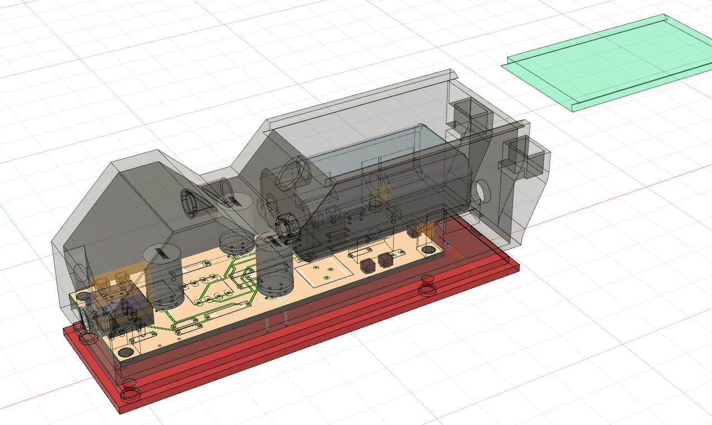

# 序論

本稿は、2017年から2018年にかけて行われた3つの音に関わる作品制作の実践の記録とその考察である。

作品の意図の概要↓

筆者は過去に様々な形で行われてきた、音楽や音を用いた芸術の表現を拡張するような試みに影響を受けてきた。正確には、作品そのものはもちろんなのだが、同じくらい**それらの作品の多くを直接体験できていないこと**に影響を受けている。数々の野心的なプロジェクトの記録自体は残っているし、芸術史という形でまとめられてもいるが、筆者が体験した多くはテキスト上の説明や、写真、記録録音という記録であって、作品そのものではない。したがって、なぜその作品が芸術史上重要なのかの実感をはっきりと持つことは難しい。

そういった芸術作品、特に音という一過性の事象を扱う芸術の制作において、記録される、記述されることが今日どういった意味を持つのか、どう作品の権威を支えているのか、ということについて意識的になり、その上で制作するということが3つの作品に通底するものだ。

## 社会的、技術的背景

なるべく一般的なところから

楽譜がある

録音がある

ストリーミングがある

マクルーハン　人間が道具を作り、またその道具が人間を作る

### 芸術史を支えるメディア

「残ったもの」が近代における音楽としての成立を支えている(大崎「音楽史の形成とメディア」)

楽譜文化

### 録楽文化

引き続き大崎「音楽史の形成とメディア」

三輪眞弘 録楽

聞こえ来る過去

### デジタル以降

マノヴィッチ ニューメディアの言語

Puckette ICMCキーノート[@puckette2015sampling]

全てはパラメーターであるのか　そうではない

## 目的

前３段の歴史の要約

本論文の

1. 物理モデリング合成を物理的に再構成し直すことで

## 本論文の構成

本論文の以降の構成を示す。

まず、

次に、具体的に実践した3つのプロジェクトの詳細な解説と考察を行う。

それぞれのプロジェクトは時期的にオーバーラップする部分があるので以下に実際の進行の図を示した。

(図)

1つ目は、コンピュータ上で実際の楽器をシミュレーションする物理モデリングシンセサイザーを物理的なオブジェクトで再実装するインスタレーション「Aphysical Unmodeling Instrument」である。(この章の構成を要約。) 〇〇という視点でこれを考察する。

2つ目はオーディオフィードバック(ハウリング)を発音の仕組みに用いた、音源を持たない電子音響楽器「Exidiophone」である。（要約）。

3つ目は時間を分割する機能のみを持ち、マスタークロックを持たないコンピューター「EDTAC(Electronic Delay Time Automatic Calculator)」である。(要約)。

次に、以上3つのプロジェクトから得られた考察をまとめ、音の記述と生成の再考について分析する。

# 関連事例

## 図形楽譜

## フルクサス・ダダ

- ケージ ライブエレクトロニクス　レコードは風景をだいなしにする
- チューダー、ゴードンムンマ
- ルシエ

超芸術トマソン

## より現代的なもの

- tristan perich
- 8bit Mixtape

## アーカイブ・再演する取り組み

- 生成音楽ワークショップ

- 日本美術サウンドアーカイブ

## メディア考古学 - 制作自体の手法としての

### フータモのメディア考古学

### パリッカのゾンビ・メディアとサーキットベンディング

{#fig:zombiemedia width=70%}

### ポール・デマリーニス

Edison Effect

### 車輪の再発明・紙レコード

## フィードバックシステム
制御工学としてのサイバネティクス

制御不可能性、自律制御の概念からカオス、複雑系へ

人間の感受を理解するためのモデルを生成するという行為

ただの機械に何故か生命らしさを見出す

手紙を送る紙は今や手紙そのものである

Sanfilippoらのフィードバックの論文は先にここで紹介しちゃう（あとで関連は述べる）

特に自分の中で大事なのはカオティックなので保存が難しいよという話

# Aphysical Unmodeling Instrument

本章ではインスタレーション作品「Aphysical Unmodeling Instrument」の4回の展示を通じての考察から〇〇について考える。

「Aphysical Unmodeling Instrument」は楽器の音色を計算で模倣する物理モデリング合成という手法を、コンピュータを用いて実装するのではなく、スピーカーやマイクロフォン、共鳴器や照明、光センサーなど物理的なオブジェクトの組み合わせで実装するサウンドインスタレーションである。

この作品は90年代に作られたWhirlwindという、クラリネット・フルート・トランペットの3つの管楽器を合体させた形の計算モデルを再実装する。

展示は2017年から2018年にかけて合計4回行われ、それぞれ和室、大学の教室、無響室、音楽ホールのロビーという音響的にも設置環境的にも異なる場所で展示された。すべての展示で元になっているモデルは同じだが、部屋の条件に合わせて具体的な実装も異なっている。

物理モデルという、音を出すプロセスを記述したものを楽譜のように捉え、それを再生する装置を作るという、演奏として展示をすることを試みた。

以下に本章の構成を示す。まず、Whirlwindというメタ管楽器モデルの概要について説明し、それが音と記述の生成という観点においてどう重要かについての視点を述べる。その後、本作と関連する作品を挙げる。

## Whirlwindについて

Whirlwindはウェーブガイド合成でモデリングされたトランペット、フルート、クラリネットの計算モデルを和集合的に合体させたものである[@cook1992meta]。元々の3つのモデルはすべてウェーブガイド合成という手法をベースにしていて、フィルタ、遅延を含むフィードバックという点で共通している。HIRNという専用のコントローラとともに使うことで、金管楽器と木管楽器の音色をモーフィングしたような演奏が出来るとされている。

{#fig:whirlwind width=100%}

{+@fig:whirlwind}はWhirlwindの処理を図解したものである。図の左側、コントローラに入力された息は、その強さ(Envelope)と、息の強さに応じて変化する雑音(Noise)として扱われる。それ以外の部分は、仮想的な管楽器の中で音波が伝達、反射される様子をフィードバックループとしてモデル化している。Delay1とDelay2は管の長さと木管楽器のトーンホールの位置に応じて変化する遅延を表す。Delay3はフルートにおける唄口から左側の頭部管端での反射を表す。 $+$  は音波の加算を表す。Nonlinearityは唇やリードの振動で生じる歪を多項式 $ax^3+bx^2+cx$ と単純化して表現している。Resonator(Lip)は演奏者の唇が単一の固有振動数を持つ共鳴器として、双二次フィルタでモデル化したものだ。Delay1,2の手前の1pole Filterは管の端で音波が反射するときに高周波数成分が減衰するのをモデル化したものだ。(Resonator(Bore)に関しては、元の3つのモデルには存在しないにも関わらずWhirlwindでは追加されている双二次フィルタがある。筆者はこれは管楽器のベル部分の持つ周波数特性を表現するものとして配置していると推測し(Bore)と名前を付けたが、実際の詳しい用途は不明である。)

## 関連研究

Venova

Ruratae Puckette

## 4回の展示の様子、それぞれの違い

本章では2017年10月から2018年6月の間に計4回展示を行った「Aphysical Unmodeling Instrument」の各展示での様子を時系列で説明する。

1. 奈良・町家の芸術祭はならぁと 2017(2017年10月)
2. インターカレッジ・ソニックアーツフェスティバル2017(2017年12月)
3. FREQ2018  -21世紀初頭の音と音楽- (2018年3月)
4. New Interfaces for Musical Expression 2018(2018年6月)

### 奈良・町家の芸術祭 はならぁと ぷらす2017

{#fig:aui_hanarart width=100%}

奈良・町家の芸術祭はならぁと 2017のうち、10月27日から 11月5日にかけて開催された「はならぁと ぷらす」企画内、橿原エリア（八木札の辻ゾーン)公募作家として、八木札の辻交流館2階にて展示した。

### インターカレッジ・ソニックアーツフェスティバル2017

{#fig:aui_icsaf width=100%}

2017年12月15日、16日に昭和音楽大学にて開催されたインターカレッジ・ソニックアーツフェスティバル2017で、一般教室の中で展示した。

### FREQ2018 21世紀初頭の音と音楽

{#fig:aui_freq width=100%}

2018年3月29日、30日に九州大学大橋キャンパス音響特殊棟で、筆者が所属する城研究室が主催したイベント「FREQ2018 21世紀初頭の音と音楽」の中で音響特殊棟無響室の中で展示した。

今までで一番管楽器っぽい音にはなった

すずえりさんの感想：全然管楽器っぽくない

### New Interfaces for Musical Expression 2018

{#fig:aui_nime2018 width=100%}

2018年6月3日から9日にかけてアメリカのVirginia Polytechnique Universityで開催された国際学会New Interfaces for Musical Expression 2018にて、Moss Arts Center2階ロビーにて展示した。

## 考察

一方で、物理的なオブジェクトを空間に配置するという行為を行う以上この作品をどこかに出品する以上は展示、インスタレーション展示という枠組みの中に留まらざるを得ない。

音楽的なモチベーションを見る側に伝えることが難しい、形式に囚われる

# Exidiophone

Exidiophoneは、オーディオフィードバック(ハウリング)を音の発音原理に用いた電子音響楽器である。

楽器には対向して配置されたLEDと光センサー、コンデンサを挿すソケット(初期型にはこれら3つの代わりに5つのつまみ)及び小型のマイクロフォン、出力のコネクタがついており、スピーカーとつなげて使う。スピーカーのボリュームが小さい間はマイクロフォンから拾った音がスピーカーから出てくるだけだが、音量を上げると純音のような音がLEDの明滅に合わせて鳴ったり止まったりを自律的に繰り返す。

演奏時にはマイクロフォンの向きを変えたり、を手やその他共鳴物で覆ったりすることで鳴る周波数を変化させたり、複数台を同時に組み合わせることでより複雑な音を鳴らすことができる。

電子楽器は通常、例えばシンセサイザーであれば回路に発振器を、サンプラーのような楽器であれば音源メモリーをというように何らかの音源を持つ。一方でExidiophoneはスピーカーから出た音がマイクロフォンを通じて循環することによって音を出すので、音源に当たるものが存在しない。

「楽器」というフォーマットはかなり縛りがゆるい

信号源の無い電子楽器

空間的パラメータ

## 楽器の仕組みの説明

### オーディオフィードバック（ハウリング）

ジミヘン

チューダー

ライヒ

### 詳細な構造

{#fig:exidiophone-sys width=100%}

Exidiophoneの基本的な動作原理を{+@fig:exidiophone-sys}に示した。

通常のオーディオフィードバックは、増幅器の限界まで際限なく増幅し続ける。一方、Exidiophoneは音量を光の強さで制御する光センサと、対向して設置されている、通常点灯しているがマイクロフォンからの信号の音量が一定を超えると消灯するLEDが設置されており、

1. フィードバックの音量が大きくなる
2. LEDが消える
3. 光センサーが音量を小さくする
4. フィードバックが止まる
5. LEDが再点灯する
6. 1に戻る

といった流れで、光の明滅と共にフィードバック音が自律的に鳴る鳴らないを繰り返す。この点滅速度は、楽器についているソケット挿し込むコンデンサの容量が大きくなるほど遅くすることができる。

## Crackleboxからのインスパイア

関連する作品としてMichel Waisviszの開発した電子楽器Crackleboxがある。[@Waisvisz2004]

## その他先行作品

No-input Mixer

David Tudor / Gordon Mumma

## 制作過程

- 6月　ノーインプットミキサー＋マイク

- 12月　緑青ソフトウェアによる試作と演奏（Faust&Max）、インターフェースの限界

### FREQ2018 21世紀初頭の音と音楽 1stプロトタイプ

{#fig:exidiophone_freq width=70%}

2018年1月頃から回路設計、プロトタイプを始め、2018年3月に九州大学大橋キャンパス音響特殊棟で行われたイベントFREQ2018 -21世紀初頭の音と音楽- で最初のパフォーマンスを行った。3Dプリンター(Formlab form2)で出力した筐体に基板を

### AA-TPF 2nd

{#fig:exidiophone_ver2 width=50%}

{#fig:exidiophone_tpf width=50%}

#### つまみによるコントロールの限界

### 回路、インターフェースの一新 3rd

{#fig:exidiophone_ver3 width=50%}

{#fig:exidiophone_ftarri2 width=50%}

{#fig:exidiophone_fullphil width=50%}

### 基板発注 4th

{#fig:exidiophone_model width=50%}

{#fig:exidiophone_pcb width=50%}

{#fig:exidiophone_ver4 width=50%}

## 演奏からの考察
この辺主観でしか語ることができないので迷う（自分のブログからさらに引用するとかか）
特に蓮沼フィルのは入れたい
演奏の記録リストは付録とかでいいかな

### 出音を目的としない楽器(音を記述するのではないこと)

出た音をただ受け入れるということ

Daxophone

プラズマディストーション

### 単機能の集合からの創発(特に5台での演奏)

ホタルの発光の例、カオス

moids

Ralf baecker

## この楽器における記述と生成

ノーインプットミキサーは、ある意味で電子回路の即興設計(BBBとかと近い)だから、ある意味回路図の変化で記述できる

Crackleは、体が記述される要素の一部になる

Exidiophoneは、空間も含めた体→サイバネティクスにおける、環境とシステムの分離は可能？の議論

## 疑問

マスプロ的ものづくりとクラフト的ものづくり

# EDTAC (Electronic Delay Time Automatic Calculator)

本章では時間を計算する機能のみを持ったコンピュータ「Electronic Delay Time Automatic Calculator」（以下、EDTAC）の制作について考察する。

EDTACは筆者が2018年9月から11月に掛けて滞在したSchool for Poetic Computationで制作されたもので、11月10日、11日に行われたSFPC Student Showcase Fall 2018 Classにて展示された。その後、前章で言及した2018年12月20日に九州大学大橋キャンパス音響特殊棟で開催されたイベント「FREQ × HardcoreAmbience」での演奏の中でも使用された。

(本章の流れ、考察したいこと)

## 関連作品・研究

### 非同期コンピュータ・アーキテクチャ

Manoharらはプロセッサ設計の複雑さ、電力消費の低減及び平均的なパフォーマンスの向上を目的とした非同期のコンピュータ・アーキテクチャを提案している[@Manohar2000]。

### 実時間コンピューティング

### 計算そのものに美学を見出す作品

- CW&T 1bit Slow Computer https://cwandt.com/products/1-bit-1hz-cpu
- ralf baecker Irrational Computing http://www.rlfbckr.org/work/irrational-computing/
- Martin Howse Natural Logic
- 高橋士郎 空気圧ロジック http://www.shiro1000.jp/mpu/compo.htm

## システム概要

{#fig:edtac_filipwolak width=70%}

本作品は電線及び光ファイバーで相互接続された3つのハードウェアで構成される。一つ目は電気パルスを受け取り、一定時間後に出力する遅延回路、二つ目は電気パルスを受け取りLEDを切り替えるカウンター回路、最後は電鍵音響器（テレグラフ・サウンダー）を電気リレーとして改造したものである。遅延回路及びカウンター回路は40cm四方ほどの木の板の上に針金を取り付け、電子部品を一つ一つはんだ付けしたものになっている。

図{#fig:edtac1 width=100%}

### 遅延回路

図xは遅延回路部の回路図である。

### カウンタ回路

図xはカウンタ回路回路部の回路図である。

### 電鍵音響器

## 全体の動作の概要

1. 遅延回路に電気パルスが入ってきて、一定時間後にパルスを再出力する。
2. 出力されたパルスが電鍵音響器を鳴らす。
3. 電鍵音響器とスイッチが働き、遅延回路とカウンタ回路の2つをトリガーする
4. カウンタ回路は入力されると光るLEDを切り替える。今回の場合は10個のLEDを1つずつ切り替える。
5. LEDは光ファイバーで、遅延回路のフォトトランジスタに繋がれていて、紙と黒鉛でできた抵抗に流れる電流を切り替える。
6. 光ファイバーが有効にした抵抗値が遅延回路の遅延時間を変化させる。
7. 1に戻る。

## 議論

光ファイバーでつなぐLEDとフォトトランジスタの組み合わせを変えることで、得られる時間の順番が変わる。

カウンタ回路のアルゴリズムを変えることでより複雑なシーケンスを得ることができる（発展形）。

「音の記述とはなんなのか」のまえに「時間の記述とはそもそもなんなのか」という疑問

# 考察・まとめ

- 他のプロジェクトとの差分
