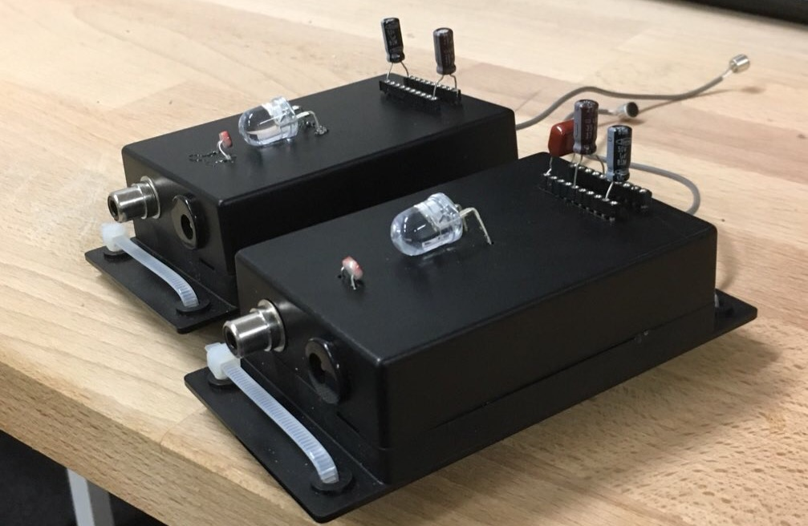
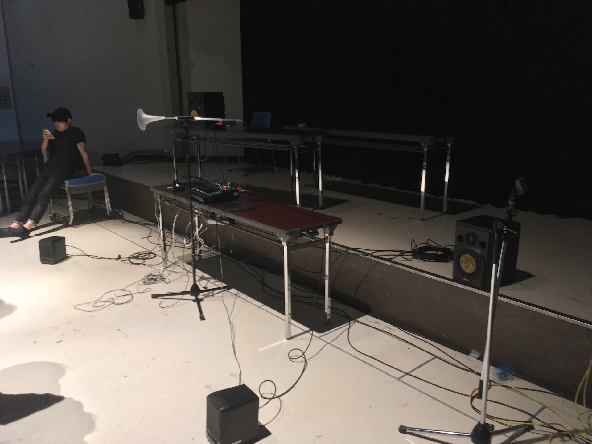
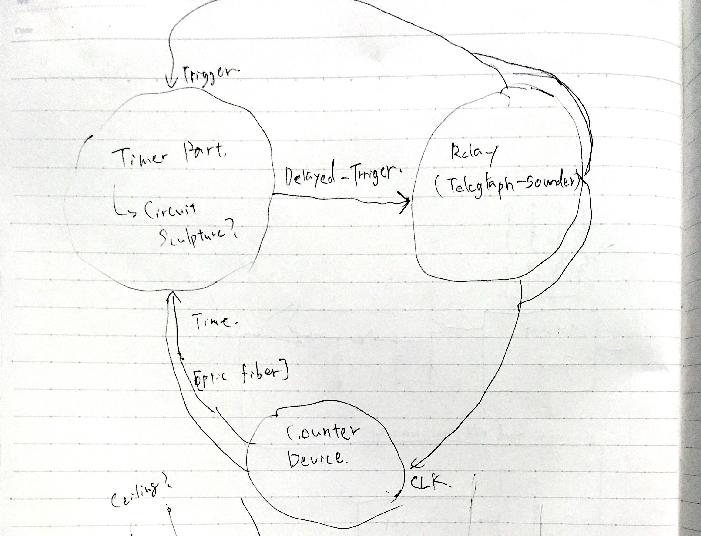
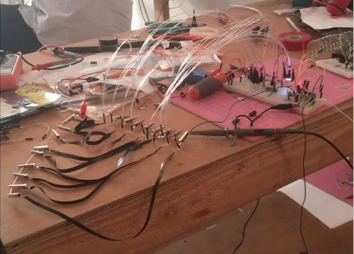

# 序論

作品の意図の概要↓

筆者は過去に様々な形で行われてきた、音楽や音を用いた芸術の表現を拡張するような試みに影響を受けてきた。正確には、作品そのものはもちろんなのだが、同じくらい**それらの作品の多くを直接体験できていないこと**に影響を受けている。数々の野心的なプロジェクトの記録自体は残っているし、芸術史という形でまとめられてもいるが、筆者が体験した多くはテキスト上の説明や、写真、記録録音という記録であって、作品そのものではない。したがって、なぜその作品が芸術史上重要なのかの実感をはっきりと持つことは難しい。

そういった芸術作品、特に音という一過性の事象を扱う芸術の制作において、記録される、記述されることが今日どういった意味を持つのか、どう作品の権威を支えているのか、ということについて意識的になり、その上で制作するということが3つの作品に通底するものだ。

本論文中で言及する電子楽器Exidiophoneを制作してから、複数回ライブパフォーマンスをするようになって、「ノイズとかをやっている人」と思われることが多くなった。しかし自分の中に電子音楽や実験音楽のバックグラウンドは殆ど無い。

ケージから始まった、聴取に基づく音楽の議論に限界が来ているのではないか

聞く側に主眼をおいて考えれば、今音楽として認められているものとそうでないもの（広義のノイズ）の二項対立に収斂してしまう。

音楽を行為として考える→ミュージッキング、参加する音楽など、もしくは人間同士の関係性として捉えることができる。

ただそれはそれで脳に直接電気信号をぶち込む音楽がでてこない限りは、音は振動という物理現象であることはまだ大きな要素であるはずなのに、行為論に還元してしまうとそういった議論が全部なくなってしまう

人-人の関係性もいいんだけど人-物(楽器とか、音を出すものとか)の関係性にもっと着目しないとダメでは

で、音を出す仕組みを、テキストとか、テキスト上にある数式とか計算モデルとか、アルゴリズムとかで記述できる方法が存在しないと歴史が成立しない

五線譜は聴取に基づく音の記述法である。

レコードとかも、聴覚の研究の上に発生した音の記録/記述方法である(聞こえ来る過去)

聴覚から外れたやり方で新しく音を生成する取り組みがずっとあったわけで、、、？

シンセサイザーもそうっちゃそうなんだけど、スペクトラルプロセッシングとかは聴取の方向に基づいたものとして発展していった

本稿は、2017年から2018年にかけて行われた3つの音に関わる作品制作の実践の記録とその考察である。

一連の作品制作で筆者は音楽とメディアアートのアーカイブ可能性についてアーティストという立場から批評するというアプローチを取った。

ムジカ・プラクティカ（ロラン・バルト　/ポピュラー音楽と資本主義/毛利嘉孝）

ベートーベンの再解釈→DIYカルチャー、DJカルチャーへ

## 動機

## 社会的、技術的背景

なるべく一般的なところから

楽譜がある

録音がある

ストリーミングがある

マクルーハン　人間が道具を作り、またその道具が人間を作る

### 芸術史を支えるメディア

「残ったもの」が近代における音楽としての成立を支えている(大崎「音楽史の形成とメディア」)

楽譜文化

### 録楽文化

引き続き大崎「音楽史の形成とメディア」

三輪眞弘 録楽

聞こえ来る過去

### デジタル以降

マノヴィッチ ニューメディアの言語

Puckette ICMCキーノート[@puckette2015sampling]

全てはパラメーターであるのか　そうではない

## 目的

前３段の歴史の要約

本論文の

1. 物理モデリング合成を物理的に再構成し直すことで

## 本論文の構成

本論文の以降の構成を示す。

まず、

次に、具体的に実践した3つのプロジェクトの詳細な解説と考察を行う。

それぞれのプロジェクトは時期的にオーバーラップする部分があるので以下に実際の進行の図を示した。

(図)

1つ目は、コンピュータ上で実際の楽器をシミュレーションする物理モデリングシンセサイザーを物理的なオブジェクトで再実装するインスタレーション「Aphysical Unmodeling Instrument」である。(この章の構成を要約。) 〇〇という視点でこれを考察する。

2つ目はオーディオフィードバック(ハウリング)を発音の仕組みに用いた、音源を持たない電子音響楽器「Exidiophone」である。（要約）。

3つ目は時間を分割する機能のみを持ち、マスタークロックを持たないコンピューター「EDTAC(Electronic Delay Time Automatic Calculator)」である。(要約)。

次に、以上3つのプロジェクトから得られた考察をまとめ、音の記述と生成の再考について分析する。

# 関連事例

## 

## アーカイブ・再演する取り組み

- 生成音楽ワークショップ
- 日本美術サウンドアーカイブ
- メディアアートの輪廻転生

## メディア考古学 - 制作自体の手法としての

### フータモのメディア考古学

### パリッカのゾンビ・メディアとサーキットベンディング

{#fig:zombiemedia width=70%}

### ポール・デマリーニス

Edison Effect

### 車輪の再発明・紙レコード

# Aphysical Unmodeling Instrument

本章ではインスタレーション作品「Aphysical Unmodeling Instrument」の4回の展示を通じての考察から〇〇について考える。

「Aphysical Unmodeling Instrument」は楽器の音色を計算で模倣する物理モデリング合成という手法を、コンピュータを用いて実装するのではなく、スピーカーやマイクロフォン、共鳴器や照明、光センサーなど物理的なオブジェクトの組み合わせで実装するサウンドインスタレーションである。

この作品は90年代に作られたWhirlwindという、クラリネット・フルート・トランペットの3つの管楽器を合体させた形の計算モデルを再実装する。

展示は2017年から2018年にかけて合計4回行われ、それぞれ和室、大学の教室、無響室、音楽ホールのロビーという音響的にも設置環境的にも異なる場所で展示された。すべての展示で元になっているモデルは同じだが、部屋の条件に合わせて具体的な実装も異なっている。

物理モデルという、音を出すプロセスを記述したものを楽譜のように捉え、それを再生する装置を作るという、演奏として展示をすることを試みた。

本章ではまず、本作品の背景となる技術、物理モデリング合成の歴史と手法を概観した上で、本作で直接参照したCookによるメタ管楽器モデルWhirlwindについて説明し、それが音と記述の生成という観点においてどう重要かについての視点を述べる。その上で本作「Aphysical Unmodeling Instrument」が具体的に何を行う作品なのか解説する。

その後、本作と関連する作品、研究を挙げる。

その上で本作「Aphysical Unmodeling Instrument」の4回の展示の実装と、各展示における部分ごとの変遷をみる。最終的に、4回の展示を通して得られたことについて議論し、まとめる。

## 作品概要

### 物理モデリング合成

物理モデリング合成とは実際の楽器の発音機構を計算で模倣する手法である。

{#fig:physicalmodel-history width=100%}

{+@fig:physicalmodel-history}はBilbaoによる物理モデリング合成の手法の歴史を概観したものである[@Bilbao2009]。

Bilbaoによれば、1960年代にRissetが様々な音高の純音の組み合わせで音を表現する加算合成を考案したのに始まり、現代のシンセサイザーの基礎となる減算合成、

またSmithは録音された実際の楽器の音を鍵盤や専用のインターフェースを介して発音するサンプリング合成、いわゆるサンプラーのようなものも現実の楽器を模倣する一つの手法として数えている[@smith2010pasp]。

もっとも基礎的な手法は、力学モデルを微分方程式として作り、その解を求め、離散化して計算機に実装するものである。例えばバネの片方の端におもりが付いていて、片方が壁に固定されているときバネを引っ張ると質点は一定の間隔で揺れる。これを
$$
m \frac{d^2x(t)}{dt^2} = -kx(t)
$$
$$
(ただしmはバネの先の質点の重さ、kはばね定数、x(t)は時間tにおけるバネの自然長からの伸び縮み)
$$

とモデル化すれば、この微分方程式は
$$
x(t) = Asin(\sqrt{\frac{k}{m}}t+\alpha)
$$
$$
(A,\alpha はx(0)および\frac{dx(0)}{dt}、すなわち初期位置と初期速度によって決定される。)
$$

というように解くことができる。コンピューターの中で扱う場合はこれを
$$
x[n] = Asin(\sqrt{\frac{k}{m}}\frac{n}{f_s}+\alpha)
$$
$$
(f_sはサンプリング周波数:時間を1秒間に何回分割するかを表す)
$$

という数列とすれば表現できる。

この数式の中ではバネそのものの重さが0ということになっているし、質点は重さはあるが全く回転しない、理想的には体積が全く無い前提になっている。現実のバネは引っ張りすぎれば伸び切ってしまうので無限に伸ばせるわけではないし、ミクロ的に見ていけば現実のバネはkが完全に一定にはならない。なにより現実には空気抵抗やバネの中で伸び縮みのエネルギーが熱として消えていくので、振動はだんだんと減衰していき、いつかは止まる。しかし上述の計算モデルは無限に振動を続けることになる。つまり、正確ではないと言える。しかし、振動をはじめてから3秒後までの様子を計算で再現したくて、現実のバネも3秒後に振幅が最初の0.999倍程度までしか減衰していないとすれば、この数式はある程度バネのふるまいを表していて、有益に使うことができる。そのうえで、例えば弦をごく小さなバネが連結されたものと見立てる≒モデル化する事で弦の振動を新たに計算モデル化出来るので、これも有益だと言える。

式は立てられても直接は解けないものはある FDA

FDAは何にでも使えるけど計算コストが大きい

ウェーブガイド合成

### リアルでない物理モデリング合成

楽器の物理モデリング合成のいちばんの目的はコンピューター上で本物の楽器にできるだけ近い音を出すことだが、その応用として現実ではありえない楽器音を作るという、一見すると真逆の取り組みが数多く行われている。

例えば商用のシンセサイザーとしてはじめて物理モデリング音源を採用したYAMAHA VL1のユーザーマニュアルにはこの様な文言が見られる[@yamahamanual]。

> VA音源は、物理モデルによる音の合成という今までになかった音源方式をとっています。これはいわば、音源内に仮想的に作りあげたアコースティック楽器を使って音づくりをしているわけです。ですからその音は、息使いや音の存在感、そして音と音のつながりの自然さなどの面で、AWM2音源よりもリアルです。(10p)

> VA音源では、まずインストゥルメントという部分で物理モデルの管の長さやリードの形などを自由に変形することによって、現実には作ることも演奏することも不可能な新しいアコースティック楽器を創造することが可能です。(7p)

リアルさを強調する一方で現実には作れない音が出せることも新規性として挙げていることがわかる。また1996年のコンピューター・ミュージック・マガジンの物理モデリング音源を特集した号では

> DTM用の音源に限らず、現在あるほとんどのシンセサイザがPCM方式となっています。
>
> 音源は音質的にも非常にクリアで,かつリアルなサウンドを作り出してくれますが,このPCMにも限界があります。
>
> 一言でいえば表情の乏しさとでもいうのでしょうか。
>
> これを,シミュレーションというまったく違うアプローチで解決してくれるのが物理音源なのです。(2p)

> しかし,ここでもうお気付きの方もいらっしゃるかもしれませんが,このような組み合わせによるシミュレーションですので,世の中には存在しない,マウスピースと弦といった組み合わせも可能になってきます。ちょっと妙ではありますが,電子音ではない,アコースティックな音が作れるというのが,この物理音源の魅力でもあるのです。(3p~4p)

と、リアルさとありえない楽器という一見対立する2つをどちらも魅力として語っていることから、開発側だけでなくユーザー側もこうした宣伝文句をある程度受け入れていた事が伺える[@cmmagazine1996]。

より近年の議論では、例えば物理モデリングの中のいち手法Functional Transformation法を提案したRabensteinらは、2018年現在もまだ製品などに応用されていないその手法について解説した本を以下のように締めくくる[@Trautman2003]。

> In acoustics, the application of the FTM has broadened the field of sound synthesis methods into the direction of a direct physical approach to simulate the vibrational behaviour not only of existing instruments but also of structures that are not realizable in the real world.

この様なリアルを目指しつつ非リアルも求める傾向を説明する言葉として、VL1の登場する1年前の1992年にBorinらが用いた疑似物理モデリングという考え方がある。物理的リアルさは発想の源でしか無く[@Borin1992]。

> From our point of view, synthesis by physical models--being a sort of a musical reality "generator" on its own--makes it possible to take inspiration from the real world in order to derive our iterpretation of it without forcing us to limit experimentation to the usual physical equations.

> Starting from these considerations, it becomes extremely interesting to expetiment with structures that are not anchored in physical reality and whose only constraints are stability and passibity. These models take physical reality only as a source of inspiration but cannot be strictly considered as physical. For all of these reasons, pseudophysical models represent a field of sound synthesis that has yet to be explored.

### Cookによるメタ管楽器モデルWhirlwind

Whirlwindはウェーブガイド合成でモデリングされたトランペット、フルート、クラリネットの計算モデルを和集合的に合体させたものである[@cook1992meta]。元々の3つのモデルはすべてウェーブガイド合成という手法をベースにしていて、フィルタ、遅延を含むフィードバックという点で共通している。HIRNという専用のコントローラとともに使うことで、金管楽器と木管楽器の音色をモーフィングしたような演奏が出来るとされている。

{#fig:whirlwind width=100%}

{+@fig:whirlwind}はWhirlwindの処理を図解したものである。図の左側、コントローラに入力された息は、その強さ(Envelope)と、息の強さに応じて変化する雑音(Noise)として扱われる。それ以外の部分は、仮想的な管楽器の中で音波が伝達、反射される様子をフィードバックループとしてモデル化している。Delay1とDelay2は管の長さと木管楽器のトーンホールの位置に応じて変化する遅延を表す。Delay3はフルートにおける唄口から左側の頭部管端での反射を表す。 $+$  は音波の加算を表す。Nonlinearityは唇やリードの振動で生じる歪を多項式 $ax^3+bx^2+cx$ と単純化して表現している。Resonator(Lip)は演奏者の唇が単一の固有振動数を持つ共鳴器として、双二次フィルタでモデル化したものだ。Delay1,2の手前の1pole Filterは管の端で音波が反射するときに高周波数成分が減衰するのをモデル化したものだ。(Resonator(Bore)に関しては、元の3つのモデルには存在しないにも関わらずWhirlwindでは追加されている双二次フィルタがある。筆者はこれは管楽器のベル部分の持つ周波数特性を表現するものとして配置していると推測し(Bore)と名前を付けたが、実際の詳しい用途は不明である。)

### Aphysical Unmodeling Instrument 作品概要

Aphysical Unmodeling InstrumentはWhirlwindをコンピューターではなく物理的なオブジェクトの組み合わせで実装するサウンドインスタレーションである。計算モデルをコンピュータの世界の外側で実装することを目的として、デジタル信号処理

本作品ではMIDIやデジタル制御の信号を使わず、モデルの各部分を物理的なオブジェクトで置き換え、そのコントロールは

例えば{+@fig:whirlwind}でDelayと書かれた遅延処理はスピーカーとマイクの組み合わせで、音速と距離に応じた音波の遅れで置き換えている。

## 関連事例

### 三輪眞弘 逆シミュレーション音楽

コンピューターのアルゴリズムをコンピューター以外で実行するという視点での類似した作品として、三輪眞弘の逆シミュレーション音楽が挙げられる。逆シミュレーション音楽は三輪によれば

> 逆シミュレーション音楽は地球上の古代人や未開民族が行っていたかもしれない、 あるいは行うことが可能であったような音楽（これを「ありえたかもしれない音楽」と呼ぶ）を空想し、 主にコンピュータ・シミュレーションによって検証しながら新しい音楽を生み出す試みである。 その際、演奏会や作曲家、演奏家、聴衆の区別など、音楽に関係する既存の社会的制度は前提としない。

とあり、音楽を作り出すための計算のアルゴリズムを決める「規則による生成」、演奏の際に現実どう行動するか、どのような道具を用いるかを検討する「解釈」、作品のタイトルや作品に使われる道具に名前を付けその由来を考える(現実には存在しない物語でも良い)「命名」という3種の行動（三輪はこれを「相」と名付ける）を元に作品を作る。実際の逆シミュレーション音楽作品には架空の物語が付随しており、三輪は全ての物語の最後を「という夢をみた。」という一文で締めている。

### CORDIS-ANIMA, GENESIS

### Ruratae

### YAMAHA Venova

### aFrame

### 

## 展示内容とその変遷

本章では2017年10月から2018年6月の間に計4回展示を行った「Aphysical Unmodeling Instrument」の各展示での様子を時系列で説明する。

1. 奈良・町家の芸術祭はならぁと 2017(2017年10月)
2. インターカレッジ・ソニックアーツフェスティバル2017(2017年12月)
3. FREQ2018  -21世紀初頭の音と音楽- (2018年3月)
4. New Interfaces for Musical Expression 2018(2018年6月)

### 奈良・町家の芸術祭 はならぁと ぷらす2017

{#fig:aui_hanarart width=100%}

奈良・町家の芸術祭はならぁと 2017のうち、10月27日から 11月5日にかけて開催された「はならぁと ぷらす」企画内、橿原エリア（八木札の辻ゾーン)公募作家として、八木札の辻交流館2階にて展示した[@hanarart2017] 。

### インターカレッジ・ソニックアーツフェスティバル2017

{#fig:aui_icsaf width=100%}

2017年12月15日、16日に昭和音楽大学にて開催されたインターカレッジ・ソニックアーツフェスティバル2017で、一般教室の中で展示した[@icsaf2017]。

### FREQ2018 21世紀初頭の音と音楽

{#fig:aui_freq width=100%}

2018年3月29日、30日に九州大学大橋キャンパス音響特殊棟で、筆者が所属する城研究室が主催したイベント「FREQ2018 21世紀初頭の音と音楽」の中で音響特殊棟無響室の中で展示した。

今までで一番管楽器っぽい音にはなった

すずえりさんの感想：全然管楽器っぽくない

### New Interfaces for Musical Expression 2018

{#fig:aui_nime2018 width=100%}

2018年6月3日から9日にかけてアメリカのVirginia Polytechnique Universityで開催された国際学会New Interfaces for Musical Expression 2018にて、Moss Arts Center2階ロビーにて展示した。

## 考察

Whirlwindは3つの現実の楽器を仮想的に合体させているので、現実には存在し得ない。それゆえに、このモデルを再物理化するときにモデルの説明されていない部分を何かしらの形で解釈して現実化する必要がある。その解釈の過程によって、それぞれの展示環境において異なる実装がなされる(??)

聴取に基づく音の記述方法と、**生成に基づく音の記述方法**

### 概念的サーキットベンディング

（グリッチとかとは別種のものとして）

VL1とか、コンポ―ネントとして成立しているものは無理やり組み合わせることが可能になってしまうという点

そして、物理モデリングは新しいけどハイプ・サイクルを通り過ぎたobsoleteなテクノロジーではあると思う

一方で、物理的なオブジェクトを空間に配置するという行為を行う以上この作品をどこかに出品する以上は展示、インスタレーション展示という枠組みの中に留まらざるを得ない。

音楽的なモチベーションを見る側に伝えることが難しい、形式に囚われる

**展示＝演奏というメタファー**（大友良英、音楽と美術のあいだ）

# Exidiophone

Exidiophoneは、オーディオフィードバック(ハウリング)を音の発音原理に用いた電子音響楽器である。

楽器には対向して配置されたLEDと光センサー、コンデンサを挿すソケット(初期型にはこれら3つの代わりに5つのつまみ)及び小型のマイクロフォン、出力のコネクタがついており、スピーカーとつなげて使う。スピーカーのボリュームが小さい間はマイクロフォンから拾った音がスピーカーから出てくるだけだが、音量を上げると純音のような音がLEDの明滅に合わせて鳴ったり止まったりを自律的に繰り返す。

演奏時にはマイクロフォンの向きを変えたり、を手やその他共鳴物で覆ったりすることで鳴る周波数を変化させたり、複数台を同時に組み合わせることでより複雑な音を鳴らすことができる。

(電子楽器は通常、例えばシンセサイザーであれば回路に発振器を、サンプラーのような楽器であれば音源メモリーをというように何らかの音源を持つ。一方でExidiophoneはスピーカーから出た音がマイクロフォンを通じて循環することによって音を出すので、音源に当たるものが存在しない。)

ExidiophoneははじめはAphysical Unmodeling Instrumentを制作していた時の興味から、オーディオフィードバックとウェーブガイド合成という管楽器の物理モデリング合成の手法の類似性（遅延付きフィードバック）に着目して作り始めた。しかし制作の中でアップデートを繰り返す中で、つまみを回すような一次元的でないパラメーター、例えばスピーカーとマイクの間を遮ることでの音響特性の変化や光を遮ったり逆に外から当てるなどを楽器のインターフェースとして用いることへと興味が移った。

(結論の簡単なまとめ)

本章では、まずこの楽器の発音原理であるオーディオフィードバックについて説明したうえで、Exidiophoneの詳細な構造について解説する。次に、2018年1月から2019年1月にかけての1年間、計8回の演奏機会を通しての楽器自体のアップデートと、演奏の変遷を記す。最後に、その演奏経験から得られたExidiophoneの〇〇について考察する。

## 楽器の仕組みの説明

### オーディオフィードバック（ハウリング）

オーディオフィードバックとは、スピーカーから出た音がマイクロフォンに拾われ、マイクロフォンからの信号が増幅器を通り、再びスピーカーに出力されることを繰り返すことで持続音が発生する現象である。日本ではハウリング、英語では現象を始めに報告したデンマーク人の物理学者Søren Absalon Larsen (1871–1957)に因んでLarsen Effectとも呼ばれる[^larsen]。

一つのスピーカーからマイクロフォンへのループの場合、スピーカーから出た音がマイクロフォンに届くまでの時間遅延がスピーカー・マイクロフォン間の距離及び音速に比例して発生する。

この時間遅延は、一般にコム(櫛形)フィルタと言われる一定の間隔で交互に強め合う周波数と打ち消し合う周波数があらわれる周波数特性を生み出す。(参考文献)

この特性に加えて、マイクロフォンとスピーカー、増幅器の周波数特性を合成したときに、それぞれの周波数ごとの増幅率が1を超えた部分でオーディオフィードバックが発生する。

ただしマイクロフォン、スピーカー、増幅器のいずれかで入力に対して非線形の出力が発生する、すなわち歪が発生したときには理論的な解析はより困難になる。

[^larsen]: [@Guo2012]に参考文献として"A. Larsen, “Ein akustischer Wechselstromerzeuger mit regulierbarer Periodenzahl für schwache Ströme,” Elektrotech. Z., ETZ 32, pp. 284–285, Mar. 1911."と引用されているが原典にあたることが出来なかったのでここに紹介するに留める。

オーディオフィードバックは拡声の際に意図せず発生してしまい、回避されるべきものとして様々な研究が行われている(参考文献)。

一方でオーディオフィードバックを積極的に芸術作品や音楽の中に取り入れる試みも数多くなされている。現代音楽の分野ではRobert Ashleyの*The Wolfman*で初めて用いられたほか、Steve Reich*のPendulum Music*などが代表例としてあげられるがこれらは関連事例の中で詳説する。

### 詳細な構造

{#fig:exidiophone-sys width=100%}

Exidiophoneの基本的な動作原理を{+@fig:exidiophone-sys}に示した。

通常のオーディオフィードバックは、増幅器の限界まで際限なく増幅し続ける。一方、Exidiophoneは音量を光の強さで制御する光センサと、対向して設置されている、通常点灯しているがマイクロフォンからの信号の音量が一定を超えると消灯するLEDが設置されており、

1. フィードバックの音量が大きくなる
2. LEDが消える
3. 光センサーが音量を小さくする
4. フィードバックが止まる
5. LEDが再点灯する
6. 1に戻る

といった流れで、光の明滅と共にフィードバック音が自律的に鳴る鳴らないを繰り返す。

### インターフェース

Exidiophoneを演奏する方法として、主にはスピーカーとの距離を変える、スピーカー、マイクロフォンの向きを変える、間を手で遮ったり、パイプなどを挟んで音響的特性を変化させることが主になる。

それ以外の楽器自体に備わるインターフェースは、開発段階で2つに大きく分かれる。

バージョン1では5つのつまみを回すコントロールが中心になっている。5つのつまみはそれぞれ、

1.　マイクロフォンからの信号の増幅率
2.　LEDを消灯するしきい値の電圧
3.　LEDが消灯するまでの反応速度
4.　電圧しきい値のヒステリシス特性[^hysterisis]
5.　スピーカーへ出力する信号の増幅率

という機能になっている。1.と5.はどちらも全体の音量を変化させるという共通点があるが、1.の値はLED消灯の電圧比較に影響を与えるのに対し5.は影響を与えないという相違点がある。

[^hysterisis]: 電圧比較のしきい値を、入力信号が増加して通過ときには高く、入力信号が減衰して通過するときには低くなるような特性のこと。電圧比較をするときに微小なノイズ成分が出力に影響を与えないようにするために用いられる。

バージョン2以降では、1.2.の可変抵抗はそのまま残っているが、小型の半固定抵抗という形で実装されており、ケースを開けてドライバーで操作するようになっていて、演奏時には操作しない。3.はつまみは省略された代わりに、ケース外側にあるソケットにコンデンサを装着でき、その容量が大きいほど反応速度が遅くなる。演奏中に差し替えることも可能である。4.5.は完全に省略されている。また、バージョン1ではLEDと光センサ(CdSセル)が熱収縮チューブで固定されたアナログオプトカプラを用いていたが、バージョン2以降ではケースの外側にLEDと光センサが隙間を開けて設置されている。この間を指で遮ったり、外側から照明をあてることでも増幅率を制御することができる。

## 関連事例

関連する作品として

### Cracklebox

Crackleboxは1975年にMichel Waisviszを中心としてオランダの電子楽器の研究所STEIMが開発した電子楽器である。

Crackleboxは両手に収まる大きさの木製の箱の上に6つの金属面が出ている電子回路基板が取り付けられており、小型スピーカーが基板の裏に取り付けられている。電子回路には1つの演算増幅器(オペアンプ)と少数のコンデンサ、トランジスタが取り付けられている。6つの金属面はオペアンプの各端子に接続されており、2つ以上の接点を手で触ることで、人体をコンデンサとして介した電気的フィードバックが発生する。金属板に触れている面積や、6つのうちどれを触るかの組み合わせにより発生する音が変わる。

指で触る以外にも、電極をスプーンやフォークに繋いで口に運ぶことで音を発生させたり、複数人で異なる電極に触れて、人同士の間に床や布、自転車、植物などを挟んで音を鳴らす例が挙げられている[@Waisvisz2004]。

### No-input Mixing Board

No-input Mixing Boardは日本の即興演奏家中村としまるがはじめた、オーディオミキサーの出力と入力をケーブルで接続することで、電気的なフィードバックを起こす演奏法である。フェーダーやイコライザーなどのミキサー上にあるつまみを操作することで演奏する。中村はミキサー出力と入力の間に様々なエフェクターを挟んで

### David Tudor Rainforest / Microphone

## 演奏と楽器の変遷

### 6月　ノーインプットミキサー＋マイク

(Aphysicalの中で説明したほうがよい？)

2017年6月、九州大学大橋キャンパス内で行われたイベント「つくると！vol.3」の中で、中村のNo-input Mixing Boardのようにミキサーの出力端子から入力端子へケーブルをつなぐことでフィードバックを起こすシステムでの演奏を行った。No-input Mixing Boardとの違いは、電気的フィードバックに加えてマイクロフォンからのオーディオフィードバックを加えている点である。

この時の機材はミキサーとしてBehringer MX-1604A、マイクロフォンにSHURE Beta57A×2、スピーカーにMeyer Sound UPM-1p×2を用いた。

操作はミキサー上でフィードバックゲインをフェーダーでコントロールしたり、それぞれのチャンネルのイコライザーのつまみを回したりすることを基本的に行った。その上で演奏中に何度かスタンドにマイクロフォンの向きを変化させたり、マイクロフォンを手で覆うことでオーディオフィードバックの周波数特性を変化させる事を行った。

### 12月　緑青、ソフトウェアによる試作と演奏（Faust&Max）、インターフェースの限界

2017年12月14日、東京のイベントスペース落合Soupにて自主開催した音楽イベント「緑青 #0」で、ラップトップと自作ソフトウェアを用いた演奏を行った。

Exidiophoneに繋がる、フィードバックの音量が大きくなったら自動的に増幅器のゲインを0にするというアイデア(以下、自動ゲインリセット)はここで初めて用いられた。

この段階では筆者は全てソフトウェア内で試作を繰り返しており、グラフィカルプログラミング環境Cycling'74 Maxを主な環境としてインターフェース構築などを行い、信号処理の大半に関数型音声処理プログラミング言語Faustを用いた[^faustgen]。

[^faustgen]: faustgen~というMaxの中でFaust言語をリアルタイムでコンパイル、実行できる外部ライブラリを用いている。

増幅、歪、自動ゲインリセット、遅延の4エフェクトを直列に繋いだモジュールを8つ並列し、それぞれの出力を一度足し合わせ再分配して入力にフィードバックする、といった構造を持っている。演奏時にはそれぞれの増幅や歪、ゲインをリセットするしきい値、遅延時間などをパッチ上のノブやボタンなどのグラフィカルインターフェースを直接マウスでコントロールするか、キーボード入力やMIDIコントローラーにそれぞれのパラメーターを割り当てることで操作した。

(課題を書く)

### バージョン1.0

{#fig:exidiophone_freq width=70%}

#### FREQ2018 21世紀初頭の音と音楽 1stプロトタイプ

2018年1月頃からExidiophoneの回路設計、プロトタイプを始め、2018年3月に九州大学大橋キャンパス音響特殊棟で行われたイベント「FREQ2018 -21世紀初頭の音と音楽-」 で最初のパフォーマンスを行った。基板をAutodesk Eagleで設計し、オープンソースのCAMソフトウェアFlatCAMとCNCミリングマシンRoland SRM-20を用いて基板を製作し、パーツを実装した。3Dプリンター(Formlab form2)で出力した筐体に基板を収めた。

基板は±12Vの電源で動作しているため、5Vから±12Vに変換するDC-DCコンバータを用いた電源モジュールを制作し、そのモジュールから3.5mmステレオミニジャックを通して基板へ接続する。

筐体にはアクリルのパイプを通せるような穴が空いており、演奏時にはアクリルのパイプをアームを取り外したマイクスタンドに固定し、3Dプリントしたベル状の共鳴器を片側に、もう片側に基板の入った楽器を取り付け演奏した。

考察

### バージョン1.1

{#fig:exidiophone_ver15 width=50%}

{#fig:exidiophone_tpf width=50%}

次の演奏に向けて、当初から複数台を組み合わせて演奏することを考えていたので、もう1台の制作に取り掛かった。その際、バージョン1.0では3Dプリントした筐体が重すぎる、今後複数台製造するにあたって時間と手間がかかりすぎるといった問題点を克服するために筐体をアクリル板をレーザーカッターで加工し組み合わせる形で製造することにした。基板は1台はバージョン1.0から流用し、もう1台を新しく実装した({+@fig:exidiophone_ver2})。

#### Alternative Act 1.0 -Tech Performance Fes.-

4月14日,15日、自主開催したイベント「Alternative Act 1.0 -Tech Performance Fes.-」にてバージョン1.5を用いて演奏を行った。{+@fig:exidiophone_tpf}は演奏の様子の記録写真である。

しかし14日には、CNCで切削できる基板が紙フェノール基板という衝撃で銅箔が欠けやすいタイプのものだった事や、電源モジュールからの±12vが逆極性で繋がれる事でオペアンプに異常な発熱が発生したりという原因で、運搬中に1台は故障し音が出なくなってしまっていた。そのためパフォーマンスは1台のExidiophoneと2台のスピーカーを用いて演奏を行った。この際、1台のスピーカーの入力をそのまま出力するLink Out端子からもう一台のスピーカーに繋いだ。2台のスピーカーのうち、片方はスタンドで目線の高さあたりに設置し、もう片方は床に設置した。それぞれスピーカーのイコライザーを片方は高音を強調するように、もう片方は低音を強調する用に設定した。

更に15日にはリハーサルの段階では音が出ていたものの本番では故障し音が出なくなっていたので(同様の理由と推測される)、急遽別のパフォーマンスを実施した。

また、アクリル板の筐体は生産の時間は短く出来たものの、運搬の途中で容易に割れてしまい組み立てられなくなるという問題が発生した。なお、3Dプリントしたレジン製のベル共鳴器も同様に運搬途中で破損が発生し、接着剤などの応急処置を施す必要があった。

### バージョン1.2

5月?日に東京、銀座にある資生堂花椿ホールで行われた「蓮沼執太フルフィル 公開リハーサル」でExidiophoneを使うつもりだったが、1台は基板が完全に故障してしまっており、楽器の筐体も割れてしまっていたため残っていた1台の基板を新たに汎用ケースの中に収めた。

しかしこれも運搬中の衝撃のためか、現地でテストしたときには音は出るもののLEDを消灯する機能が働かなくなっていたため使用することができなくなっていた。

### バージョン1.xでの課題点

ここまでのバージョン1.xでの問題点を改めて整理する。

まずは先述した筐体および基板の耐久性の問題があった。加えて一つの回路の中で4回路入りオペアンプを2台用いるという回路の複雑さがパーツを増やし、パーツの密度の増加が銅箔パターンを細くし基板が欠けやすくなると共に故障箇所の特定を難しくしているということも故障時のメンテナンスの手間を増やしていた。

また演奏面ではつまみの操作が中心になることで、観客から見たときに何が起きているのかわからない、5つの異なるパラメータを操作するものが全て同じつまみであるために演奏時に混乱するという問題があった。結果的に2台以上を同時に演奏するときはこの段階では出来なかったが、これだけのパラメータを2台以上同時に操作するのはおよそ不可能であった。

その中でも音量の操作に関してはスピーカーとマイクの距離や向き、Exidiophone上の2種類の音量つまみ、さらにはスピーカーの主音量つまみでも操作可能なので、それぞれの状態がいまどうなっているかを演奏時に全て把握することが難しいうえに、冗長である。

またソフトウェア上では音色の操作として有効だったヒステリシス特性のパラメーターは実際の楽器上ではLEDの点滅間隔を操作するつまみと得られる効果はさほど変わらなかったので、そちらと統一してもよいだろうと判断した。

### バージョン2.0 回路、インターフェースの一新

{#fig:exidiophone_ver3 width=50%}

バージョン1.2までの反省を経て、6月初旬頃から新たなバージョンの制作作業に取り掛かった。

まずは回路を、オペアンプを8回路使用していたところから2回路まで削減し、回路の機能をシンプルにすると共に制作を簡易化した。具体的には音量を検出するのに使っていた全波整流回路(絶対値回路)をダイオード1本の半波整流回路に単純化、インピーダンスを下げるために出力段など合計3箇所に用いていたボルテージフォロワ(バッファ)回路を排し、冗長だった増幅器を1回路にまとめる事で、最終的に信号増幅に1回路、しきい値との電圧比較に1回路の計2回路に収めることが出来た。

また、オペアンプの数が多いと回路がシンプルにできる±12Vの両電源も2回路だけなら単電源で直接駆動したほうが電源モジュールを排することも出来て演奏時のセッティングも簡単になると判断し、電源は5VのACアダプタから直接供給する形にした。

回路の実装はパーツ数が減った事により、回路図とパターン作成まではEagleで行ったものの基板をCNCで削って実装するよりも早くなるだろうという判断でユニバーサル基板を用いて実装した。

{+@fig:exidiophone_ver3}がバージョン2.0の写真である。

ケースはバージョン1.3同様に汎用のケースを用いたが、基板が小型になったためケースも同様に小型のものを利用した。ケースをネジで壁などに固定できるタイプのものを使用し、そのネジ穴に結束バンドを通すことでアクリルパイプを取り付けたり楽器をどこかに固定できるように運用した。

LEDは10mm径の超高輝度白色LEDを利用し、ケースの穴に90°折り曲げた足を差し込み接着剤で固定した。光センサはCdSを同様に固定している。写真ではそのまま設置されているが、テスト演奏を繰り返す中で明るい場所では消灯中でもフィードバックが容易に発生してしまう事があったため、CdSに短く切った熱収縮チューブを被せることでLED以外の方向からの光をある程度遮蔽している。

#### 水道橋ftarri 「フタリのさとがえり」

2018年7月1日、水道橋ftarriで行われたライブイベント「フタリのさとがえり」でバージョン2.0を初めて使用した。この時も当初は2台同時に使用する予定だったが、片方がオペアンプの故障のため使用できなかった。

そこでセッティングはスピーカーはYAMAHA MS101-2を2台使用し、Alternative Act 1.0のときと同様片方のスピーカーのLine Outをもう一台のインプットに接続した。

#### 薬院IAF SHOP* 「KINK GONG JAPAN TOUR 2018 電磁的音族」

#### 九州大学大橋キャンパス 「つくると！ vol.5」

#### 水道橋ftarri 「ftarri 6周年記念コンサート vol.3」

2018年7月21日、水道橋ftarriにて演奏を行った。機材はExidiophoneバージョン2.0を2台、片方にはベル型共鳴器を付け、もう片方はパイプのみを使用した。この演奏から、アルミニウム製の照明スタンドにワイヤレスマイク用クリップをアダプタを介して取り付け、楽器に通したアクリルパイプを挟む形で固定している。

この時は片方を私物のスタジオモニタースピーカーEVE Audio SC204に接続し、もう一台は会場のPAシステムに入力した。SC204を利用した理由はYAMAHA MS101と違いマイクスタンド用のネジ穴が本体についているので持ち運びに適しているからだったが、結果としてSC204は高域用のリボンツイーターユニットがついていたため、MS101に比べて高域でのフィードバックが発生しやすく、演奏のバリエーションが広がったように感じられた。

一方、会場のPAの方はスピーカーシステムにBOSE L1という、小型ユニットを縦に細長く並べた中〜高域用ユニットと、サブウーファーで出来ているシステムを使用しており、先述のFOSTEXよりも低い音域でのフィードバックが発生した。スピーカーまでの距離も長かったため、楽器とスピーカーの間をただ歩き回るだけでも発音パターンに変化が生まれる事があった。

{#fig:exidiophone_ftarri2 width=50%}

#### DOMMUNE 蓮沼執太フルフィル特集

#### すみだトリフォニーホール / 蓮沼執太フルフィル「フルフォニー」

ベル共鳴器を使うのをやめた

決まったピッチに合わせて出す事

{#fig:exidiophone_fullphil width=50%}

### バージョン3.0

9月に入ってから基板を両面PCBとして設計し直し、9V電池で駆動するようにしたバージョンをSeeed StudioのFusionPCBというサービスを利用して発注した。回路そのものはバージョン2.0とほとんど変わっていないが、9V電池を内部で5V駆動するためのリニアレギュレータ―、マイクを外付けするための3.5mmステレオミニジャックを新たに加えた。電池で駆動する際に常に電源が入ったままになってしまうことを避ける目的も兼ねて、3.5mmジャックにマイクを挿しているときのみ電源が入る仕様になっている。

加えて、バージョン2.0での演奏体験を元にして改めて3Dプリントでボディを製造することにした。2.0制作当初は光センサを手で覆ったりすることでの演奏は積極的には想定していなかったが、実際には演奏手段として有効(?)だったため、ボディの一部分をくぼませてその部分にLEDと光センサを対向させるという形状を取った。

(3DプリンタはUltimaker 3でPLAフィラメントを利用した。精度ではバージョン1.0に用いたform2に劣るが、水溶性サポート剤が使用できるので表面の状態を綺麗に保つことができることや、レジン素材よりも割れにくいこと、微妙な寸法のズレを熱を掛けることである程度後から修正できることなどのメリットがある。)いる？

{#fig:exidiophone_model width=50%}

{#fig:exidiophone_pcb width=50%}

#### 九州大学大橋キャンパス FREQ x HARDCORE AMBIENCE

2018年12月20日、九州大学大橋キャンパスで行われたイベント「FREQ x HARDCORE AMBIENCE」でバージョン3.0を初めて使用した。

この演奏では2台のバージョン2.0と新しく製造した3台のバージョン3.0、計5台を全て使用し、大橋キャンパス音響特殊棟スタジオ内を全体的に使用したパフォーマンスを行った。

それぞれの楽器はひとつずつスピーカーに繋がれていた。2つはEVE Audio SC204、2つはYAMAHA StagePass(?)、1つはYAMAHA MS101に接続した。

この内StagePassに繋いだものはスピーカーと共にスタジオ内に設置されていたグランドピアノのそばに設置し、パフォーマンス中はピアノのサスティンペダルを踏み、ピアノの弦による残響効果を利用することを試みた。

もう片方のStagePassには、Exidiophoneと同時にマイクロフォンSHURE Beta57Aが繋がれており、後述するEDTACが鳴らす打鍵音を拡声している。

またMS101にはパフォーマンス中にアルミ箔をテープでスピーカー前面に貼り付け、ビリビリと共振する音を鳴らすことを行った。

{#fig:exidiophone_ver4 width=50%}

## 考察
### 制作のモチベーションの変化

Exidiophoneを作りはじめたときは、オーディオフィードバックの構造とウェーブガイド合成の類似点から管楽器に近いけれど違う楽器という点に注目していた。

トロンボーンのようなコントロールは、難しかった

結果的につまみの操作に依存してしまい、これまでの電子楽器と変化がなかった。

コントロールを手放したことで、

### 出音を目的としない楽器(音を記述するのではないこと)

出た音をただ受け入れるということ

Daxophone

プラズマディストーション

### 単機能の集合からの創発(特に5台での演奏)

ホタルの発光の例、カオス

moids

Ralf baecker

## まとめ

ノーインプットミキサーは、ある意味で電子回路の即興設計(BBBとかと近い)だから、ある意味回路図の変化で記述できる

Crackleは、体が記述される要素の一部になる

Exidiophoneは、空間も含めた体→サイバネティクスにおける、環境とシステムの分離は可能？の議論

何かの「再現」でなく音を作る方法

Errant Sound Synthesis(Nick Collins)

# EDTAC (Electronic Delay Time Automatic Calculator)

本章では時間を計算する機能のみを持ったコンピュータ「Electronic Delay Time Automatic Calculator」（以下、EDTAC）の制作について考察する。

EDTACは筆者が2018年9月から11月に掛けて滞在したSchool for Poetic Computationで制作されたもので、11月10日、11日に行われたSFPC Student Showcase Fall 2018 Classにて展示された。その後、前章で言及した2018年12月20日に九州大学大橋キャンパス音響特殊棟で開催されたイベント「FREQ × HardcoreAmbience」での演奏の中でも使用された。

(本章の流れ、考察したいこと)

## システム概要

{#fig:edtac_filipwolak width=70%}

本作品は電線及び光ファイバーで相互接続された3つのハードウェアで構成される。一つ目は電気パルスを受け取り、一定時間後に出力する遅延回路、二つ目は電気パルスを受け取りLEDを切り替えるカウンター回路、最後は電鍵音響器（テレグラフ・サウンダー）を電気リレーとして改造したものである。遅延回路及びカウンター回路は40cm四方ほどの木の板の上に針金を取り付け、電子部品を一つ一つはんだ付けしたものになっている。

図{#fig:edtac1 width=100%}

### 遅延回路

図xは遅延回路部の回路図である。

### カウンタ回路

図xはカウンタ回路回路部の回路図である。

### 電鍵音響器

### 全体の動作の概要

1. 遅延回路に電気パルスが入ってきて、一定時間後にパルスを再出力する。
2. 出力されたパルスが電鍵音響器を鳴らす。
3. 電鍵音響器とスイッチが働き、遅延回路とカウンタ回路の2つをトリガーする
4. カウンタ回路は入力されると光るLEDを切り替える。今回の場合は10個のLEDを1つずつ切り替える。
5. LEDは光ファイバーで、遅延回路のフォトトランジスタに繋がれていて、紙と黒鉛でできた抵抗に流れる電流を切り替える。
6. 光ファイバーが有効にした抵抗値が遅延回路の遅延時間を変化させる。
7. 1に戻る。

こうした流れを踏むことでEDTACは10種類の抵抗値に応じた時間の長さごとに電鍵音響器がトリガーされ、音が鳴る。10回の不均一な時間間隔（以下、シーケンスと呼ぶ）の打鍵を規則的に繰り返し続け、同じ抵抗値を用いて同じLEDとフォトトランジスタの組み合わせを光ファイバーで繋げば理論上は再現性のあるシーケンスが得られることになる。

## 関連作品・研究

### 回路彫刻

Peter Vogel

Eirik Brandal

### 非同期コンピュータ・アーキテクチャ

Manoharらはプロセッサ設計の複雑さ、電力消費の低減及び平均的なパフォーマンスの向上を目的とした非同期のコンピュータ・アーキテクチャを提案している[@Manohar2000]。

### 実時間コンピューティング

### 計算そのものに美学を見出す作品

- CW&T 1bit Slow Computer https://cwandt.com/products/1-bit-1hz-cpu
- ralf baecker Irrational Computing http://www.rlfbckr.org/work/irrational-computing/
- 高橋士郎 空気圧ロジック http://www.shiro1000.jp/mpu/compo.htm

## 制作過程、発表

まずはじめに、全体のコンセプトを一度考えた後、回路図の作成とブレッドボードでのプロトタイピングを往復しながら作品案を練り上げていった。

タイマー回路にはCMOSロジックゲートICを用いるバージョンや555タイマーICを用いるものなど、いくつかの仕様を検討した後、ICなどブラックボックスを最小限にしつつ、回路をシンプルにできるという条件からNPNトランジスタを用いた単安定マルチバイブレータの回路に決定した。

当初はカウンター回路も同様の理由ですべてトランジスタだけで構成する案を検討していたが、あまりに回路が煩雑になりすぎることや展示までのスケジュールを鑑みて、入力を受け取ったらひとつずつアクティブなポートを切り替えるという10進カウンタのシンプルな入出力の関係性であれば問題ないだろうと判断し、4017ICを採用することにした。

{#fig:edtac2 width=70%}

{#fig:edtac4 width=70%}

当初はカウンター回路からのフィードバックも電線を通じて行うつもりだったが、その場合LEDは人間が視認するためという機能しか持っていないことになり、全てのパーツに対して対人インターフェース以外の何らかの機能をもたせることをしたかったため、LEDから光ファイバーを通じて抵抗を切り替えることにした。

長さによって抵抗値が異なるような抵抗モジュールを作る方法として、市販されていたセンサー作成用の導電ラバーフィルムを細切りにしたもの（写真参照）、導電糸、プラスチック辺や紙に導電インクを施したものなどをテストしたが、いずれも抵抗値が低すぎることや一般的に手に入りやすいものでない、などの理由より紙を鉛筆、シャープペンシルで塗りつぶした自作可能な抵抗素子を制作し、使用することにした。

このモジュールも当初はワニ口クリップ→抵抗→フォトトランジスタ→ワニ口クリップだけのシンプルなものにする予定でいたが、フォトトランジスタが暗所でも多少の電流を流してしまうためタイマーが適切に働かないことから、フォトトランジスタで別のトランジスタをスイッチする、という形に変更した[^jfet]。

[^jfet]: ただしこのとき用いたトランジスタはバイポーラトランジスタを用いるとスイッチするために使われる電流がタイマーに回路を駆動する電流としても流れてしまうためうまく働かなかった。そのためベース-エミッタに電流が流れない電界効果トランジスタを用いたのだが、実際に用いたJ-fetは全く電圧を掛けない状態でもコレクタからエミッタにわずかに電流を流す特性がある。これを避けるためにはMOSFETを用いる必要があった。

ブレッドボード上での回路のテストを一通り終えてから、実際の回路への実装を行うことにした。

完全に空中配線で制作することも検討したが、持ち運びなどの理由のため板の上にマウントすることにした。

まずイラストレーター上で実際の実寸大の設計図を回路図に従って行った。EagleなどのPCBCADソフトを使用することも検討したが、パーツが奥行方向に並列する場合の扱いなどが難しいため手書きの回路図に従ってイラストレーターで図を書き、奥行方向はレイヤーを分けて作業した。

その設計図を実寸でプリントアウトし、木の上に貼り付け、必要な部分に紙の上から直接ドリルで穴あけを行った。その後鉄素材の針金を設計図に従って必要な長さに切り出し、はんだ付けを行った。

{#fig:edtac1 width=70%}

{#fig:edtac5 width=70%}

#### 展示 - School for Poetic Computation Fall 2018 Student Showcase

展示に際して、壁に取り付けられるようなフック（名前？）を回路側に取り付け、部屋の隅に直角に並ぶように設置した。回路のすぐ下にテレグラフサウンダーが置けるような棚を設置してある。

#### 演奏 - FREQ x HARDCORE AMBIENCE

前章でも取り上げた、2018年12月20日に行われたイベントFREQ x HARDCORE AMBIENCEの中で、演奏の一部としてEDTACを使用した。パフォーマンスはじめに電源を入れ、演奏中終始稼働している状態になっており、EDTACの電源を切ると共にパフォーマンス終了となった。SFPCのときのように取り付けられる壁面が無かったため、回路は譜面台に立てかける形で、テレグラフサウンダーは水平にした譜面台の上に設置した。

はじめはテレグラフサウンダーの生音を使用していたが、演奏途中からはマイクロフォンで増幅してすぐ傍に置いてあるスピーカーから拡声した。

ある種のメトロノームのような使い方として、演奏中にEDTACの打鍵のタイミングに合わせるように自転車用のベルを鳴らすことを行った。

## 議論

### 理想と実際

当初はEDTACは遅延時間を抵抗値$R$とコンデンサの容量$C$の組み合わせから事前に計算することができるように作っていた。元々単安定マルチバイブレータの遅延時間は$–ln(0.5)RC\approx-0.693RC$と理論上の計算ができるがEDTACではそうはなっていない。これは単安定マルチバイブレータが出力後に初期状態に復帰するためには電源から負荷抵抗$R_l$を通じてコンデンサを充電するが、この充電にもまた$R_l$に応じた時間がかかるからだ。

図nは動作テスト中の抵抗を取り付けている部分(回路図におけるA部分)の電位を測ったものだが、静止状態からはじめにトリガーをしたときには-4Vまで電位が下がっているがその後は-2Vほどまでしか下がっていない。これはコンデンサが充電されきらないうちに次のトリガーが入力されているからである。

これを解決する方法としては例えばCMOSロジックゲートで単安定マルチバイブレータを構成すれば負荷抵抗を0にでき、充電時間を限りなく早くすることができる。

### 関連作品、研究との比較

EDTACは音を出す回路彫刻作品ではあるが、VogelやBrandalのような作品とは違い、装置からある音を生成することを最終的な目的としているわけではない。

EDTACは光ファイバーでつなぐLEDとフォトトランジスタの組み合わせを変えることで、得られる時間シーケンスが変わる。

例えば最初の電気式コンピューターであるENIACは各計算モジュールの順番をケーブルで切り替えることで任意の計算を行えるようになっていた。このケーブルの抜き差しは歴史的にはプログラミングと呼ばれる(引用)わけだが、ならばEDTACで光ファイバーを抜き差しする行為もプログラミングと呼べるのではないだろうか。

今回は10進カウンタを用いたが例えばバイナリカウンタ、グレイコードカウンタ、ジョンソンカウンタのようなカウントのアルゴリズムを変えることで更に複雑なシーケンスを得ることができる。しかしこれは任意の時間シーケンスを得るためのアルゴリズムがカウンタ回路の中に含まれていることになる。

Wendy Hui Kyong Chunが「a new ENIAC was created each time it was used (使われるたびに新しいENIACが作られていたのだ)」と表現している

「音の記述とはなんなのか」のまえに「時間の記述とはそもそもなんなのか」という疑問

# 考察・まとめ

- 他のプロジェクトとの差分
