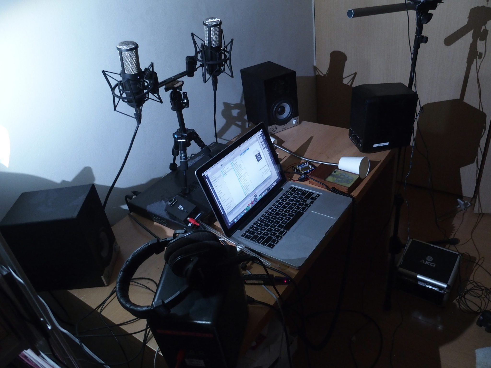
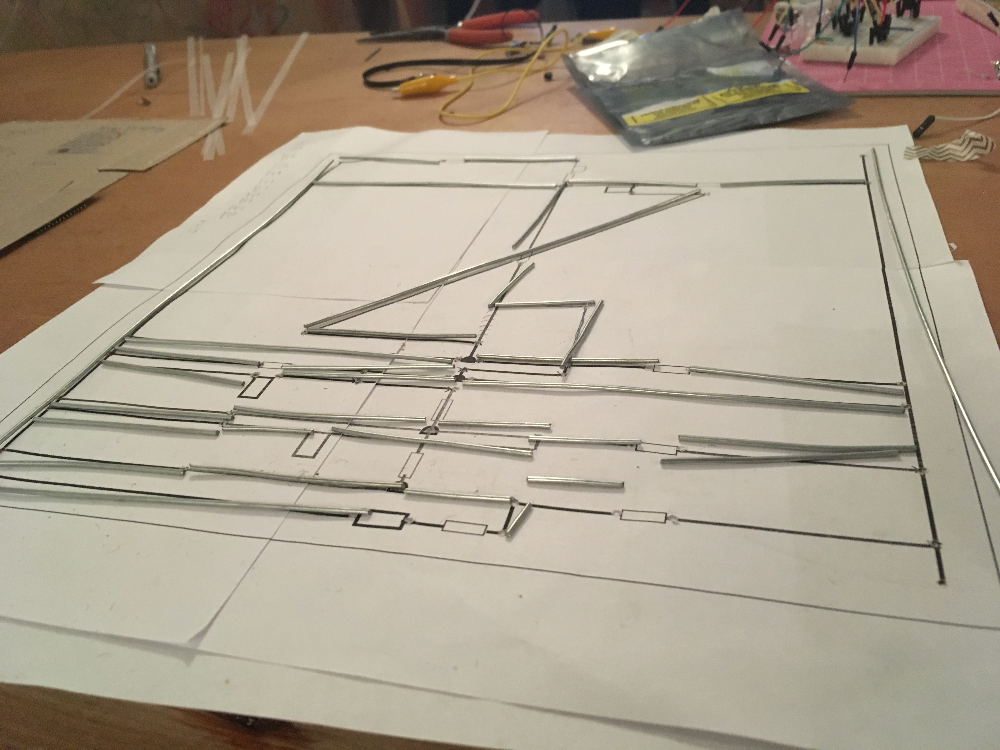

# 概要 {.unnumbered}

本研究では音響再生産技術とコンピューターが与えた文化的影響をメディア考古学的視座に基づいて見直す3つの作品制作を行う。音を人間の聴取や知覚に基づくのではなく生成方法で記述するという手法を再考することで、今日における音を作り出すという行為の意義を問い直すものである。

具体的なアプローチとして、1.物理モデリング合成という、実際の楽器をコンピューターで再現する手法を電子回路や共鳴器のような音響的要素で物理的に再実装、具現化するサウンドインスタレーション「Aphysical Unmodeling Instrument」の制作、展示 2.オーディオフィードバックを発音原理とする、演奏に空間的要素が入り、既存の楽譜で記述不可能、またコンピューター上での再現が不可能な電子音響楽器「Exidiophone」の開発とそれを用いた演奏活動 3.音楽、更には時間の記述を再考するためのフィードバック構造を持つ、時間を分割する機能のみを持った電子計算機としての回路彫刻作品「Electronic Delay Time Automatic Calculator」の制作、展示を行った。以上3作品それぞれを音楽に関わるテクノロジーの発展の歴史と、サウンドアートや実験音楽における音楽の概念の更新を試みてきた芸術家の取り組み双方の視点から検討し、その考察を行う。

# Abstract {.unnumbered}

This part is an abstract in english

# 謝辞 {.unnumbered}

みなさま有難うございました。

# 序論

本研究は音に関わる3つの作品制作を通じて、単純な進歩論ではない形での音楽と技術の、またその2者の関係性の発展のあり方を探るものである。これらの作品には一切コンピューターが直接登場しないが、すべての作品が音をコンピューターで扱うことに対しての批評的なアプローチを出発点にしているという共通点がある。

> Technology has always played a role in creating new types of sounds that inspire musicians—from the sounds of distortion to the electronic sounds of synths. Today, advances in machine learning and neural networks have opened up new possibilities for sound generation.
>
> テクノロジーは常にミュージシャンを刺激する新しい種類の音を生み出してきました―歪んだ音からシンセサイザーの電子音まで。今日、機械学習の進歩とニューラル・ネットワークは音生成の新たな可能性を切り開きました。(NSynth Superより)

新しい技術を用いれば新しい表現が開拓できる。こうした言い回しは新しい楽器の宣伝文句に常に用いられてきたものだが、筆者自身そういった思考を持って音楽プログラミングを始めた。

信号処理や音声合成などのデジタル音響技術は例えば録音した歌声の音高を自然に後から編集させる技術や一度足し合わせてしまった音源同士を後から分離できる技術など、アナログ技術だけでは不可能だったことを可能にしてきた。

その一方で常に新しい技術が新しい表現を生み出してきたのかといえばそうではない。例えばシンセサイザーを世に広めたのはクラシック音楽の演奏を収めたアルバムだったように、新しい表現を生むと言いながらも既存の表現を新しい技術で再生産することが繰り返し行われてきた。

> クララ・ロックモアはまるで彼女自身が肉声で歌っているかのようにテルミンを演奏するほどの名手だったが、ロマン派の名曲などから一歩も離れようとしなかった。トラウトニウムのすべてを知り尽した作曲家/演奏家であったオスカー・ザラは、件の楽器のためにいくつもの曲を書いたが、どれも保守的な音楽という印象を免れない。モーグ・シンセサイザーの名を世界に知らしめたウォルター（ウェンディ）・カーロスの出世作は”Swithced on Bach”だった。その数年後には日本の冨田勲が『月の光』を発表している[^tomita]。どれも多くの人に感銘を与え、演奏や作曲、編曲の技が優れているにもかかわらず、ここには新しいものは何もない。（"技術と音楽についての自動筆記風覚書"、村井啓哲 ユリイカポストノイズ）

[^tomita]: 「Switched on Bach』も『月の光』もクラシック音楽をシンセサイザーで演奏したもの。

もちろんシンセサイザーでバッハはこれまで演奏されてこなかったという意味での新規性はあるとは言える。逆に言えば新規性だけがあって、必然性は無い。既存の楽器では絶対に作れないがシンセサイザーでは作れる音楽ではない。この新規性は既存のものを再生産した結果の副作用としての新規性、ということもできるだろう。

他方、そうでない新規性として、アーティストがそうした楽器や新しいテクノロジーを適当に弄り回しているうちに生まれる表現、技術の誤用とも呼べるものがある。これはCasconeがデジタルフォーマットの誤用を意図的に用いるグリッチを始めとした表現に対してもちいた「失敗の美学」という考え方や、コンピューター以前でもサーキットベンディングという、音の出るおもちゃの電子回路を知識のないままに実験しながら繋ぎ変えることで新しい楽器として使用するような試みにも通じる[@Hertz2012]。

ただ、こうした手法は基本的にノイズミュージックとセットで語られる事が多いことにも触れるべきだろう。楽器を壊しておかしな音を出させるのだからその定義からしてノイズと化すのは仕方なく思える。

ではこうした誤用による新規性の全てが葬り去られてきたのかと言うとそうではない。例えばオーディオフィードバック―ハウリングと呼ばれる、スピーカーから出た音がマイクと増幅器を通じてフィードバックし持続音を出す現象は望まれざるものとして回避するための研究がいくつも成されている一方で、エレキギターにおいてはジミ・ヘンドリックスを始めとした数々のミュージシャンが演奏法の一つとして用いてきた歴史がある。

このエレキギターのハウリングは電気増幅という技術の進展を背景に生まれたのは確かだが、技術が進歩したからこの表現が生まれたという直接的な因果関係では無いのは確かだろう。

本研究は基本的に過去に起きたある技術の発展に伴う表現の変化とその受容の歴史を調べ直した上で、あり得る表現の形を作品として提示するというプロセスを取る。

こうしたスタンスの参考として挙げられる研究アプローチに、メディア考古学と呼ばれる研究手法がある。

## メディア考古学

{#fig:zombiemedia width=70%}

メディア考古学とは学問の名前ではなく、研究のアプローチの名前であり研究者によってその定義も様々だが、太田によればその最大限一般化された定義は「日々増殖するメディアテクノロジーによって、埋没してしまったメディア文化やそれがもたらす経験についての言説の掘り起こし」であり、「大半のメディア考古学者たちに共通するのは、メディア文化についての規範的で正統的な物語を突き抜けて「掘り下げて」、省かれたものや的外れに終わった解釈を指摘すること」だという(https://mediag.bunka.go.jp/article/media-archeology/)。

[@Huhtamo2015]

こうしたアプローチは研究者に、また当人が自認しているいないに限らず、例えばHuutamoがアーティストが作品制作として行っている行為をメディア考古学的アプローチである、と指摘することもある。

HertzとParikkaはサーキットベンディングは一つのメディア考古学的実践として捉えることができるという。それは商業的にはもう使われなくなった音の鳴るおもちゃを持ってくることで、古びたメディアの歴史を浮かび上がらせる試みとしてサーキットベンディングを解釈している。

一方で、直接的に古びたメディアそのものを再制作したり再利用したりしないメディア考古学的アプローチも存在し、Huutamoが取り上げるアーティストPaul Demarinisはその代表例と言える。

彼はレコードプレイヤーの再発明や、炎を音声再生のメディウムとして用いる装置などを細かなリサーチをもとにして制作するが、こうした研究は装置の調査だけにとどまらず、例えば近年の作品『Jiffy Pop(2014)』『Timpanic Array(2015)』では人間の聴覚系とそれに関連する脳活動に関するリサーチをもとに作ってもいる。

(ただいじくり回してのベンディングはソフトウェアが高度になるに連れて難しくなってくる。

しかしこうした状況自体を踏まえた上で、技術を研究して理解した上で誤用するアプローチを取ることができる。)

## 聴覚の時代

こうしたメディア考古学的研究の中で筆者がより直接参照しているのはスターンの音響再生産文化研究である[@Sterne2015]（スタートここでもよくね？）

スターンは聴取の文化について考察する人なのでMP3に流れたけど、その先のデジタル、コンピューターで音を生成する方向に行きたい

科学的客観性を求めて人の聴覚研究が盛り上がる→ヘルムホルツ　

ジャンリセの音声合成とか、初期はそういう聴覚に頼ったうえで科学的に正しい音声合成というのが行われてきた

こうした流れが物理モデリングシンセという音源側の仮想化に繋がる（それは本論で？）

コンピュータのメタメディア化、全てを代替する透明な機械

実はまだそうではないらしい　Puckette ICMCキーノート[@puckette2015sampling]

また、音を用いた表現に関して言えばコンピューターに加えてスピーカーという装置もまた、この世に存在する音をできるだけ完全に再現するもの、声や楽器を代替するものとして存在している。コンピューターの中で処理されたデータはできる限り客観的に世界を再現するものであるとするならば、スピーカー同士が同じ信号を入力して全然違う音を出していたのでは意味がない。という理屈でスピーカーはできるだけ透明であって欲しがられる（Eck）

この辺りは音楽を行為として考える→ミュージッキング、参加する音楽など、もしくは人間同士の関係性として捉えることができる、という議論で回避されつつあるかもしれない

ただそれはそれで脳に直接電気信号をぶち込む音楽がでてこない限りは、音は振動という物理現象であることはまだ大きな要素であるはずなのに、行為論に還元してしまうとそういった議論が全部なくなってしまう

人-人の関係性もいいんだけど人-物(楽器とか、音を出すものとか)の関係性にもっと着目しないとダメでは

ヒト−モノの捉え方のわりとラディカルなやり方としてはJohn RichardsのMusic of Thingsとか、オブジェクト指向存在論を援用したものとかがある。この議論はサーキットベンディングとか、モジュラーシンセ文化とかを考えると非常に相性が良いとも言える。あとはサイバネティックな作品群との関連性も（Di ScipioのAudible Ecosystemicsとか)だし、ヒト-ヒト間の相互行為論もそのままひっくるめられるし

だが、Exidiophoneの感想からするとそんなに世界をオブジェクトごとに簡単に分割できないのではないか？とも思う。演奏繰り返すまではサイバネティックな自己組織化の作品とかもわりと納得できてたんだけど　JJギブソンの直接知覚論とか、アフォーダンスとか、環境と人間は不可分なものでは、という気分

> このように考えますと、ジョン・ケージの有名な「4分33秒」という作品は、実はあまり称賛ばかりしていられないものになってしまいます。ケージは、すべての音は喜ばしきもの、と禅に影響された独特の音楽思想を展開しました。~もしすべての音がよきものになってしまうなら、著者が定義するようなノイズの居場所は無くなってしまうことになります。（ヘガティ訳者あとがき）

### 芸術史を支えるメディア

 (ここ多分飛ばす)

で、音を出す仕組みを、テキストとか、テキスト上にある数式とか計算モデルとか、アルゴリズムとかで記述できる方法が存在しないと歴史が成立しない

「残ったもの」が近代における音楽としての成立を支えている(大崎「音楽史の形成とメディア」)

筆者は過去に様々な形で行われてきた、音楽や音を用いた芸術の表現を拡張するような試みに影響を受けてきた。正確には、作品そのものはもちろんなのだが、同じくらい**それらの作品の多くを直接体験できていないこと**に影響を受けている。数々の野心的なプロジェクトの記録自体は残っているし、芸術史という形でまとめられてもいるが、筆者が体験した多くはテキスト上の説明や、写真、記録録音という記録であって、作品そのものではない。したがって、なぜその作品が芸術史上重要なのかの実感をはっきりと持つことは難しい。

> これは、先駆者（例えばヴァレーズ）が、後にのみ先駆者として認められること、つまり先駆者であったことが、**常に後から認められてきた**ことを思い起こそう。（23p）
>
> 同時に、ケージは望まれない音を締め出しもした。すべての音がよきものなら、どうしてノイズが存在できよう。そして、ここでのノイズは多様性や社会的聴覚的不協和音のことである

## 本論文の構成

本論文の以降の構成を{+@fig:structure}に示した。

{width=70% #fig:structure}

本章では研究の中心である3作品の背景となる技術史、近年の研究の動向やそれと関連する音楽や音を用いた作品について言及してきた。

2、3、4章では具体的に実践した3つのプロジェクトについて一つずつ解説する。

1つ目の作品は、コンピュータ上で実際の楽器をシミュレーションする物理モデリングシンセサイザーを物理的なオブジェクトで再実装するインスタレーション「Aphysical Unmodeling Instrument」

2つ目はオーディオフィードバック(ハウリング)を発音の仕組みに用いた、音源を持たない電子音響楽器「Exidiophone」である。（要約）。

3つ目は時間を分割する機能のみを持ち、マスタークロックを持たないコンピューター「EDTAC(Electronic Delay Time Automatic Calculator)」である。(要約)。

それぞれのプロジェクトは時期的にオーバーラップする部分があるので以下に実際の進行の図を示した({+@fig:timeline})。

{#fig:timeline width=100%}

それぞれの作品について、必要な背景となる技術的、文化的トピック及び関連する先行作品について説明する。次に実際に制作した作品の概要を説明し、実際の制作過程や展示の様子などを時系列を追って見ていく。特に「Aphysical Unmodeling Instrument」は展示を計4回、「Exidiophone」は演奏を先行した実験を含め10回以上行っており、展示や演奏を繰り返す中で作品の性質が徐々に変化しているためその変化をなるべく細かく記していく。その後作品の制作を通じて気づいたことを背景となる技術や先行作品などと比較しながら考察を行いまとめる。

次に、以上3つのプロジェクトから得られた考察をまとめ、音の記述と生成の再考について分析する。

# Aphysical Unmodeling Instrument

本章ではインスタレーション作品「Aphysical Unmodeling Instrument」の4回の展示を通じての考察から〇〇について考える。

「Aphysical Unmodeling Instrument」は楽器の音色を計算で模倣する物理モデリング合成という手法を、コンピュータを用いて実装するのではなく、スピーカーやマイクロフォン、共鳴器や照明、光センサーなど物理的なオブジェクトの組み合わせで実装するサウンドインスタレーションである。

この作品は90年代に作られたWhirlwindという、クラリネット・フルート・トランペットの3つの管楽器を合体させた形の計算モデルを再実装する。

展示は2017年から2018年にかけて合計4回行われ、それぞれ和室、大学の教室、無響室、音楽ホールのロビーという音響的にも設置環境的にも異なる場所で展示された。すべての展示で元になっているモデルは同じだが、部屋の条件に合わせて具体的な実装も異なっている。

物理モデルという、音を出すプロセスを記述したものを楽譜のように捉え、それを再生する装置を作るという、演奏として展示をすることを試みた。

本章ではまず、本作品の背景となる技術、物理モデリング合成の歴史と手法を概観する。その上で、物理モデリング合成が、実際の楽器をコンピューター上で模倣するという目的を持つにも関わらず実際には非現実的な音作りに多数応用されてきたことを実例を挙げながら指摘する。こうした矛盾の中にはモデル、モデリングという行為にまつわる形而上学的な議論が科学哲学の領域においてなされていることにも触れる。

そうした例の一つでもあり、作中でで直接参照したCookによるメタ管楽器モデルWhirlwindについて説明し、それが音と記述の生成という観点においてどう重要かについての視点を述べる。その上で本作「Aphysical Unmodeling Instrument」が具体的に何を行う作品なのか解説する。

そして実際に「Aphysical Unmodeling Instrument」の4回の展示の実装と、各展示における部分ごとの変遷を詳説する。最終的に、4回の展示を通して得られたことについて議論し、まとめる。

## 背景

### 物理モデリング合成

物理モデリング合成とは実際の楽器の発音機構を計算で模倣する手法である。

{#fig:physicalmodel-history width=100%}

{+@fig:physicalmodel-history}はBilbaoによる物理モデリング合成の手法の歴史を概観したものである[@Bilbao2009]。

Bilbaoによれば、

1965年頃からRissetとMathewsは音響心理研究と主観評価法の発展を背景にしてコンピューターを用いた楽器音の分析と再合成の研究を行っている[@Risset1965; @Mathews1969]。こうした研究を元に加算合成（解説？）やウェーブテーブル合成、周波数変調合成といった手法で実際の楽器音や人間の声をコンピューター上で再現する試みが数多く行われてきた(文献)。

Smithはこうした手法と物理モデリング合成と違いは、前者が**人間の聴覚に基づいて音をモデル化**しているのに対して、物理モデリング合成は**音源の発音の仕組みをモデル化**していることだと述べている[@OSmithIII2004;  @smith2010pasp]。

もっとも基礎的な手法は、力学モデルを微分方程式として作り、その解を求め、離散化して計算機に実装するものである。例えばバネの片方の端におもりが付いていて、片方が壁に固定されているときバネを引っ張ると質点は一定の間隔で揺れる。これを
$$
m \frac{d^2x(t)}{dt^2} = -kx(t)
$$
$$
(ただしmはバネの先の質点の重さ、kはばね定数、x(t)は時間tにおけるバネの自然長からの伸び縮み)
$$

とモデル化すれば、この微分方程式は
$$
x(t) = Asin(\sqrt{\frac{k}{m}}t+\alpha)
$$
$$
(A,\alpha はx(0)および\frac{dx(0)}{dt}、すなわち初期位置と初期速度によって決定される。)
$$

というように解くことができる。コンピューターの中で扱う場合はこれを
$$
x[n] = Asin(\sqrt{\frac{k}{m}}\frac{n}{f_s}+\alpha)
$$
$$
(f_sはサンプリング周波数:時間を1秒間に何回分割するかを表す)
$$

という数列とすれば表現できる。

この数式の中ではバネそのものの重さが0ということになっているし、質点は重さはあるが全く回転しない、理想的には体積が全く無い前提になっている。現実のバネは引っ張りすぎれば伸び切ってしまうので無限に伸ばせるわけではないし、ミクロ的に見ていけば現実のバネはkが完全に一定にはならない。なにより現実には空気抵抗やバネの中で伸び縮みのエネルギーが熱として消えていくので、振動はだんだんと減衰していき、いつかは止まる。しかし上述の計算モデルは無限に振動を続けることになる。つまり、正確ではないと言える。しかし、振動をはじめてから3秒後までの様子を計算で再現したくて、現実のバネも3秒後に振幅が最初の0.999倍程度までしか減衰していないとすれば、この数式はある程度バネのふるまいを表していて、有益に使うことができる。そのうえで、例えば弦をごく小さなバネが連結されたものと見立てる≒モデル化する事で弦の振動を新たに計算モデル化出来るので、これも有益だと言える。

式は立てられても直接は解けないものはある FDA

FDAは何にでも使えるけど計算コストが大きい

ウェーブガイド合成

### リアルでない物理モデリング合成

楽器の物理モデリング合成のいちばんの目的はコンピューター上で本物の楽器にできるだけ近い音を出すことだが、その応用として現実ではありえない楽器音を作るという、一見すると真逆の取り組みが数多く行われている。

> *コンピューターの音楽的価値は本物の楽器にできる事を全て複製できるという能力はもちろんのこと、実際の楽器音を包括し超えて拡張された音の種類を生み出せることにあります。([@Mathews1969]、筆者訳)*

より近年の理論的な議論の中においても、例えば物理モデリングの中のいち手法Functional Transformation法を提案したRabensteinらは、2018年現在もまだ製品などに応用されていないその手法について解説した本を以下のように締めくくる。

> *In acoustics, the application of the FTM has broadened the field of sound synthesis methods into the direction of a direct physical approach to simulate the vibrational behaviour not only of existing instruments but also of structures that are not realizable in the real world.*
>
> 音響の分野において、FTMを応用することで音響合成の分野を実存する楽器だけにとどまらず、現実には実現不可能な構造の物理的な振動の特性を直接シミュレーションするまでに広げています。　([@Trautman2003]、筆者訳)

具体的な製品の例についても時系列で紹介していく。商用のシンセサイザーとしてはじめて物理モデリング音源を採用したYAMAHA VL1のユーザーマニュアルにはこの様な文言が見られる[@vl1perfectguide1993]。

> *VA音源は、物理モデルによる音の合成という今までになかった音源方式をとっています。これはいわば、音源内に仮想的に作りあげたアコースティック楽器を使って音づくりをしているわけです。ですからその音は、息使いや音の存在感、そして音と音のつながりの自然さなどの面で、AWM2音源よりもリアルです。(10p)*

> *VA音源では、まずインストゥルメントという部分で物理モデルの管の長さやリードの形などを自由に変形することによって、現実には作ることも演奏することも不可能な新しいアコースティック楽器を創造することが可能です。(7p)*

リアルさを強調する一方で現実には作れない音が出せることも新規性として挙げていることがわかる。また1996年のコンピューター・ミュージック・マガジンの物理モデリング音源を特集した号では

> *DTM用の音源に限らず、現在あるほとんどのシンセサイザがPCM方式となっています。*
>
> *音源は音質的にも非常にクリアで,かつリアルなサウンドを作り出してくれますが,このPCMにも限界があります。*
>
> *一言でいえば表情の乏しさとでもいうのでしょうか。*
>
> *これを,シミュレーションというまったく違うアプローチで解決してくれるのが物理音源なのです。(2p)*

> *しかし,ここでもうお気付きの方もいらっしゃるかもしれませんが,このような組み合わせによるシミュレーションですので,世の中には存在しない,マウスピースと弦といった組み合わせも可能になってきます。ちょっと妙ではありますが,電子音ではない,アコースティックな音が作れるというのが,この物理音源の魅力でもあるのです。(3p~4p)*

と、リアルさとありえない楽器という一見対立する2つをどちらも魅力として語っていることから、開発側だけでなくユーザー側もこうした宣伝文句をある程度受け入れていた事が伺える[@cmmagazine1996]。

より意図的に物理モデリングを実際の楽器の再現以外に用いたものの代表例としてフランスの音響研究所ACROE-ICAでCadozらによって開発されてきたCORDIS-ANIMAシステムが挙げられる。これを応用したものとして音楽の作曲の構造自体をバネ、おもり、ダンパのような物理的な相互作用のモデルとして記述する「pico..TERA」などの発展例がある[@Cadoz2002]。また近年の類似したシステムとして、同様にバネ、おもり、ダンパをグラフィカルに組み合わせて仮想的な楽器を作るソフトウェアRurataeがある[@allen2014ruratae]。

現在販売されている物理モデリング合成を用いたシンセサイザーの中でこうした非リアルな応用をしている製品として、Applied Acoustic Systems社のソフトウェア音源Tassman、String Studio VS-2、Chromaphone、また同社とIntellijel Design社が共同で開発したユーロラック規格のハードウェア音源モジュールPlonkなどがある[@aas2017web; @IntellijelDesignsInc2017]。（より詳細な説明？）

また、コンピューター上でこうした手法を応用するのではなく、現実の楽器開発に逆輸入した例としてYAMAHAの管楽器Venovaがある。元々サクソフォンなどの円錐管の周波数特性を再現するために、仮想的に2つに枝分かれした円筒として扱うことで効率的に計算ができる分岐管構造という技術があり[@masuda2011pipe]、Venovaはこれをサクソフォンのような音色を保ちつつ楽器を小型化するために実際に分岐した円筒管の構造を持っている[@Yamaha2017]。

この様なリアルを目指しつつ非リアルも求める傾向を説明する言葉として、VL1の登場する1年前の1992年にBorinらが議論していた疑似物理モデリングという考え方がある。物理的リアルさは発想の源でしか無い[@Borin1992]

> *From our point of view, synthesis by physical models--being a sort of a musical reality "generator" on its own--makes it possible to take inspiration from the real world in order to derive our iterpretation of it without forcing us to limit experimentation to the usual physical equations.*

> *Starting from these considerations, it becomes extremely interesting to expetiment with structures that are not anchored in physical reality and whose only constraints are stability and passibity. These models take physical reality only as a source of inspiration but cannot be strictly considered as physical. For all of these reasons, pseudophysical models represent a field of sound synthesis that has yet to be explored.*

Kojsらはこうした物理モデリング合成の展開をコンピューターを用いた音楽作品に応用されてきた例を**拡張(Extended)・融合(Hybrid)・抽象(Abstract)**という3種類に分類し整理している({+@fig:kojs-table})[@Kojs2007]。

{#fig:kojs-table width=65%}

実際に分類してみる

### モデリングに関する科学哲学に置ける議論

こうした物理モデリングの非リアルな応用の一つの補助線となりうる議論として、そもそもモデル、モデリング、モデル化という言葉が何を指しているのかが統一されていないという形而上学的問題が科学哲学の文脈で議論されている。

Giereは1988年の著作の中でこういった議論を行っている。はじめに例としてあげたバネとおもりが摩擦や空気抵抗を無視して考えることができるのは科学者というコミュニティの中で共有された社会的に組みあげられた存在だという。そしてこの様な理想化されたシステムそのものを(理論)モデルと呼ぶと定義した。またモデル構築の中で行われる、例えば我々が$ma = -kx$という数式を見たときに$x$という値をおもりの位置であると認識することを**解釈**と、逆に現実のおもりとバネについて解析をするなかでおもりの位置を$x$と名付けることを**特定**と呼んでいる。ここでGiereはモデルそのものと、それを定義づけるテキストや数式をモデルそのものと分けている。{+@fig:giere-model}はそうしたモデル、そのテキスト、実際のシステムの関係性を表したものだ。

{#fig:giere-model width=70%}

Godfley-Smithはこうした議論を踏まえた上で科学者がモデルという言葉を用いる時、モデルを表すテキストを表しているのか、モデルそのものを表しているのか、またそれがある固有のモデルに関するものなのか複数の物を指しているのか様々なケースがあることを指摘している[@Godfrey-Smith2009]。Godfley-Smithは同時にモデルと実世界の関係性は小説の中の世界など、フィクションのようなものではないかという説を提案している。

またWisebergは特定の対象のないモデリングというものも存在すると議論する。これは3種類あり、1つ目はいくつかのモデルを一般化した汎化モデル（例えば、$ma=-kx$という数式は電気回路においてコンデンサとコイルの共振を表す式にも使われるが、そういった形を一般化して調和振動子と呼ぶ）、2つ目は現実ではありえない条件のモデルを作ることで逆説的に現実世界へのヒントを得るもの、3つ目は純粋な数学的分析に近いが時に現実世界への洞察を与えてくれるもの(セルオートマトンという、ピクセルをシンプルな遷移規則で変化させるモデルが例として挙げられている)である。

こうした議論は生物学や化学の中で活発だが、非リアルな物理モデリング合成の例もこの中に含める事ができるだろう。

### Cookによるメタ管楽器モデルWhirlwind

Whirlwindはウェーブガイド合成でモデリングされたトランペット、フルート、クラリネットの計算モデルを和集合的に合体させたものである[@cook1992meta]。元々の3つのモデルはすべてウェーブガイド合成という手法をベースにしていて、フィルタ、遅延を含むフィードバックという点で共通している。HIRNという専用のコントローラとともに使うことで、金管楽器と木管楽器の音色をモーフィングしたような演奏が出来るとされている。

{#fig:whirlwind width=100%}

{+@fig:whirlwind}はWhirlwindの処理を図解したものである。図の左側、コントローラに入力された息は、その強さ(Envelope)と、息の強さに応じて変化する雑音(Noise)として扱われる。それ以外の部分は、仮想的な管楽器の中で音波が伝達、反射される様子をフィードバックループとしてモデル化している。Delay1とDelay2は管の長さと木管楽器のトーンホールの位置に応じて変化する遅延を表す。Delay3はフルートにおける唄口から左側の頭部管端での反射を表す。$+$ は音波の加算を表す。Nonlinearityは唇やリードの振動で生じる歪を多項式 $ax^3+bx^2+cx$ と単純化して表現している。Resonator(Lip)は演奏者の唇を単一の固有振動数を持つ共鳴器として、双二次フィルタでモデル化している。Delay1,2の手前の1pole Filterは管の端で音波が反射するときに高周波数成分が減衰するのをモデル化したものだ。

(Resonator(Bore)に関しては、元の3つのモデルには存在しないにも関わらずWhirlwindでは追加されている双二次フィルタがある。筆者はこれは管楽器のベル部分の持つ周波数特性を表現するものとして配置していると推測し(Bore)と名前を付けたが、実際の詳しい用途は不明である。)

## 作品概要

Aphysical Unmodeling InstrumentはWhirlwindをコンピューターではなく物理的なオブジェクトの組み合わせで実装するサウンドインスタレーションである。計算モデルをコンピュータの世界の外側で実装することを目的として、デジタル信号処理

例えばトランペットの物理モデルであれば現実化すればトランペットに戻せるだろうが、WhirlwindのようなHybridなモデルは現実にそれに相当するものが存在しない。しかし一方でWhirlwindは計算の手続きを記述しただけのものなので、三輪が逆シミュレーション音楽で行っていたよう何らかの方法で現実化することができる。

そうして非リアルな物理モデルを再現実化することでこれまで説明してきたリアルを目指しつつ非リアルをも目指すという矛盾を露わにするとともにそこから生まれる音楽表現のあり方について問いかけることが本作品の大きな意図である。

本作品ではMIDIやデジタル制御の信号を使わず、モデルの各部分を物理的なオブジェクトで置き換え、そのコントロールは

例えば{+@fig:whirlwind}でDelayと書かれた遅延処理はスピーカーとマイクの組み合わせで、音速と距離に応じた音波の遅れで置き換えている。

## 展示内容とその変遷

本章では2017年10月から2018年6月の間に計4回展示を行った「Aphysical Unmodeling Instrument」の各展示での様子を時系列で説明する。

1. 奈良・町家の芸術祭はならぁと 2017(2017年10月)
2. インターカレッジ・ソニックアーツフェスティバル2017(2017年12月)
3. FREQ2018  -21世紀初頭の音と音楽- (2018年3月)
4. New Interfaces for Musical Expression 2018(2018年6月)

### 事前実験

作品の制作に際し、コンピュータ上でWhirlwindを再実装した。この実装には音響処理言語Faust[^faust]およびCycling' 74 Maxを使用し[@matsuura2017whirlwind]、エンベロープなどの演奏パラメータを変更した際の音色の変化を確認した。

[^faust]:フランスの音響研究所GRAMEの開発する関数型音声処理プログラミング言語。C++を中心にMaxやWebブラウザなど様々なプラットフォーム上で実行可能なのが特徴。<http://faust.grame.fr>

次にディレイ部分のみをスピーカーによる空気伝播に置き換える実験を九州大学大橋キャンパスの残響可変室にて行った。オーディオインターフェースの入出力における遅延を考慮しその音速に応じた遅延時間を差し引いてマイクとスピーカーの距離を設定したところ、ソフトウェア上での再実装と近似した音色が出ることを確認した({+@fig:aui-test}、2018年10月6日)。

{#fig:aui-test width=100%}

その後、遅延以外の部分も電気回路など物理的なオブジェクトとして実装するテストを行い、はならぁとでの展示内容を具体的に決定した。

### 奈良・町家の芸術祭 はならぁと ぷらす2017

{#fig:aui_hanarart width=100%}

{width=100% #fig:aui-hanarart-diagram}

奈良・町家の芸術祭はならぁと 2017のうち、10月27日から 11月5日にかけて開催された「はならぁと ぷらす」企画内、橿原エリア（八木札の辻ゾーン)公募作家として、八木札の辻交流館2階にて展示した[@hanarart2017] 。展示環境の制約として、会場が文化財に指定されているため釘やテープなどを壁に使用できないこと、運搬の都合上持ち込めたスタンド類に限りがあった事などから会場に常備されていた鴨居フック(手回しネジでクランプのように上下から挟み込むフック)を積極的に使用し、ケーブルなどをフックに直接吊ったりテグスやタコ糸をフックに引っ掛け、そこからLEDなどを固定するなどの設置方法を取った。

以下、各計算要素の置き換えを詳しく見ていく。

#### エンベロープ

仮想の管楽器における息の強さとして定義されているエンベロープは計算モデルの外側のパラメータであるが、本作品ではこれも計算と同様置き換え方は自由なものと捉え、モーターの軸に風車を繋ぎ、その回転速度に応じた電圧の変化をエンベロープとして取り扱っている({+@fig:aui_hanarart}最手前)。

#### ノイズ

Whirlwindではホワイトノイズとして表現されている息を吹き込む際のノイズを、この時はモーターによって回転する紙テープのベルトにコンタクトマイクの付いた針をあてがうことで出力される雑音により置き換えている。厳密には擬似乱数しか作ることが出来ないデジタル処理ではなく、紙テープを擦る音を用いることで、有限な周期でループする機構から、その聞こえは殆ど雑音となるという状態を作り出している(+@fig:aui-nara-noise)。

{#fig:aui-nara-noise width=50%}

#### 加算

加算の殆どは各要素から流れる電気信号をミキサーによって合流させることで作られている。一部遅延と関わる部分では複数のスピーカーから単一のマイクに対して音を発することで加算を置き換えている({+@fig:aui-nara-main2})。

#### 遅延

遅延は管体を進む音波の伝播遅延をスピーカーから出した音のマイクロフォンに到達するまでの伝播遅延により再現している。スピーカーの取り付けられた棒は風で水平にランダムに回転するので遅延時間が変化するが、同じスピーカーから2つのマイクにはそれぞれ同じ遅延時間で届く必要があるので、スピーカーの高さは2つのマイクの中間点になっている({+@fig:aui-nara-main2})。

{#fig:aui-nara-main2 width=50%}

#### 乗算(1)

乗算としてエンベロープに比例した音量を出力するためにLEDとCdSセルを用いている。エンベロープとしての電圧の変化に対応してLEDの明るさが変化し、その明るさの変化によってCdSセルの抵抗値が変化する。そのCdSセルにオーディオ信号を流すことで、LEDが光っている時は音量が大きくなり消えている時は小さくなるようにしている({+@fig:aui-nara-mult-light})。

{#fig:aui-nara-mult-light width=50%}

#### 乗算(2)

$ax+bx^2+cx^3$で表される歪部分の乗算の置き換えには前項のようなLEDとCdSセルの乗算機構では応答速度が遅いため適さない。そのため十分応答速度が早い素子であるダブルバランスドミキサICのNJM2594を用いて$ax+bx^2+cx^3$を記号的に置き換えた({+@fig:aui-nara-mult2})。

{#fig:aui-nara-mult2 width=50%}

#### 共鳴器

唇の振動をモデル化した共鳴器の部分はマイクとスピーカーの間をモビールの要領でランダムに動く異なる長さの紙筒に置き換えた({+@fig:aui_hanarart}手前側)。

#### 高域減衰フィルタ

管体端における高域減衰フィルタはスピーカーの手前に紙を垂らすことで、高域はある程度紙で反射され減衰するような置き換えを行った({+@fig:aui-nara-main2})。

置き換えのミスの話？

聞こえが実際どうだったかの話

### インターカレッジ・ソニックアーツフェスティバル2017

{#fig:aui_icsaf width=100%}

{#fig:aui-icsaf-diagram width=100%}

2017年12月15日、16日に昭和音楽大学にて開催されたインターカレッジ・ソニックアーツフェスティバル(以下ICSAF)2017で、一般教室の中で展示した[@icsaf2017]。

この会場でも壁に対してなにかを固定することが出来ず、さらに天井などから物を吊り下げることも出来なかったため、マイクスタンドを複数利用し、そこからスピーカーなどを吊り下げるようにした。

#### エンベロープ、

この展示では、エンベロープはCD、2つの光センサー(CdS)をマイクロフォンスタンドから吊り下げ、机から2つのLED照明を吊り下げることで置き換えた({+@fig:icsaf1})。片方の光センサはエンベロープとして、片方は共鳴器の周波数を変える仮想の唇の締め具合のパラメーターとして利用している。CDのは風などで不確定に回転し、照明からの光を反射し光センサの値を変化させる。

{#fig:icsaf1 width=50%}

#### ノイズ

ノイズはポータブルラジオをチューニングしない状態で使用し({+@fig:icsaf2}左)、接続されたイヤホンをマイクロフォンの先端に括り付ける形で設置している。

{#fig:icsaf2 width=50%}

#### 遅延・加算・乗算

遅延、加算、乗算ははならぁとでの展示を同じ置き換えを用いた。

#### 共鳴器

共鳴器はプラスチック製のタンクにアクリルパイプを取り付けたヘルムホルツ共鳴器で置き換えている。光センサーがポンプを制御しタンク内の水の容量を変えることで、タンク内の共振周波数を変える。

ここで、はならぁとの展示で逆になっていた非線形歪と共鳴の順番は修正されている。

#### 高域減衰フィルタ

紙は無くしたのはなし（そう言えばNIMEで書いてない・・・）

聞こえがどうだったかの話

### FREQ2018 21世紀初頭の音と音楽

図を作る

{#fig:aui_freq width=100%}

2018年3月29日、30日に九州大学大橋キャンパス音響特殊棟で、筆者が所属する城研究室が主催したイベント「FREQ2018 21世紀初頭の音と音楽」（以下FREQ2018）の中で音響特殊棟無響室の中で展示した。

前2回の展示ではスタンドでマイクロフォンを2つ縦に並ぶように設置し、その中間の高さに2つのスピーカーが吊り下げられ回転するようになっていたが、この展示ではスピーカーとマイクロフォンの位置関係が逆転している。これは、前回まで使用していた小型スピーカーの特性が悪いことから同軸のスピーカー（メーカー？）を使用することにしたものの、天井から吊り下げるには重すぎたことからマイクロフォンの方を吊り下げることにしたという理由がある。

#### エンベロープ

ICSAF2017での展示同様、2つの光センサ、2つのLED照明を用いているが、反射板としてCDではなくA4大のアルミ板を用いている。ここで、このアルミ板は反射板であると同時にそれぞれのマイクロフォンと天秤のように重さの釣り合いを取る機能もある。

#### ノイズ・加算・遅延・乗算

これらはICSAF2017と同様の置き換えを行った。

#### 共鳴器

これもICSAF2017同様プラスチックタンクとアクリルパイプを用いたが、共鳴周波数の変更は名刺大の画用紙を糸で左右から吊り下げ、風で自由に動くことでパイプの開口面積を変える事で操作するかたちになっている。

今までで一番管楽器っぽい音にはなった

すずえりさんの感想：全然管楽器っぽくない

### New Interfaces for Musical Expression 2018

ここも図を作る

{#fig:aui-nime2018 width=100%}

{width=100% #fig:aui-nime2018-diagram}

2018年6月3日から9日にかけてアメリカのVirginia Polytechnique Universityで開催された国際学会New Interfaces for Musical Expression 2018で、音楽ホールMoss Arts Centerの2階ロビーにて展示した。

この展示ではエンベロープはICSAF2017やFREQ2018の展示と同様2つのLED照明、2つの光センサーを用いたが

{#fig:aui-nime2018-2 width=100%}

{#fig:aui-nime2018-2 width=100%}

現実的には人が操作するような形に

## 考察

Whirlwindは3つの現実の楽器を仮想的に合体させているので、現実には存在し得ない。それゆえに、このモデルを再物理化するときにモデルの説明されていない部分を何かしらの形で解釈して現実化する必要がある。その解釈の過程によって、それぞれの展示環境において異なる実装がなされる(??)

聴取に基づく音の記述方法と、**生成に基づく音の記述方法**

無理やりコンポーネント同士をつなげて面白い音を作ってしまおうというプロセス（VL1はじめ、疑似物理モデリング、融合型）　→　別に、ヴァーチャルな物理モデルの要素同士をつなげるみたいなものでなくても、物理化して展示を組み立てるうちに繋げられる要素が出てきてしまう

逆シミュレーションとは、あっちが厳密にアルゴリズムを実行させようとするという点でだいぶ違う

サーキットベンディングとも似てるけどまた違う、ベンディングは「中身を知らず」にやりながら試していくけど、この作品では中身をしっかり理解したうえで異化させていくという　概念的ベンディング、ティンカリング

ポストデジタルにおける失敗の美学とも異なる：こうしたキメラ楽器のようなものは楽器の進歩の延長線上の用に語られつつ本来の目的から逸脱しているという二枚舌的側面があるからだ

一方でマイクとスピーカーの位置関係という制約は4作品できちんと守り通されている、記述は結局の所、生成のための制約（Constraint）以外の何物でもない?

・第一次VRブームに置ける物理モデリング楽器の失敗を考えるとヴァーチャル・アコースティック楽器として「まるで本物のような」楽器を追い求める一方でノンリアルな応用が出てくるという矛盾があった。これはサイボーグとかスーパーヒューマン、超知能、超現実みたいな「精度の悪いモデル→現実と同じレベルのモデル→現実を超えたモデル！」という進歩論の元に成り立つ誤謬であって、結局現実を超えるとただの現実じゃないなにかが出てくるというだけである。

・ここに音響再生産の歴史を比較してみると、ハイ・フィデリティを追い求める一方でそうじゃなく、音源をただの素材として用いてサンプリング・カットアップして新しいものを作る流れがあった。こうした考えはモデルの誤用から生まれる新しい表現として同じように見ることができるんじゃないだろうか。

↑KojsのExtended、Hybridには適用できるけどAbstractはまた別の次元にあるものかもね（Exidiophoneはちょっとそっち寄りのなにかがありそう）

という点で、やっぱりモデルというものを楽譜と見立てて演奏するような関係に近い、ということをあらためて言えば良い気がする

**展示＝演奏というメタファー**（大友良英、音楽と美術のあいだ[@Otomo2017]）

メタファーと言うか、Rurataeも楽器作りと演奏を分けていない

一方で、物理的なオブジェクトを空間に配置するという行為を行う以上この作品をどこかに出品する以上は展示、インスタレーション展示という枠組みの中に留まらざるを得ない。音楽的なモチベーションを見る側に伝えることが難しい、形式に囚われる→Exidiophoneへのモチベーション

## まとめ

# Exidiophone

Exidiophoneは、オーディオフィードバック(ハウリング)を音の発音原理に用いた電子音響楽器である。

楽器には対向して配置されたLEDと光センサー、コンデンサを挿すソケット(初期型にはこれら3つの代わりに5つのつまみ)及び小型のマイクロフォン、出力のコネクタがついており、スピーカーとつなげて使う。スピーカーのボリュームが小さい間はマイクロフォンから拾った音がスピーカーから出てくるだけだが、音量を上げると純音のような音がLEDの明滅に合わせて鳴ったり止まったりを自律的に繰り返す。

ExidiophoneははじめはAphysical Unmodeling Instrumentを制作していた時の興味から、オーディオフィードバックとウェーブガイド合成という管楽器の物理モデリング合成の手法の類似性（遅延付きフィードバック）に着目して作り始めた。しかし制作と演奏、楽器の改良を繰り返す中でそうした興味は少しづつ変化していった。

そうした開発者から見た視点でのExidiophoneの楽器としての特徴は最終的に3つの問題に集約された。

まず、電子楽器は通常、例えばシンセサイザーであれば回路に発振器を、サンプラーのような楽器であれば音源メモリーをというように何らかの音源を持つ。一方でExidiophoneはスピーカーから出た音がマイクロフォンを通じて循環することによって音を出すので、音源に当たるものが存在しない。これは電子楽器が必ず必要とするスピーカーという出力装置を、何かの音源を具現化するだけでない音の生成装置へと変化させることを意味する。Exidiophoneそのものはスピーカーを持たないが、その本質はスピーカーの役割を変容させることにある。

それから、完全な制御が出来ないということだ。Exidiophoneを演奏する時にはマイクロフォンの向きを変えたり、を手やその他共鳴物で覆ったりすることで演奏し、複数台を同時に組み合わせることでより複雑な音を鳴らすことができる。こうした演奏はフィードバックシステムという出力が入力に帰還される構造を持つことに起因している。

最後に、インタフェースの問題である。いわゆる電子楽器はつまみやタッチパッドをはじめ、様々なインターフェースが考案されてきたが、内部的にそうした入力は複数の1次元数値パラメーターの集合として扱われる。一方で本楽器はスピーカーとマイクロフォンの間の周波数特性や、部屋の明るさなど、一つの行動が同時多発的な変化をもたらす。こうしたパラメータの不可分性は楽器と演奏者、聴取者、そして環境のそれぞれの不可分性にも起因する。

本章では、まずこの楽器の発音原理であるオーディオフィードバックという現象について説明する。そして、楽器や実験音楽の歴史の中で、オーディオフィードバックという現象がどのように、またどの様な興味で用いられてきたのかを、ハウリングに限らないフィードバックシステムを用いた作品群の分類を行ったSanfilippoらの研究、またスピーカーやマイクロフォンを楽器として用いてきた歴史についての研究を行ったEckの研究を足がかりに見ていく。加えて、筆者がExidiophoneの制作に取り掛かる前に演奏の経験を持ち、本楽器制作にあたって大きく影響を受けたWaisviszの電子楽器Crackleboxについても触れる。

Exidiophoneの詳細な構造について解説する。次に、2018年1月から2019年1月にかけての1年間、計8回の演奏機会を通しての楽器自体のアップデートと、演奏の変遷を記す。そして、演奏から得られた経験と先行研究を参照することで本楽器が楽器の歴史上、また音楽演奏の歴史上にどう位置づけられるのかについて考察する。

## 背景

### オーディオフィードバック（ハウリング）

オーディオフィードバックとは、スピーカーから出た音がマイクロフォンに拾われ、マイクロフォンからの信号が増幅器を通り、再びスピーカーに出力されることを繰り返すことで持続音が発生する現象である。日本ではハウリング、英語では現象を始めに報告したデンマーク人の物理学者Søren Absalon Larsen (1871–1957)に因んでLarsen Effectとも呼ばれる[^larsen]。

一つのスピーカーからマイクロフォンへのループの場合、スピーカーから出た音がマイクロフォンに届くまでの時間遅延がスピーカー・マイクロフォン間の距離及び音速に比例して発生する。

この時間遅延は、一般にコム(櫛形)フィルタと言われる一定の間隔で交互に強め合う周波数と打ち消し合う周波数があらわれる周波数特性を生み出す。(参考文献)

この特性に加えて、マイクロフォンとスピーカー、増幅器の周波数特性を合成したときに、それぞれの周波数ごとの増幅率が1を超えた部分でオーディオフィードバックが発生する。

ただしマイクロフォン、スピーカー、増幅器のいずれかで入力に対して非線形の出力が発生する、すなわち歪が発生したときには理論的な解析はより困難になる。

[^larsen]: [@Guo2012]に参考文献として"A. Larsen, “Ein akustischer Wechselstromerzeuger mit regulierbarer Periodenzahl für schwache Ströme,” Elektrotech. Z., ETZ 32, pp. 284–285, Mar. 1911."と引用されているが原典をあたることが出来なかったのでここに紹介するに留める。

### フィードバックシステムの音楽、芸術作品への利用

オーディオフィードバックは拡声の際に意図せず発生してしまい、回避されるべきものとして様々な研究が行われている([A procedure for controlling room-ring modes and feedback modes in sound systems with narrow-band filters](http://www.aes.org/e-lib/browse.cfm?elib=624))。

一方でオーディオフィードバックを積極的に芸術作品や音楽の中に取り入れる試みも数多くなされている。大衆音楽の分野ではビートルズの"I Feel Fine"で初めて用いられたほか(Hodgson, Jay (2010). *Understanding Records*) ジミ・ヘンドリックスがエレキギターにディストーション効果を附した上でフィードバック音をを用いながらアメリカ国家を演奏したものが代表的な例として挙げられる。

一方実験音楽の分野でもほぼ同時期からRobert Ashleyの*The Wolfman*で用いられたほか、Steve Reich*のPendulum Music*などが代表例としてあげられる[@Eck2017]。

また、オーディオフィードバックに限らず出力を入力に帰還するフィードバックシステムを芸術に用いる例は、1950年ごろからNobert WienerやRobert Ashbyによって立ち上がった学問であるサイバネティクスの影響が顕著に見られる。サイバネティクスは第二次世界大戦における弾道制御の自動化やレーダーシステムのためにネガティブ・フィードバック（説明）を用いたのを始まりにして、同時期に登場した電子計算機（今日のいわゆるコンピューター）とシャノンに始まる情報工学と共に勃興し、今日の人工生命や人工知能研究、ヒューマン・マシン/コンピュータ・インタラクションといった研究の基礎となった[@Rid2016]。

芸術への影響としてはCybernetic Serendipity

SanfilippoとValleはこうしたフィードバックシステムの利用はサイバネティクスの流れをくむものと、その後オーディオアンプの登場によって発生したオーディオフィードバックをアーティストが意図せずに用いたもの、ハードウェア・ハッキングなどの過程で偶発的に生じたものなど複数の文脈があると分析したうえで、アーティストがフィードバックシステムを用いた意図や興味を分析するための視点として以下の4つがその特徴だと挙げた[@sanfilippo2013feedback]。

- 非線形と繰り返し効果
- 相互作用・相互依存性・相乗効果(複数パスのフィードバック)
- 自己組織化/非組織化とホメオスタシス（恒常性）・ホメオレシス（変化）
- カオス・複雑性

その上で、作品フィードバックシステムを{+@fig:sanfilippo-framework}のように表し、以下の6つの、各々3つの段階を持つ指標を用いて代表的な作品群を分類することを試みている。

- アナログ・デジタル変換がある、ない、部分的に用いている
- フィードバックスピード(オーディオレート、コントロールレート、両方)
- システムが環境に対してオープンである、無い、ある
- トリガーが外部、内部、どちらも
- システムに環境適応性がある、ない、一部ある
- ヒューマン・マシンインタラクションのある、ない、一部ある

{width=80% #fig:sanfilippo-framework}

それぞれの定義については書いたほうがいいですよね、、、

一例として挙げられている、中村としまるによるNo-input Mixing Boardについて見ていく。No-input Mixing Boardは中村がはじめた、オーディオミキサーの出力と入力をケーブルで接続することで電気的なフィードバックを起こす演奏法である。フェーダーやイコライザーなどのミキサー上にあるつまみを操作することで演奏する。中村はミキサー出力と入力の間に様々なエフェクターを挟んでより複雑な効果を発生させている(参考文献)。この場合システムは基本的にアナログであり、フィードバックスピードはオーディオのスピードで発生している。システムは基本的に電気系統の中で完結しているのでシステムはオープンでない。トリガーは、ミキサー内の僅かなノイズ成分が急速に増幅され発振を起こすので、発振を起こすための特別なインプットは無い。システムが閉じていることから環境適応性も無い。インタラクションに関しては、基本的に音色の変化に演奏者がフェーダーやツマミをいじる操作を必要とするため、ありとなる。

### スピーカーとマイクロフォンの楽器としての利用

フィードバックシステム全体からオーディオフィードバックに焦点を再び絞ると、フィードバックシステムそれ自体が持つ特徴に加えてオーディオフィードバックの意図的な利用はスピーカーやマイクロフォンを現実の音の増幅や録音の再生(Reproduction)でなく用いているという特徴がある。Eckはマイクロフォンとスピーカーの利用法には4つのアプローチがあると分析する[@Eck2017]。

1. Reproducing レコードを代表とした何かの音を取り出すこと
2. Supporting　現実の楽器を増幅して補強すること
3. Generating　（電子楽器的の利用も含め）新しく音を作り出す
4. Interacting スピーカー、マイクロフォン自体とのインタラクションがある

このうち1と2についてはスピーカーを透明な

> The idea of creating music which no longer has any connection to existing musical instruments nor needs musicialns to perform on them forms the third approach, which I term *generating*. The sound is produced by the loudspeakers and could not exist without them. A musical instruments is not present at all in this music. Whereas the sound of electronic instruments, such as the theremin, also need a loudspeaker to become audible, the difference lies not in the *method* of sound production, which may be the same (both are produced electronically) but rather in the *acts of sound creation* which diverge.

### Cracklebox

またフィードバックシステムを用いた楽器の代表例として、Cracklebox(Kraakdoos)がある。

Crackleboxは1975年にMichel Waisviszを中心としてオランダの電子楽器の研究所STEIMが開発した電子楽器で、両手に収まる大きさの木製の箱の上に6つの金属面が出ている電子回路基板が取り付けられており、小型スピーカーが基板の裏に取り付けられている。電子回路には1つの演算増幅器(オペアンプ)と少数のコンデンサ、トランジスタが取り付けられている。6つの金属面はオペアンプの各端子に接続されており、2つ以上の接点を手で触ることで、人体をコンデンサとして介した電気的フィードバックが発生する。金属板に触れている面積や、6つのうちどれを触るかの組み合わせにより発生する音が変わる。

指で触る以外にも、電極をスプーンやフォークに繋いで口に運ぶことで音を発生させたり、複数人で異なる電極に触れて、人同士の間に床や布、自転車、植物などを挟んで音を鳴らす例が挙げられている[@Waisvisz2004]。

Waisviszはこの楽器をラジオを分解して中の基板を手で触ることで音を変えることからはじめており、こんにち、ハードウェア・ハッキングやサーキットベンディングといった既存の電気回路を改造して音を鳴らす文化の初期の代表例であると同時に[@Collins2013,75p]、制作の動機として同時代の主要な電子音楽が既存の現代音楽の記譜に基づいて作られていることへの不満を挙げ、その音の記述不可能性にこそ魅力を見出している。

筆者もExidiophoneを制作するよりも前にCrackleboxでの演奏を複数回行っているが、6つの接点一つ一つが音の高さや音量といった聴覚上のパラメーターに対応しているわけではないので、西洋音楽的な指示で任意の音を出すことはおよそ不可能である。触り方で指示を行えばある程度の再現性を持って音を出すことは可能だが、接点と指とが触れている面積が僅かでも変化すれば大きく音色が変わることや、電池の残量などによっても音が変化するので、現実的に演奏の再現は難しいと言える。

またオリジナルの木箱に入ったCrackleboxは外部出力端子を持たず、基本的に内蔵スピーカーでのみ音を出すことになっていることにも本研究においては注目する点である。

## 作品概要

### 動作の仕組み

{#fig:exidiophone-sys width=100%}

Exidiophoneの基本的な動作原理を{+@fig:exidiophone-sys}に示した。

通常のオーディオフィードバックは、増幅器の限界まで際限なく増幅し続ける。一方、Exidiophoneは音量を光の強さで制御する光センサと、対向して設置されている、通常点灯しているがマイクロフォンからの信号の音量が一定を超えると消灯するLEDが設置されており、

1. フィードバックの音量が大きくなる
2. LEDが消える
3. 光センサーが音量を小さくする
4. フィードバックが止まる
5. LEDが再点灯する
6. 1に戻る

といった流れで、光の明滅と共にフィードバック音が自律的に鳴る鳴らないを繰り返す。

この流れを見ると、オーディオフィードバックというループ、音量を自律制御するループ、更に奏者の聴覚を経て演奏へとフィードバックされる3重のフィードバックループを見ることができるだろう。

### インターフェース

Exidiophoneを演奏する方法として、主にはスピーカーとの距離を変える、スピーカー、マイクロフォンの向きを変える、間を手で遮ったり、パイプなどを挟んで音響的特性を変化させることが主になる。

それ以外の楽器自体に備わるインターフェースは、開発段階で2つに大きく分かれる。

バージョン1では5つのつまみを回すコントロールが中心になっている。5つのつまみはそれぞれ、

1.　マイクロフォンからの信号の増幅率
2.　LEDを消灯するしきい値の電圧
3.　LEDが消灯するまでの反応速度
4.　電圧しきい値のヒステリシス特性[^hysterisis]
5.　スピーカーへ出力する信号の増幅率

という機能になっている。1.と5.はどちらも全体の音量を変化させるという共通点があるが、1.の値はLED消灯の電圧比較に影響を与えるのに対し5.は影響を与えないという相違点がある。

[^hysterisis]: 電圧比較のしきい値を、入力信号が増加して通過ときには高く、入力信号が減衰して通過するときには低くなるような特性のこと。電圧比較をするときに微小なノイズ成分が出力に影響を与えないようにするために用いられる。

バージョン2以降では、1.2.の可変抵抗はそのまま残っているが、小型の半固定抵抗という形で実装されており、ケースを開けてドライバーで操作するようになっていて、演奏時には操作しない。3.はつまみは省略された代わりに、ケース外側にあるソケットにコンデンサを装着でき、その容量が大きいほど反応速度が遅くなる。演奏中に差し替えることも可能である。4.5.は完全に省略されている。また、バージョン1ではLEDと光センサ(CdSセル)が熱収縮チューブで固定されたアナログオプトカプラがケース内に設置されていたが、バージョン2以降ではケースの外側にLEDと光センサが隙間を開けて設置されている。この間を指で遮ったり、外側から照明をあてることでも増幅率を制御することができる。

## 演奏と楽器の変遷

筆者は以下で説明する以前に前項で紹介したCrackleboxを用いた即興演奏を何度か行っている。その中では、マイクロフォンで拾った音を増幅し、その信号の流れるケーブルを直接Crackleboxの接点に触れさせることで、人体をコンデンサとしたフィードバックに加えてマイクロフォンからのオーディオフィードバックを発生させて演奏することなどを行ってきた。

### 6月　ノーインプットミキサー＋マイク

(Aphysicalの中で説明したほうがよい？)

2017年6月、九州大学大橋キャンパス内で行われたイベント「つくると！vol.3」の中で、中村のNo-input Mixing Boardのようにミキサーの出力端子から入力端子へケーブルをつなぐことでフィードバックを起こすシステムでの演奏を行った。No-input Mixing Boardとの違いは、電気的フィードバックに加えてマイクロフォンからのオーディオフィードバックを加えている点である。

この時の機材はミキサーとしてBehringer MX-1604A、マイクロフォンにSHURE Beta57A×2、スピーカーにMeyer Sound UPM-1p×2を用いた。

操作はミキサー上でフィードバックゲインをフェーダーでコントロールしたり、それぞれのチャンネルのイコライザーのつまみを回したりすることを基本的に行った。その上で演奏中に何度かスタンドにマイクロフォンの向きを変化させたり、マイクロフォンを手で覆うことでオーディオフィードバックの周波数特性を変化させる事を行った。

### 12月　緑青、ソフトウェアによる試作と演奏（Faust&Max）、インターフェースの限界

2017年12月14日、東京のイベントスペース落合Soupにて自主開催した音楽イベント「緑青 #0」で、ラップトップと自作ソフトウェアを用いた演奏を行った。

Exidiophoneに繋がる、フィードバックの音量が大きくなったら自動的に増幅器のゲインを0にするというアイデア(以下、自動ゲインリセット)はここで初めて用いられた。

この段階では筆者は全てソフトウェア内で試作を繰り返しており、グラフィカルプログラミング環境Cycling'74 Maxを主な環境としてインターフェース構築などを行い、信号処理の大半に関数型音声処理プログラミング言語Faustを用いた[^faustgen]。

[^faustgen]: faustgen~というMaxの中でFaust言語をリアルタイムでコンパイル、実行できる外部ライブラリを用いている。

増幅、歪、自動ゲインリセット、遅延の4エフェクトを直列に繋いだモジュールを8つ並列し、それぞれの出力を一度足し合わせ再分配して入力にフィードバックする、といった構造を持っている。演奏時にはそれぞれの増幅や歪、ゲインをリセットするしきい値、遅延時間などをパッチ上のノブやボタンなどのグラフィカルインターフェースを直接マウスでコントロールするか、キーボード入力やMIDIコントローラーにそれぞれのパラメーターを割り当てることで操作した。

(課題を書く)

### バージョン1.0

{#fig:exidiophone_freq width=70%}

#### FREQ2018 21世紀初頭の音と音楽 1stプロトタイプ

2018年1月頃からExidiophoneの回路設計、プロトタイプを始め、2018年3月に九州大学大橋キャンパス音響特殊棟で行われたイベント「FREQ2018 -21世紀初頭の音と音楽-」 で最初のパフォーマンスを行った。基板をAutodesk Eagleで設計し、オープンソースのCAMソフトウェアFlatCAMとCNCミリングマシンRoland SRM-20を用いて基板を製作し、パーツを実装した。3Dプリンター(Formlab form2)で出力した筐体に基板を収めた。

基板は±12Vの電源で動作しているため、5Vから±12Vに変換するDC-DCコンバータを用いた電源モジュールを制作し、そのモジュールから3.5mmステレオミニジャックを通して基板へ接続する。

筐体にはアクリルのパイプを通せるような穴が空いており、演奏時にはアクリルのパイプをアームを取り外したマイクスタンドに固定し、3Dプリントしたベル状の共鳴器を片側に、もう片側に基板の入った楽器を取り付け演奏した。アクリルパイプは径の異なる2本をトロンボーンのように組み合わせて長さを可変できるようにしている。

当初はアクリルパイプの長さを変えることで実際にトロンボーンのようにピッチを可変させて、慣れたらある程度狙った音程を出せるようになるものにすることも考えていた。しかし実際に演奏してみると数センチメートルレベルでの微妙なピッチの変化は発生するがおそらくスピーカーとマイクロフォンの周波数特性のほうが支配的になってしまい、例えばパイプの長さを短くしていくと音程が徐々に高くなるがある程度で低い音に戻ってしまい、また少しずつ上昇していくというような効果になってしまった。

### バージョン1.1

{#fig:exidiophone_ver11 width=50%}

{#fig:exidiophone_tpf width=50%}

次の演奏に向けて、当初から複数台を組み合わせて演奏することを考えていたので、もう1台の制作に取り掛かった。その際、バージョン1.0では3Dプリントした筐体が重すぎる、今後複数台製造するにあたって時間と手間がかかりすぎるといった問題点を克服するために筐体をアクリル板をレーザーカッターで加工し組み合わせる形で製造することにした。基板は1台はバージョン1.0から流用し、もう1台を新しく実装した({+@fig:exidiophone_ver11})。

#### Alternative Act 1.0 -Tech Performance Fes.-

4月14日,15日、自主開催したイベント「Alternative Act 1.0 -Tech Performance Fes.-」にてバージョン1.5を用いて演奏を行った。{+@fig:exidiophone_tpf}は演奏の様子の記録写真である。

しかし14日には、CNCで切削できる基板が紙フェノール基板という衝撃で銅箔が欠けやすいタイプのものだった事や、電源モジュールからの±12vが逆極性で繋がれる事でオペアンプに異常な発熱が発生したりという原因で、運搬中に1台は故障し音が出なくなってしまっていた。そのためパフォーマンスは1台のExidiophoneと2台のスピーカーを用いて演奏を行った。この際、1台のスピーカーの入力をそのまま出力するLink Out端子からもう一台のスピーカーに繋いだ。2台のスピーカーのうち、片方はスタンドで目線の高さあたりに設置し、もう片方は床に設置した。それぞれスピーカーのイコライザーを片方は高音を強調するように、もう片方は低音を強調する用に設定した。

更に15日にはリハーサルの段階では音が出ていたものの本番では故障し音が出なくなっていたので(同様の理由と推測される)、急遽別のパフォーマンスを実施した。

また、アクリル板の筐体は生産の時間は短く出来たものの、運搬の途中で容易に割れてしまい組み立てられなくなるという問題が発生した。なお、3Dプリントしたレジン製のベル共鳴器も同様に運搬途中で破損が発生し、接着剤などの応急処置を施す必要があった。

### バージョン1.2

5月?日に東京、銀座にある資生堂花椿ホールで行われた「蓮沼執太フルフィル　公開リハーサル」でExidiophoneを使うつもりだったが、1台は基板が完全に故障してしまっており、楽器の筐体も割れてしまっていたため残っていた1台の基板を新たに汎用ケースの中に収めた。

しかしこれも運搬中の衝撃のためか、現地でテストしたときには音は出るもののLEDを消灯する機能が働かなくなっていたため使用することができなくなっていた。

### バージョン1.xでの課題点

ここまでのバージョン1.xでの問題点を改めて整理する。

まずは先述した筐体および基板の耐久性の問題があった。加えて一つの回路の中で4回路入りオペアンプを2台用いるという回路の複雑さがパーツを増やし、パーツの密度の増加が銅箔パターンを細くし基板が欠けやすくなると共に故障箇所の特定を難しくしているということも故障時のメンテナンスの手間を増やしていた。

また演奏面ではつまみの操作が中心になることで、観客から見たときに何が起きているのかわからない、5つの異なるパラメータを操作するものが全て同じつまみであるために演奏時に混乱するという問題があった。結果的に2台以上を同時に演奏するときはこの段階では出来なかったが、これだけのパラメータを2台以上同時に操作するのはおよそ不可能であった。

その中でも音量の操作に関してはスピーカーとマイクの距離や向き、Exidiophone上の2種類の音量つまみ、さらにはスピーカーの主音量つまみでも操作可能なので、それぞれの状態がいまどうなっているかを演奏時に全て把握することが難しいうえに、冗長である。

またソフトウェア上では音色の操作として有効だったヒステリシス特性のパラメーターは実際の楽器上ではLEDの点滅間隔を操作するつまみと得られる効果はさほど変わらなかったので、そちらと統一してもよいだろうと判断した。

### バージョン2.0 回路、インターフェースの一新

{#fig:exidiophone_ver3 width=50%}

バージョン1.2までの反省を経て、6月初旬頃から新たなバージョンの制作作業に取り掛かった。

まずは回路を、オペアンプを8回路使用していたところから2回路まで削減し、回路の機能をシンプルにすると共に制作を簡易化した。具体的には音量を検出するのに使っていた全波整流回路(絶対値回路)をダイオード1本の半波整流回路に単純化、インピーダンスを下げるために出力段など合計3箇所に用いていたボルテージフォロワ(バッファ)回路を排し、冗長だった増幅器を1回路にまとめる事で、最終的に信号増幅に1回路、しきい値との電圧比較に1回路の計2回路に収めることが出来た。

また、オペアンプの数が多いと回路がシンプルにできる±12Vの両電源も2回路だけなら単電源で直接駆動したほうが電源モジュールを排することも出来て演奏時のセッティングも簡単になると判断し、電源は5VのACアダプタから直接供給する形にした。

回路の実装はパーツ数が減った事により、回路図とパターン作成まではEagleで行ったものの基板をCNCで削って実装するよりも早くなるだろうという判断でユニバーサル基板を用いて実装した。

{+@fig:exidiophone_ver3}がバージョン2.0の写真である。

ケースはバージョン1.3同様に汎用のケースを用いたが、基板が小型になったためケースも同様に小型のものを利用した。ケースをネジで壁などに固定できるタイプのものを使用し、そのネジ穴に結束バンドを通すことでアクリルパイプを取り付けたり楽器をどこかに固定できるように運用した。

LEDは10mm径の超高輝度白色LEDを利用し、ケースの穴に90°折り曲げた足を差し込み接着剤で固定した。光センサはCdSを同様に固定している。写真ではそのまま設置されているが、テスト演奏を繰り返す中で明るい場所では消灯中でもフィードバックが容易に発生してしまう事があったため、CdSに短く切った熱収縮チューブを被せることでLED以外の方向からの光をある程度遮蔽している。

コンデンサソケットの話

#### 水道橋ftarri 「フタリのさとがえり」

2018年7月1日、水道橋ftarriで行われたライブイベント「フタリのさとがえり」でバージョン2.0を初めて使用した。この時も当初は2台同時に使用する予定だったが、片方がオペアンプの故障のため使用できなかった。

そこでセッティングはスピーカーはYAMAHA MS101-2を2台使用し、Alternative Act 1.0のときと同様片方のスピーカーのLine Outをもう一台のインプットに接続した。

またこの演奏の時からほぼ毎回、防犯用のホイッスルを演奏の中で何度か吹くことを行うようになった。これはフィードバック音の中に笛の音が介入することでExidiophoneのピッチが強制的に変化したり、大音量で吹くことで全ての楽器のLEDを強制的に消灯する事ができるなどの効果がある。

この笛の使用によってExidiophoneの演奏方法の中に**音で音をコントロールする**といった方法が加わったということができる。無論、笛以外の楽器でもこうしたことを行うことはできるが、演奏の自由度の低いホイッスルを選んだ理由としては演奏時には笛を吹く以外の操作が発生しないのでExidiophone自体の演奏の邪魔にならないこと、単純な音の方がExidiophoneによる音の変異が際立つ事、それによって本来の防犯用笛の目的である信号音が楽音に変化するという面白みがある。無論こうした理由付けははじめから全てそうだったという訳ではなく、演奏を繰り返す中で徐々に顕在化してきたものではある。

#### 薬院IAF SHOP* 「KINK GONG JAPAN TOUR 2018 電磁的音族」

{width=100% #fig:kinkgong}

2018年7月8日、福岡市薬院にあるIAF SHOP*で行われたイベント「KINK GONG JAPAN TOUR 2018 電磁的音族」で演奏した。この演奏でExidiophone2台をはじめて同時使用した({+@fig:kinkgong})。スピーカーはYAMAHA MS101-2をそれぞれに対して繋いでいる。笛も使用した。1台はマイクスタンドにアクリルパイプとベルを付けスピーカーは床においた。1台はスタンドを用いず、会場にあった台にスピーカーを置き、楽器とパイプは直接手で持って使用したり床に置いたりした。

2台は大変だった

#### 九州大学大橋キャンパス 「つくると！ vol.5」

2018年7月15日、九州大学大橋キャンパス、多次元デザイン実験棟で開催されたものづくりイベント 「つくると！ vol.5」の中のライブパフォーマンスコーナーに出演した。この演奏ではExidiophoneを2台、ミキサーに接続しそこからモニタースピーカーFOSTEX NF-4Aをステージ後方に左右1台ずつ、YAMAHA MS101-2をステージ前方の床の左右に1台ずつ設置した。前回同様片方だけをマイクスタンドに設置している。

このセッティングは会場が比較的広いのでそれを有効活用したいという考えと前回までの演奏でYAMAHA MS101-2が低音があまり出ないことに不満を感じた結果である。

ミキサーいじるばっかりになった

{#fig:tsukuruto2018 width=70%}

#### 水道橋ftarri 「ftarri 6周年記念コンサート vol.3」

2018年7月21日、水道橋ftarriにて演奏を行った。

この日は後述する蓮沼執太フルフィルのリハーサルを行っており、それに向けた機材の更新が反映されている。機材はExidiophoneバージョン2.0を2台、片方にはベル型共鳴器を付け、もう片方はパイプのみを使用した。この演奏から、アルミニウム製の照明スタンドにワイヤレスマイク用クリップをアダプタを介して取り付け、楽器に通したアクリルパイプを挟む形で固定している。また、アクリルパイプよりもより共鳴が発生させやすいのではないかという考えから、アルミニウムパイプを太さの違うものを2つ用意し、それも演奏中でアクリルパイプやスピーカーユニットに近づけるなどの方法で利用した。

この時は片方を私物のスタジオモニタースピーカーEVE Audio SC204に接続し、もう一台は会場のPAシステムに入力した。SC204を利用した理由はYAMAHA MS101と違いマイクスタンド用のネジ穴が本体についているので持ち運びに適しているからだったが、結果としてSC204は高域用のリボンツイーターユニットがついていたため、MS101に比べて高域でのフィードバックが発生しやすく、演奏のバリエーションが広がったように感じられた。

一方、会場のPAの方はスピーカーシステムにBOSE L1という、小型ユニットを縦に細長く並べた中〜高域用ユニットと、サブウーファーで出来ているシステムを使用しており、先述のFOSTEXよりも低い音域でのフィードバックが発生した。スピーカーまでの距離も長かったため、楽器とスピーカーの間をただ歩き回るだけでも発音パターンに変化が生まれる事があった。

{#fig:exidiophone_ftarri2 width=50%}

#### DOMMUNE 蓮沼執太フルフィル特集

2018年8月6日、インターネット配信イベントDOMMUNEに出演した。この時は自宅から東京のスタジオへ音声を送った上でインターネットに配信されるという特殊な状況だった。

この時のセッティングは、Exidiophoneを直接YAMAHA MS101に接続したものを2台、先述したライブ、緑青で使用したソフトウェア上でのフィードバックシステム、Cracklebox、紙コップとバネを用いた簡易音具[^analapos]を用いている。

[^analapos]: 本題に深くかかわらないので詳説は省くがこの簡易音具は鈴木昭夫の楽器アナラポスに影響を受けて制作したものである。オリジナルでは紙コップではなく缶を用い、より長くゆるいバネを用いているが、演奏としてはアナラポス同様にバネを引っ掻いたり紙コップを叩いたりして音を出す。

この演奏が他のどの演奏とも異なっていた点は、最終的に演奏を2チャンネルの音源として送らなければならなかったことだ。たとえ使用しているスピーカーが2つであっても、これ以外の演奏で観客は基本的にExidiophoneがフィードバックを起こしているスピーカーそのものからの音を聞くが、この演奏のようなフォーマットではそうはならない。

その状況下ではExidiophoneから出る信号を分岐ケーブルやアクティブスプリッターを用いてミキサーなどに送り、最終的に配信の信号に混ぜるか、通常のアコースティック楽器のようにスピーカーから出た音を更にマイクロフォンで収録して配信の信号に混ぜる2つの選択肢が考えられるが、この時はExidiophoneに加えCrackleboxなどのアコースティック楽器が他にもあったので後者を選んだ。ラップトップ後方に置いてある2台のコンデンサーマイクロフォンはその集音とともに、ソフトウェアへのさらなるフィードバックにも使われた。

一番の困難は配信音のモニタリングだった。ソフトウェアから出る音も含めた最終的な配信音をスピーカーで出すと、その音が更にExidiophoneやその集音マイクにも拾われてしまい、それはあまりに複雑過ぎて混乱するだろうと判断しヘッドフォンでのモニタリングを行ったのだが、Exidiophoneの演奏にはフィードバックに使われるスピーカーに注意深く耳を傾けないと演奏しづらい。一方で最終的な出音を確認しないわけにもいかないがヘッドフォンを付けていてもその他のスピーカーからの音もある程度聞こえてしまうので、結局配信音がバランスよくミックスできていたかは確認できなかった。

{width=70% #fig:dommune}

#### すみだトリフォニーホール / 蓮沼執太フルフィル「フルフォニー」

ベル共鳴器を使うのをやめた

決まったピッチに合わせて出す事

{#fig:exidiophone_fullphil width=50%}

### バージョン3.0

9月に入ってから基板を両面PCBとして設計し直し、9V電池で駆動するようにしたバージョンをSeeed StudioのFusionPCBというサービスを利用して発注した。回路そのものはバージョン2.0とほとんど変わっていないが、9V電池を内部で5V駆動するためのリニアレギュレータ―、マイクを外付けするための3.5mmステレオミニジャックを新たに加えた。電池で駆動する際に常に電源が入ったままになってしまうことを避ける目的も兼ねて、3.5mmジャックにマイクを挿しているときのみ電源が入る仕様になっている。

加えて、バージョン2.0での演奏体験を元にして改めて3Dプリントでボディを製造することにした。2.0制作当初は光センサを手で覆ったりすることでの演奏は積極的には想定していなかったが、実際には演奏手段として有効(?)だったため、ボディの一部分をくぼませてその部分にLEDと光センサを対向させるという形状を取った。

3DプリンタはUltimaker 3を使用しPLAフィラメントで印刷した。精度ではバージョン1.0に用いたform2に劣るが、水溶性サポート剤が使用できるので表面の状態を綺麗に保つことができることや、レジン素材よりも割れにくいこと、微妙な寸法のズレを熱を掛けることである程度後から修正できることなどのメリットがある。

{#fig:exidiophone_model width=50%}

{#fig:exidiophone_pcb width=50%}

#### 九州大学大橋キャンパス FREQ x HARDCORE AMBIENCE

2018年12月20日、九州大学大橋キャンパスで行われたイベント「FREQ x HARDCORE AMBIENCE」でバージョン3.0を初めて使用した。

この演奏では2台のバージョン2.0と新しく製造した3台のバージョン3.0、計5台を全て使用し、大橋キャンパス音響特殊棟スタジオ内を全体的に使用したパフォーマンスを行った。

それぞれの楽器はひとつずつスピーカーに繋がれていた。2つはEVE Audio SC204、2つはYAMAHA StagePass(?)、1つはYAMAHA MS101に接続した。

この内StagePassに繋いだものはスピーカーと共にスタジオ内に設置されていたグランドピアノのそばに設置し、パフォーマンス中はピアノのサスティンペダルを踏み、ピアノの弦による残響効果を利用することを試みた。

もう片方のStagePassには、Exidiophoneと同時にマイクロフォンSHURE Beta57Aが繋がれており、後述するEDTACが鳴らす打鍵音を拡声している。

またMS101にはパフォーマンス中にアルミ箔をテープでスピーカー前面に貼り付け、ビリビリと共振する音を鳴らすことを行った。

{#fig:exidiophone_ver4 width=50%}

## 考察
### フィードバックシステムの分類

「音自体のループ」と「音量というパラメーター」のループの2観点で見ないとダメかも

デジタル処理:なし、レート：オーディオレート(ただし音量を自立制御するというループを見るとコントロールでもある？？) 環境適応性：なし　オープン性:あり トリガー：内(外から笛を吹けば音量は強制的にリセットできる) ヒューマンマシンインタラクション　あり

### 楽器としてのスピーカー

だいぶあった（ヤマハ、EVE、Fostex、FtarriのPA）

### 楽器の透明性 - 透明な道具を濁らせる

スピーカーの透明性　(非楽器としての利用)はそのまま楽器自体にも言える気がするという話↓

（あまり背景と対応しないが？）

もともとCrackleboxを用いた即興演奏を行っていた頃から、完全なコントロールが不可能な楽器の演奏はコミュニケーションを取っているような物に近いのではないかということを考えていた。

楽器という道具について考える時には2つの立場がある。楽器は身体の延長であるという視点と、楽器を他者として捉える視点だ。Eckは後者について、楽器から聴覚や触覚を通じて演奏に反映されるフィードバックループを「共鳴（Resonance）」と名付けている[@Eck2017,49p]。また即興演奏を行うギタリストのデレク・ベイリーは次のように語る[@bailey1981]。

> 即興演奏家のあいだには楽器に対しておもに二つの姿勢がみられる。楽器は人間の親友であり、道具であると同時に助っ人、協同者であるという考えが一方にあるとすると、もうひとつの姿勢としては、楽器は必要ではなく、へたをすると演奏者と音楽のあいだに介入する負担となりかねないという考え方がある。

これは、後者が楽器は透明化されるべきという、身体の延長だとする立場に近いと読めるだろう。ただし

> 〜反＝楽器派の態度は、「楽器が演奏者と音楽とのあいだに介入する」、「ストラディヴァリでもブリキの太鼓でも使う楽器は問題ではない。その後ろにいる人間がたいせつなのだ」といった発言にあらわれている。技術的なことを言えば、楽器は征服すべき対象である。

という発言にもあるように、楽器は征服すべき**対象**であって、自己の延長そのものではないようにも読める。

こうした議論をヒューマン・コンピューター・インタラクションの分野に置けるインターフェース設計の議論から検討してみたい。渡邉は道具をそれがあると意識せずに使える状態を道具の透明性と呼ぶ[@Watanabe2015]。例えばコンピューターでマウスを使っている時は普段はマウスカーソルのことを意識しなくてもよいが、動作が遅くなって思ったとおりに動かせない状態になって初めてその存在を強く意識することになる、といった状況のことを指す。そして、道具が透明であるためには、対象が自分の体の一部であるような感覚、自己帰属感と、それを動かしているのは自分であるという感覚、運動主体感が重要だと指摘する。

言い換えればこれは、**対象が人間に完全に制御されている状態になると道具は透明化**するのだと読める。また渡邉はマウスを動かした際にマウスカーソルを意図的に不自然に動かすことで、直接的な物理的関係や振動がないにも関わらず持っている手に触感の様な感覚を擬似的にフィードバックさせられることを実験から明らかにしている。これを整理すると**意図的に制御不可能性を加えることで人間に対しての情報のフィードバックが可能**であると読むことができる。

これをそのまま楽器において当てはめてもある程度納得がいくように思える。楽器の制御不可能性が増えれば増えるほど楽器からフィードバックされる情報量が増え、その関係性は体の延長から分離された他者となる。

この事は、ノーバート・ウィーナーがサイバネティクスの研究において制御と通信は本質的に同一のものだと位置づけたことからも示唆されるだろう。

> 我々は普通、通信とは人から人へ送られるものだと考えているが、そうでなければならないということは全くない。かりに私が不精者で朝ベッドから出ないで、ボタンを押してストーブに火をつけ、窓を閉め、コーヒー沸しの下の電熱器のスイッチを入れるとすれば、私はこれらすべての装置に通信を送っているのである。一方また、電気卵ゆで器が特定の何分かたって笛を鳴らし始めるなら、それは私に一つの通信を送っているのである。自動恒温装置が下手の温度が高すぎることを記録してオイル・バーナーの栓を閉じる場合には、そのバーナーの制御の手段は恒温装置からの通信だということができる。**制御ということは、いいかえれば、受診者の動作を有効に変更できるような通信を送ることに他ならない。**(強調は筆者、一部旧表現をあらためた)[@Wiener1954]

こうした、楽器を制御するのではなくコントロールするといった関係性の捉え方や、システムをあたかも人のように扱う発言はSanfilippoらの研究にあらわれるフィードバックシステムを用いる人たちに中にもみられる。

> I think I was seeking an equal relationship with my instrument, instead of putting myself above my instrument. The instrument could lead me.
>
> この楽器には未だに驚かされます。私はアナログ・オーディオフィードバックを用いて安い機材を活用している。そしてそれを完璧にコントロールすることは非常に難しいというかほとんど不可能だ。しかしテクニックは最も重要な問題ではない。どうコントロールするかというよりも、**楽器との関係性**に気を配っている。 （中村としまる 「Egrets」インタビュー　[@Samadhisound2010]筆者訳）

> Bandoneon! は(回路を)起動するとそれ自身の複合的な楽器の性質を超えて**作品それ自身が作曲をする**ので、(制作に)なんら作曲的手法を用いていない。(David Tudor in 「Open Sources: Words, Circuits and the Notation-Realization Relation in the Music of David Tudor」Ron Kuivila[@Kuivila2004] 筆者訳)

ギブソンのアフォーダンス(投げたボールはどこまで身体か？)

> 環境は「情報」が構造化されているものであると捉え、そういった環境の中で人間が知覚・行為することで、意味や価値が立ち上がってくると考える。環境と人間はひとつのシステムとして成立し、知覚と行為によって環境と人間が接続されているように捉えるのだ。したがって、環境と知覚、身体、行為は切り離せず、よってギブソン的には「知覚対象と思っている環境」を客観的に見るということはできず、すなわち主観と客観の切り分けも難しいという主張になる。(融けるデザイン)

EckのInteractingを考える。非楽器のものでもパフォーマーとの間のインタラクションがあることで楽器として認められる→ところで聞いた感じの音とはこれは関係ないのでノイズと思われてもしょうがない ヘガティのノイズっぽい話？

空間も含めた体→サイバネティクスにおける、環境とシステムの分離は可能？の議論

↑いわゆるマルチエージェント作曲、人工生命みたいなものとも異なる点

何かの「再現」でなく音を作る方法

Errant Sound Synthesis(Nick Collins)

## まとめ

本章では電子音響楽器Exidiophoneの開発とその演奏に伴う変遷を追ったうえで楽器としての歴史上の立ち位置について議論した（？）。

Exidiophoneはオーディオフィードバック現象を発音の基本原理としている。楽器に繋がれたスピーカーとマイクロフォン間で発生するフィードバックの音量が大きくなると自ら増幅を止める事で自律的に発音と消音を繰り返す。

楽器の演奏過程でははじめはつまみによるコントロールを中心に行っていたが、やがてコントロールが画一的すぎることに不満を覚え、バージョン2.0以降は演奏中のつまみによる操作を排した。結果として演奏を繰り返す中でマイクロフォンを動かしたり手で覆ってスピーカーとの共鳴をコントロールすること、光を用いた強制的な音量コントロール、笛など外部の音を用いてのコントロール、コンデンサーを差し替えることでの発音間隔の調整など本楽器特有の演奏法と言えるものが立ち上がってきた。

こうした楽器の構造は先行するCrackleboxの様な電子回路によるフィードバックと同様に確実な制御を不可能にする。一方で異なる点としてはCrackleboxは回路としてその音の生成システムを記述する事が可能なのに対して、

# EDTAC (Electronic Delay Time Automatic Calculator)

本章では時間を計算する機能のみを持ったコンピュータ「Electronic Delay Time Automatic Calculator」（以下、EDTAC）の制作について考察する。

EDTACは筆者が2018年9月から11月に掛けて滞在したSchool for Poetic Computationで制作されたもので、11月10日、11日に行われたSFPC Student Showcase Fall 2018 Classにて展示された。その後、前章で言及した2018年12月20日に九州大学大橋キャンパス音響特殊棟で開催されたイベント「FREQ × HardcoreAmbience」での演奏の中でも使用された。

Exidiophoneの演奏において、絶えずインタラクションが発生し、その演奏についての記述が難しいゆえに楽譜にあたるものの制作がほぼ不可能だったことを振り返り、あの様なフィードバックシステムで発生する時間の流れを適切に表現できるシステムというものが存在するのか、といういうことに興味を抱いた。

Pucketteはここかな

音プログラミングもたくさんやってきたけど、基本的にどれもPCMであることを前提としている

"音をプログラミングした"といえる最小限の状態とは何なのかという問いがひとつ。そして、既存のコンピューターで表現することが不可能な時間イベントの記述方法を作り出す。

そしてアウトプットの形式として、高度に規格化されたコンピューター産業やデジタル音楽処理に相対する、極めて個人的で用途が限定されたコンピューターを全て手で組み上げられた回路彫刻の形で制作した。

(本章の流れ、考察したいこと)

## 背景

### 音楽プログラミングの最小限

現在、コンピューターで音を合成するための基礎的な記述方法は電話を始めとした音声通信の分野で発展したPCM(パルス符号変調)方式である。PCM方式とは音圧信号を一定の時間間隔で区切り(離散化)数列にし、その値である音圧を一定の間隔で分割し(量子化)、バイナリデータとして扱う表現方法である[@Taniguchi2015]。

この方式はReevesが1937年に長距離通信のために音声をパルスで表す方式を開発し[@Reeves1942; @Vardalas2012]、OliverやShannonらがNyquistとHartleyの研究を[@Nyquist1928;@Hartley1928]をベースにして理論化がなされている[@Shannon1948;@Oliver1948]。

コンピューターを音楽のために応用した歴史をたどると、Xenakis、Koenig、コンピューターを用いて音価レベルの音楽生成に用いてきたものにはじまり、Max MathewsらのMUSIC-NがPCM方式に基づく形で直接音の波形を計算して出力する最初の例とされている[@Nishino2016]。

この音価レベルの操作の時代とPCMに基づく波形の生成の登場までのあいだに電子計算機を用いて音を直接生成しているもののPCM方式ではない例として、オーストラリアで最初の電子計算機CSIRAC(CSIR Mk1)、イギリスの初期の商用コンピューターFerranti Mk 1があり、Doornbushはコンピューターで初めて音楽を演奏した例をCSIRACとしている[@Ariza2011; @Doornbusch2004; @Doornbusch2016]。

CSIRACで行われた音響合成は音響遅延線メモリーという初期のデジタル記憶装置の仕組みを有効活用している。音響遅延線メモリーとは水銀の入ったタンクの両端にピエゾ素子というスピーカー、マイクロフォンにあたる素子を付けた構造を持ち、端からデータを音のパルスとして流し、反対の端で受信しバイナリデータを復元し、再び反対の端から出力するという、音パルスをフィードバックし循環させ続けることで、パルスの時間幅幅、音速分の遅れ、タンクの長さの3要素に基づいたデータ記録を可能にする装置だ。その仕組み上、データの読み取りはシーケンシャル(順次)アクセスと呼ばれる、任意のアドレスにデータを読み書きするためにはデータを最初から全て読みださなければならない制限がある。

CSIRACやFerranti Mark1はメインメモリに音響遅延線メモリーを用いており、またデバッグ用途にバイナリデータを直接スピーカーに出力するHooterという機能を持っていた。そして、メモリーに一定の間隔でデータを並べてスピーカーに出力すれば任意の周波数の音を出力する事ができ、複数の音響遅延線メモリーを切り替えながら、同時にメモリー内のデータを更新していく事によってメロディを演奏させることも可能になる。これに気がついたPearceyら開発者たちは1951年にいくつかの既存曲をCSIRACで演奏した。

この例は、プログラミングを用いて任意の音高やリズムを再現出来たのだから音楽のプログラミングとして捉えることができるものの、0・1のパルスを用いているため今日のPCMに基づく音プログラミングのように任意の音圧波形を再現することはできない。

一方で、PCMに基づいた音プログラミングに全くの問題がないかと言えばそうではない。サンプリング理論に基づくとサンプリング周波数($f_s$としよう)の半分までの周波数までしか音を表現することが出来ない。例えばサンプリング周波数48000Hzの中で30000Hzの信号を表現しようとしても$30000- 48000/2 = 6000$Hzの信号として表現されてしまう。これは折り返し歪みと呼ばれており、通常音を録音する際には一般的な人間の近くできる音の高さ20000Hzまでが収録できるように44100Hzや48000Hzといったサンプリング周波数を使用するので問題がない。しかし音声を処理する際に、信号同士の乗算が発生するときには問題が変わってくる。それぞれの音声信号に$f_1$、$f_2$という周波数成分が含まれていた場合、それらを乗算すると$f_1+f_2$の周波数成分が発生する。これがサンプリング周波数を超えていた場合やはり$f_s/2-(f_1+f_2)$という折返し歪みが発生する。音声信号を乗算する処理はオーバードライブやディストーション、コンプレッサーといった基礎的な効果の中で容易に発生するので、**PCMにおいても聴覚の限度までサンプリング周波数を確保した場合においても知覚できる副作用は発生しうる**。もちろんこうした問題は一時的にサンプリング周波数を引き上げるオーバーサンプリングという処理で回避することができるが、この時引き上げられた周波数は人間の知覚と何ら関係がない。

Pucketteはこうした問題を指摘した上で、音声信号のデジタル処理には例えば折れ線の様な形式を用いれば、鋸歯状波のように、理論上には無限に高い周波数成分が僅かに含まれることでPCMの形式で記述しきれない波形を記述できるといった例を挙げながら、PCM以外の形式でのデジタル信号処理の可能性について言及している[@puckette2015sampling]。

？？

### 計算そのものに美学を見出す作品

- CW&T 1bit Slow Computer https://cwandt.com/products/1-bit-1hz-cpu
- ralf baecker Irrational Computing http://www.rlfbckr.org/work/irrational-computing/
- 高橋士郎 空気圧ロジック http://www.shiro1000.jp/mpu/compo.htm

## システム概要

{#fig:edtac_filipwolak width=70%}

本作品は電線及び光ファイバーで相互接続された3つのハードウェアで構成される。一つ目は電気パルスを受け取り、一定時間後に出力する遅延回路、二つ目は電気パルスを受け取りLEDを切り替えるカウンター回路、最後は電鍵音響器（テレグラフ・サウンダー）を電気リレーとして改造したものである。遅延回路及びカウンター回路は40cm四方ほどの木の板の上に針金を取り付け、電子部品を一つ一つはんだ付けしたものになっている。

図

{#fig:edtac1 width=100%}

### 遅延回路

{#fig:edtac-timer width=100%}

{+@fig:edtac-timer}は遅延タイマー部の回路図である。回路は単安定マルチバイブレータ部分、次の回路への電流量を確保するバッファ部分、入力電圧が5Vから0Vに降下した時に短いパルスを出力する回路である。

単安定マルチバイブレータは回路図左側の入力に短いパルスが入力された時に一定時間出力電圧が電源電圧まで引き上げられ、一定時間後に0Vに戻る。時間はコンデンサーの容量$C$(回路図内ではC1)と抵抗値$R$（回路図内ではR14に相当する）によって決まり、その時間は$ln(2)CR\approx0.69CR$で決定される。

C1は回路に一つだけ固定されており、回路図網点部分が作品写真における黒い帯状のパーツに相当する。図中T7となっているフォトトランジスタ(光センサーの一種)が受光しているあいだだけ図中Q1のFETの入力電圧が上がり、電源からR14の抵抗値に応じた電流がQ1を通じてタイマー部に流れ、コンデンサを充電する。

全体として、まず入力部にパルス電圧が加えられると、マルチバイブレータ回路の出力が5Vに上がり、$C$と$R$に応じた時間のあと0Vに降下し、その時回路から短い電気パルスが出力される。

### カウンタ回路

カウンタ回路には汎用ICの一つであるCD4017Bを用いている。CD4017Bは10進カウンタと呼ばれる機能を持ち、入力端子、0~9までの出力端子、桁上り出力、リセット入力端子、電源端子を持つ。電源を入れたときには出力0が電源電圧(本作品では5V)になっており、他の出力は0である。入力にパルス電圧が加わる度に5Vを出力端子が1、2、3と順番に切り替わり、9の次には0に戻る。この時桁上り出力が同時に0から5Vになる。リセット端子に5Vを印加すると出力が強制的に0に戻るが、本作品では桁上りとリセット機能は用いていない。

回路は単純にそれぞれの出力にLEDが取り付けられており、入力パルス電圧が加わる度に点灯するLEDが上から反時計周りに切り替わるだけである[^anticlock]。

[^anticlock]: 展示に際して切り替わる順番が反時計回りなのは何か作品としての意図があるのかと聞かれたが、特に何も考えずに組み立てていたので時計回りになっている可能性も十分にあった。

### 電鍵音響器

電鍵音響器（テレグラフ・サウンダー）とはモールス信号を用いた電信の中で用いられていた機器である。その起源は弱い電気入力でスイッチをコントロールする継電器（リレー）の元でもある電鍵継電器（テレグラフ・リレー）である。元々は長距離で信号を送るために途中でモールス信号を電磁石に入力し、その磁力でスイッチを動かし、改めて信号を送るという目的で使われていたが、機械的にスイッチを押すのでその際に打鍵音が発生する。本来モールス信号は紙テープに打鍵したものを見て読み取る手法を用いていたが、このリレーを使う中で音から直接信号を聞き取るオペレーターがあらわれ、仕組みとしては同じながらも音を出す機能を中心に据えた音響器が登場することになった[@telegraphsounder;@Sterne2015,173p-192p]。

本作品で用いた電鍵音響器はインターネットオークションサイトebayで購入したWestern Electric社製の中古品で、型番ははっきりしていない。本機はリレーとしての機能を持っていないが、作品内では打鍵部に銅箔テープで接点を作り、強制的にリレーとして操作するように用いた。

### 全体の動作の概要

以上で説明した3つの装置を相互接続することで全体として以下のような動作を行う。

1. 遅延回路に電気パルスが入ってきて、一定時間後にパルスを再出力する。
2. 出力されたパルスが電鍵音響器を鳴らす。
3. 電鍵音響器とスイッチが働き、遅延回路とカウンタ回路の2つをトリガーする
4. カウンタ回路は入力されると光るLEDを切り替える。今回の場合は10個のLEDを1つずつ切り替える。
5. LEDは光ファイバーで、遅延回路のフォトトランジスタに繋がれていて、紙と黒鉛でできた抵抗に流れる電流を切り替える。
6. 光ファイバーが有効にした抵抗値が遅延回路の遅延時間を変化させる。
7. 1に戻る。

こうした流れを踏むことでEDTACは10種類の抵抗値に応じた時間の長さごとに電鍵音響器がトリガーされ、音が鳴る。10回の不均一な時間間隔（以下、シーケンスと呼ぶ）の打鍵を規則的に繰り返し続け、同じ抵抗値を用いて同じLEDとフォトトランジスタの組み合わせを光ファイバーで繋げば理論上は再現性のあるシーケンスが得られることになる。

## 制作過程、発表

まずはじめに、全体のコンセプトを一度考えた後、回路図の作成とブレッドボードでのプロトタイピングを往復しながら作品案を練り上げていった。

タイマー回路にはCMOSロジックゲートICを用いるバージョンや555タイマーICを用いるものなど、いくつかの仕様を検討した後、ICなどブラックボックスを最小限にしつつ、回路をシンプルにできるという条件からNPNトランジスタを用いた単安定マルチバイブレータの回路に決定した。

当初はカウンター回路も同様の理由ですべてトランジスタだけで構成する案を検討していたが、あまりに回路が煩雑になりすぎることや展示までのスケジュールを鑑みて、入力を受け取ったらひとつずつアクティブなポートを切り替えるという10進カウンタのシンプルな入出力の関係性であれば問題ないだろうと判断し、4017ICを採用することにした。

{#fig:edtac2 width=70%}

{#fig:edtac4 width=70%}

当初はカウンター回路からのフィードバックも電線を通じて行うつもりだったが、その場合LEDは人間が視認するためという機能しか持っていないことになり、全てのパーツに対して対人インターフェース以外の何らかの機能をもたせることをしたかったため、LEDから光ファイバーを通じて抵抗を切り替えることにした。

長さによって抵抗値が異なるような抵抗モジュールを作る方法として、市販されていたセンサー作成用の導電ラバーフィルムを細切りにしたもの（写真参照）、導電糸、プラスチック辺や紙に導電インクを施したものなどをテストしたが、いずれも抵抗値が低すぎることや一般的に手に入りやすいものでない、などの理由より紙を鉛筆、シャープペンシルで塗りつぶした自作可能な抵抗素子を制作し、使用することにした。

このモジュールも当初はワニ口クリップ→抵抗→フォトトランジスタ→ワニ口クリップだけのシンプルなものにする予定でいたが、フォトトランジスタが暗所でも多少の電流を流してしまうためタイマーが適切に働かないことから、フォトトランジスタで別のトランジスタをスイッチする、という形に変更した[^jfet]。

[^jfet]: ただしこのとき用いたトランジスタはバイポーラトランジスタを用いるとスイッチするために使われる電流がタイマーに回路を駆動する電流としても流れてしまうためうまく働かなかった。そのためベース-エミッタに電流が流れない電界効果トランジスタを用いたのだが、実際に用いたJ-fetは全く電圧を掛けない状態でもコレクタからエミッタにわずかに電流を流す特性がある。これを避けるためにはMOSFETを用いる必要があった。

ブレッドボード上での回路のテストを一通り終えてから、実際の回路への実装を行うことにした。

完全に空中配線で制作することも検討したが、持ち運びなどの理由のため板の上にマウントすることにした。

まずイラストレーター上で実際の実寸大の設計図を回路図に従って行った。EagleなどのPCBCADソフトを使用することも検討したが、パーツが奥行方向に並列する場合の扱いなどが難しいため手書きの回路図に従ってイラストレーターで図を書き、奥行方向はレイヤーを分けて作業した。

その設計図を実寸でプリントアウトし、木の上に貼り付け、必要な部分に紙の上から直接ドリルで穴あけを行った。その後鉄素材の針金を設計図に従って必要な長さに切り出し、はんだ付けを行った。

{#fig:edtac1 width=70%}

{#fig:edtac3 width=50%}

{#fig:edtac4 width=50%}

{#fig:edtac5 width=50%}

#### 展示 - School for Poetic Computation Fall 2018 Student Showcase

展示に際して、壁に取り付けられるようなフック（名前？）を回路側に取り付け、部屋の隅に直角に並ぶように設置した。回路のすぐ下にテレグラフサウンダーが置けるような棚を設置してある。

#### 演奏 - FREQ x HARDCORE AMBIENCE

前章でも取り上げた、2018年12月20日に行われたイベントFREQ x HARDCORE AMBIENCEの中で、演奏の一部としてEDTACを使用した。パフォーマンスはじめに電源を入れ、演奏中終始稼働している状態になっており、EDTACの電源を切ると共にパフォーマンス終了となった。SFPCのときのように取り付けられる壁面が無かったため、回路は譜面台に立てかける形で、テレグラフサウンダーは水平にした譜面台の上に設置した。

はじめはテレグラフサウンダーの生音を使用していたが、演奏途中からはマイクロフォンで増幅してすぐ傍に置いてあるスピーカーから拡声した。

ある種のメトロノームのような使い方として、演奏中にEDTACの打鍵のタイミングに合わせるように自転車用のベルを鳴らすことを行った。

## 考察

### 理想と実際

当初はEDTACは遅延時間を抵抗値$R$とコンデンサの容量$C$の組み合わせから事前に計算することができるように作っていた。元々単安定マルチバイブレータの遅延時間は$–ln(0.5)RC\approx-0.693RC$と理論上の計算ができるがEDTACではそうはなっていない。これは単安定マルチバイブレータが出力後に初期状態に復帰するためには電源から負荷抵抗$R_l$を通じてコンデンサを充電するが、この充電にもまた$R_l$に応じた時間がかかるからだ。

図nは動作テスト中の抵抗を取り付けている部分(回路図におけるA部分)の電位を測ったものだが、静止状態からはじめにトリガーをしたときには-4Vまで電位が下がっているがその後は-2Vほどまでしか下がっていない。これはコンデンサが充電されきらないうちに次のトリガーが入力されているからである。

これを解決する方法としては例えばCMOSロジックゲートで単安定マルチバイブレータを構成すれば負荷抵抗を0にでき、充電時間を限りなく早くすることができる。

### 関連作品、研究との比較

EDTACは音を出す回路彫刻作品ではあるが、VogelやBrandalのような作品とは違い、装置からある音を生成することを最終的な目的としているわけではない。

EDTACは光ファイバーでつなぐLEDとフォトトランジスタの組み合わせを変えることで、得られる時間シーケンスが変わる。

例えば最初の電気式コンピューターであるENIACは各計算モジュールの順番をケーブルで切り替えることで任意の計算を行えるようになっていた。このケーブルの抜き差しは歴史的にはプログラミングと呼ばれる(引用)わけだが、ならばEDTACで光ファイバーを抜き差しする行為もプログラミングと呼べるのではないだろうか。

今回は10進カウンタを用いたが例えばバイナリカウンタ、グレイコードカウンタ、ジョンソンカウンタのようなカウントのアルゴリズムを変えることで更に複雑なシーケンスを得ることができる。しかしこれは任意の時間シーケンスを得るためのアルゴリズムがカウンタ回路の中に含まれていることになる。

Wendy Hui Kyong Chunが「a new ENIAC was created each time it was used (使われるたびに新しいENIACが作られていたのだ)」と表現している

「音の記述とはなんなのか」のまえに「時間の記述とはそもそもなんなのか」という疑問

# 考察

モデルのサンプリング・カットアップとしてのAphysical

フィードバックの制御不可能性、自己組織化に加えて環境との分離の本質的な不可能性に着目したExidiophone

Pucketteが論文最後でCrackleboxについて触れた事はここで、ExidiophoneとEdtacのブリッジをつくる

テクノロジー的に何ら新しいことを用いていない、というか新しさみたいなものを否定する

コンピューター上での再現が不可能/再現する意味がない作品

# まとめ
